> **ĐÍNH CHÍNH 23/09/2026:** Các tổng 1055/1056/1065, 100% pass và zero skips bên dưới là tuyên bố chưa có log toàn bộ tương ứng. Không dùng để nghiệm thu. Dùng kết quả thực thi mới tại output/acceptance_verification; discovery và test kiểm tra tài liệu không chứng minh thực thi.

# HỒ SƠ NGHIỆM THU HỌC THUẬT TOÀN DIỆN

Nhóm bổ sung đối chiếu cuối: `test_academic_current_claims.py` (nội dung hiện hành), `test_rag_review_packet.py` (nguồn/định danh phiếu chấm RAG), `test_release_secret_scan.py` (scan không lộ giá trị secret). Đây là kiểm tra công cụ/hồ sơ, không tự chứng nhận semantic hoặc production.

Đối chiếu 04/10: bằng chứng release/UAT/restore mới tại
`RELEASE_ACCEPTANCE_2026_10_04.md` thay thông tin thiếu đã lỗi thời theo phạm vi
ghi rõ. Không sửa danh sách/số tiến độ 97 mục hoặc bản Word thầy duyệt. Manifest
bao gồm công cụ local; tên file trong danh mục không đồng nghĩa mọi file được
phát hành lên Render hoặc đã được chạy trong một phiên test duy nhất.

Kiểm thử bổ sung 25/09: `test_collaboration_workspace_selection.py` thuộc WORKSPACES & ISOLATION, BULLETIN BOARD và TEAM CHAT; kiểm invalid/foreign/blank selector, active membership, header conflict, no-write và PermissionDenied. Kết quả ghi riêng, không cộng vào full suite trước bản vá.
## ĐỒ ÁN TỐT NGHIỆP ĐẠI HỌC / KỸ SƯ CÔNG NGHỆ THÔNG TIN

---

- **Tên đề tài chuẩn thống nhất:** **Xây dựng nền tảng quản lý vận hành doanh nghiệp tích hợp trợ lí AI (AlphaTech AI Platform)**
- **Tiêu đề tiếng Anh:** *Building an Intelligent Business Operations Platform Integrated with AI Assistant (AlphaTech AI Platform)*
- **Cơ quan / Khoa:** Khoa Công nghệ Thông tin
- **Phiên bản tài liệu:** Bản làm việc đối chiếu 25/09/2026, chưa phải biên bản nghiệm thu được ký duyệt.
- **Thời điểm dữ liệu:** Mỗi bằng chứng có ngày và fingerprint riêng; không gộp thành một phiên bản production.
- **Căn cứ pháp lý & kỹ thuật:** 
  - Đề cương chi tiết đồ án tốt nghiệp
  - Danh mục 97 tiêu chí nghiệm thu học thuật ([docs/CHECKLIST_97_PROGRESS.md](file:///d:/ai_business_platform/docs/CHECKLIST_97_PROGRESS.md))
  - Phạm vi nghiệm thu chuẩn hóa ([docs/ACADEMIC_ACCEPTANCE_SCOPE.md](file:///d:/ai_business_platform/docs/ACADEMIC_ACCEPTANCE_SCOPE.md))
  - Ma trận yêu cầu và bằng chứng mã nguồn ([docs/ACADEMIC_REQUIREMENTS_MATRIX.md](file:///d:/ai_business_platform/docs/ACADEMIC_REQUIREMENTS_MATRIX.md))
  - Quy ước phát triển và cam kết cốt lõi ([AGENTS.md](file:///d:/ai_business_platform/AGENTS.md))

---

## MỤC LỤC TỔNG THỂ

1. [Phần 1: Giới thiệu Đề tài, Phạm vi & Trích dẫn Khoa học Chuẩn IEEE](#phần-1-giới-thiệu-đề-tài-phạm-vi--trích-dẫn-khoa-học-chuẩn-ieee)
2. [Phần 2: Kiến trúc Hệ thống, Mô hình Dữ liệu (ERD) & Biểu đồ Tuần tự](#phần-2-kiến-trúc-hệ-thống-mô-hình-dữ-liệu-erd--biểu-đồ-tuần-tự)
3. [Phần 3: Ma trận Nghiệm thu 12 Phân hệ Bắt buộc (Use Case $\to$ Code $\to$ Test $\to$ Bằng chứng)](#phần-3-ma-trận-nghiệm-thu-12-phân-hệ-bắt-buộc)
4. [Phần 4: Báo cáo Tiến độ 97 Mục & Tổng hợp 41 Đợt Kiểm chứng (Batches 01–41)](#phần-4-báo-cáo-tiến-độ-97-mục--tổng-hợp-41-đợt-kiểm-chứng)
5. [Phần 5: Sổ tay Nghiệm thu Thực hành dành cho Giảng viên & Hội đồng (Teacher Runbook)](#phần-5-sổ-tay-nghiệm-thu-thực-hành-dành-cho-giảng-viên--hội-đồng)

---

## PHẦN 1: GIỚI THIỆU ĐỀ TÀI, PHẠM VI & TRÍCH DẪN KHOA HỌC CHUẨN IEEE
*(Phần làm việc; trạng thái mục 89 theo CHECKLIST_97_PROGRESS.md.)*

### 1.1 Tính cấp thiết và Mục tiêu của Đề tài

Trong bối cảnh chuyển đổi số của các doanh nghiệp vừa và nhỏ (SMEs), nhu cầu quản lý tích hợp giữa hoạt động **bán lẻ đa kênh (Retail Operations)**, **điều phối dịch vụ kỹ thuật bảo hành (Field Service Operations)** và **ứng dụng trí tuệ nhân tạo hỗ trợ ra quyết định (AI Decision Support)** ngày càng trở nên cấp thiết. Tuy nhiên, các giải pháp ERP truyền thống thường cồng kềnh, chi phí cao, thiếu tính linh hoạt và khó tích hợp các mô hình học máy hiện đại.

Đề tài **"Xây dựng nền tảng quản lý vận hành doanh nghiệp tích hợp trợ lí AI (AlphaTech AI Platform)"** được thực hiện nhằm giải quyết các thách thức trên thông qua:
1. **Kiến trúc Modular Monolith tối ưu hóa**: Xây dựng hệ thống backend đồng nhất trên nền tảng Django 5 và PostgreSQL 18, kết hợp sức mạnh không gian của PostGIS 3.6 và tìm kiếm tương đồng vector của tiện ích pgvector.
2. **Đa khách thuê (Multi-Tenancy) và RBAC**: Phân lập logic theo Workspace, kiểm tra membership và quyền tại các cổng nội bộ. Kết quả bảo mật chỉ được báo cáo trong phạm vi các ca đã kiểm thử, không bảo đảm không còn lỗ hổng.
3. **Trợ lý Tri thức (Grounded RAG Assistant)**: Truy xuất SOP và dữ liệu nghiệp vụ qua công cụ có phân quyền, trình bày nguồn tham chiếu. Chấm đại lượng số học là đánh giá offline, không phải bộ kiểm chứng ngữ nghĩa bắt buộc cho mọi câu trả lời runtime.
4. **Phân tích Dự báo Chu kỳ Thời gian (Time-Series Forecasting)**: Tích hợp mô hình Gradient Boosting (XGBoost Regressor) phục vụ dự báo doanh thu bán lẻ hàng ngày, đối chiếu minh bạch với các mô hình đường cơ sở (Baseline) cùng giao thức thực nghiệm chặt chẽ.
5. **Điều phối Không gian Không giới hạn (GIS Operations)**: Tích hợp thư viện Leaflet.js, thuật toán tính toán khoảng cách Geodesic WGS84 chính xác trên mặt Elipsoid và định tuyến điều phối kỹ thuật viên hiện trường tối ưu.

### 1.2 Rà soát Thuật ngữ & Tuyên bố Ranh giới Khoa học
Để bảo vệ tính trung thực học thuật và phản ánh khách quan năng lực hệ thống theo khuyến nghị của Hội đồng chấm đề tài:
- **Về tính năng ERP/WMS**: Đề tài **không** tuyên bố xây dựng một hệ sinh thái ERP/WMS hoàn chỉnh (không bao gồm kế toán tài chính tổng hợp, quản lý sản xuất, quản trị nhân sự chuyên sâu hay sơ đồ bốc dỡ kho bãi tự động). Hệ thống tập trung giải quyết bài toán vận hành bán lẻ (Retail) và dịch vụ kỹ thuật (Service Operations) hỗ trợ cốt lõi.
- **Về bảo mật và cô lập**: Hệ thống áp dụng **cách ly logic bằng Workspace và phân quyền RBAC theo workspace**, không sử dụng thuật ngữ phóng đại *"air-gap"* (vốn chỉ cách ly vật lý hoàn toàn khỏi mạng).
- **Về Trợ lý AI và RAG**: Hệ thống **không** tuyên bố "không ảo giác 100%" hay "an toàn tuyệt đối". Hệ thống báo cáo trung thực kết quả kiểm thử trên các bộ dữ liệu thử nghiệm độc lập, có cơ chế gắn nhãn tường minh nguồn gốc vector (`embedding_provenance`), phân biệt rõ ràng giữa phản hồi từ LLM API ngoài và cơ chế suy luận xác định (deterministic fallback).
- **Về dữ liệu mẫu (Seed Data)**: Dữ liệu khởi tạo thông qua lệnh `seed_demo` phục vụ mục đích kiểm thử và minh họa nghiệp vụ, không được suy rộng thành hiệu quả sinh lời trong môi trường sản xuất thực tế.

### 1.3 Danh mục Tài liệu Tham khảo Khoa học Chuẩn IEEE

```text
[1] P. Lewis et al., "Retrieval-Augmented Generation for Knowledge-Intensive NLP Tasks," in Advances in Neural Information Processing Systems (NeurIPS), vol. 33, pp. 9459-9474, 2020.
[2] T. Chen and C. Guestrin, "XGBoost: A Scalable Tree Boosting System," in Proc. 22nd ACM SIGKDD Int. Conf. on Knowledge Discovery and Data Mining (KDD '16), pp. 785-794, 2016.
[3] R. S. Sandhu, E. J. Coyne, H. L. Feinstein, and C. E. Youman, "Role-Based Access Control Models," IEEE Computer, vol. 29, no. 2, pp. 38-47, Feb. 1996.
[4] Open Geospatial Consortium (OGC), "OpenGIS Implementation Standard for Geographic Information - Simple feature access - Part 1: Common architecture," Standard OGC 06-103r4, 2011.
[5] C. F. Karney, "Algorithms for geodesics," Journal of Geodesy, vol. 87, no. 1, pp. 43-55, 2013.
[6] D. L. Parnas, "On the criteria to be used in decomposing systems into modules," Communications of the ACM, vol. 15, no. 12, pp. 1053–1058, 1972, doi: 10.1145/361598.361623.
[7] R. T. Fielding, "Architectural Styles and the Design of Network-based Software Architectures," Ph.D. dissertation, Dept. Inf. Comput. Sci., Univ. of California, Irvine, CA, USA, 2000.
[8] PostgreSQL Global Development Group, "PostgreSQL 18: The World's Most Advanced Open Source Relational Database," Documentation, 2025.
[9] PostGIS Project Steering Committee, "PostGIS 3.6 Spatial Database Extension for PostgreSQL," Technical Documentation, 2025.
[10] A. Vaswani et al., "Attention Is All You Need," in Advances in Neural Information Processing Systems (NeurIPS), vol. 30, pp. 5998-6008, 2017.
[11] W3C Geolocation API Working Group, "Geolocation API Specification 2nd Edition," W3C Recommendation, 2016.
[12] H. Garcia-Molina and K. Salem, "Sagas," in Proc. ACM SIGMOD Int. Conf. on Management of Data, pp. 249-259, 1987.
```

---

## PHẦN 2: KIẾN TRÚC HỆ THỐNG, MÔ HÌNH DỮ LIỆU (ERD) & BIỂU ĐỒ TUẦN TỰ
*(Đối chiếu bổ sung: ACADEMIC_USE_CASE_TRACEABILITY_2026_09_25.md và output/model_contract_20260925_v2/. Không chứng nhận mọi sơ đồ cũ đã đúng.)*

### 2.1 Kiến trúc Phân tầng Tổng thể (Modular Monolith Blueprint)

Nền tảng AlphaTech được xây dựng theo mô hình **Modular Monolith** kết hợp nguyên lý **Domain-Driven Design (DDD)**. Toàn bộ logic nghiệp vụ được đóng gói trong 12 module độc lập nhưng chia sẻ cùng một cơ sở dữ liệu quan hệ mạnh mẽ, đảm bảo tính nhất quán giao dịch ACID mà không phải đối mặt với độ trễ mạng và sự phức tạp của kiến trúc Microservices.

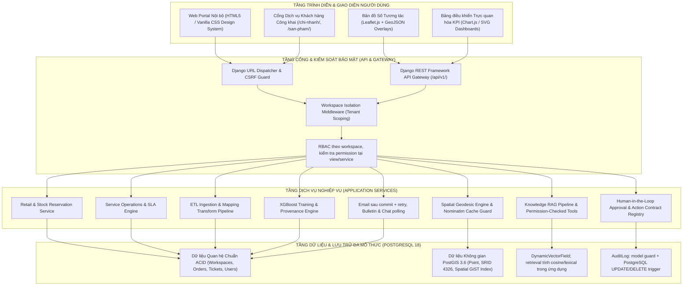

---

### 2.2 ERD theo model hiện hành

Bản ERD viết tay trước đây có field không tồn tại (ví dụ `quantity_reserved`) và đã được thay bằng sơ đồ trích xuất từ ORM. Đây là schema khai báo, không chứng minh database deploy đã chạy migration.

Nguồn máy đọc đầy đủ 48 model, field, null, unique, on_delete, constraint: `output/model_contract_20260925_v2/model_contract.json`. Danh mục route/view: `routes.json` cùng thư mục. Script tái xuất: `scripts/export_model_contract.py <thư-mục-mới>`.

Các sơ đồ theo module bên dưới không liệt kê chi tiết constraint tổ hợp/điều kiện; phải đọc JSON kèm theo. Quan hệ giữa module không có nghĩa được phép truy vấn chéo workspace.

#### accounts

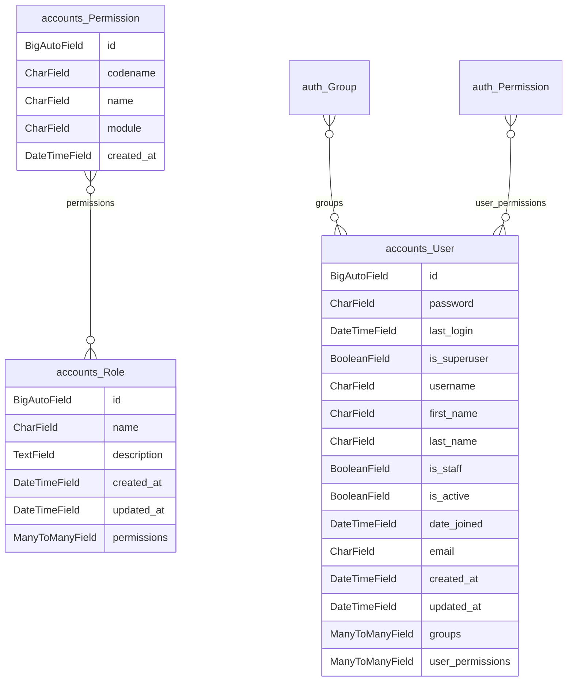

#### approvals

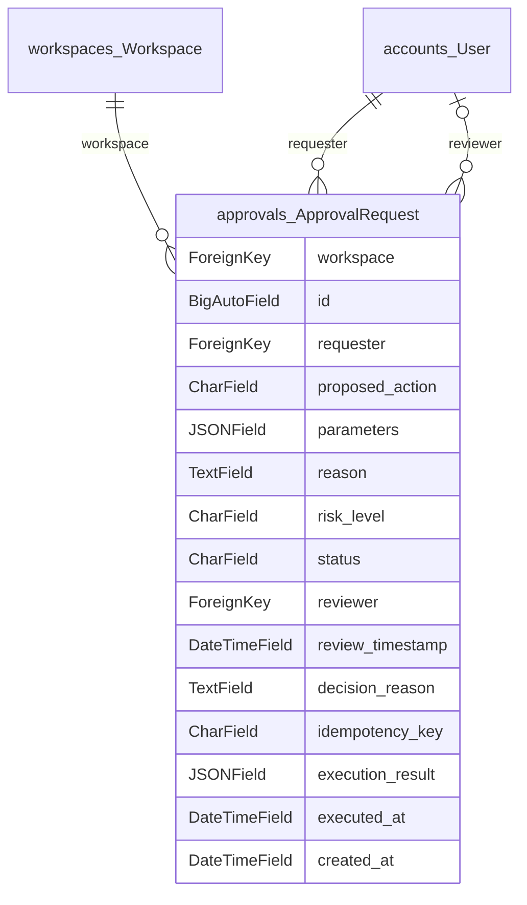

#### audit

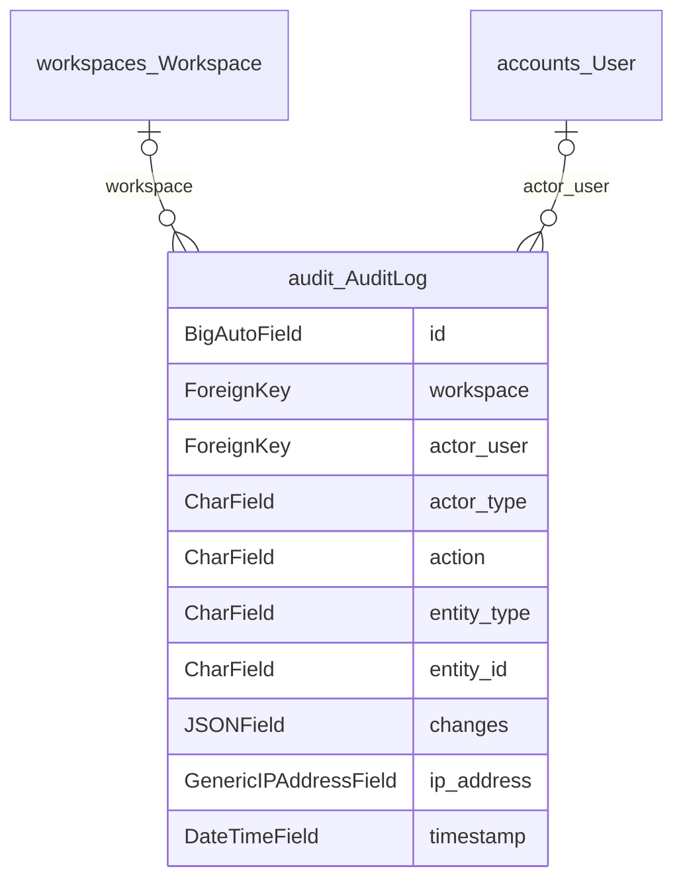

#### forecasting

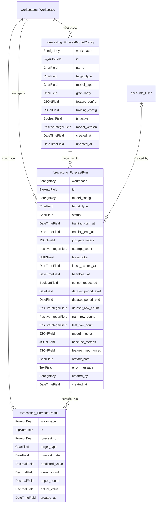

#### integration

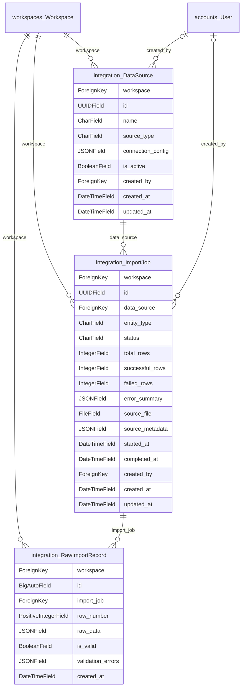

#### knowledge

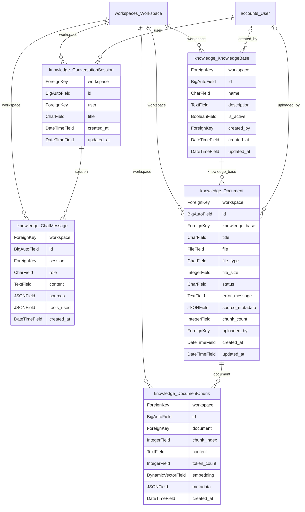

#### mapping

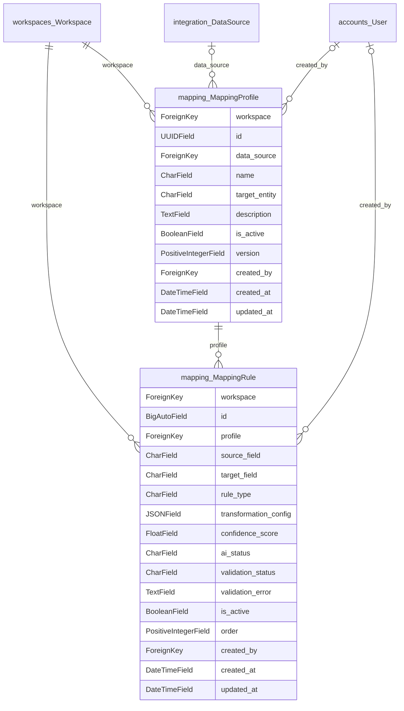

#### notifications

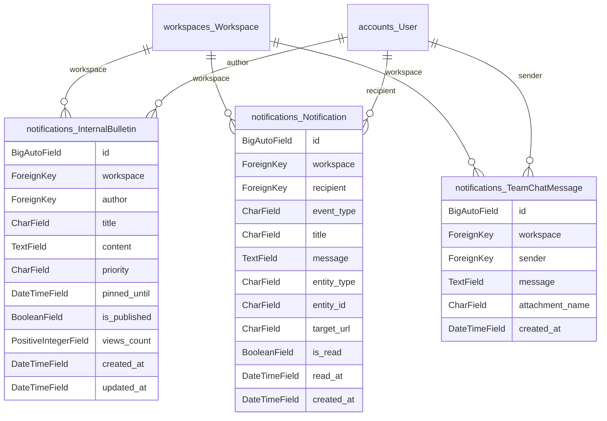

#### public_web

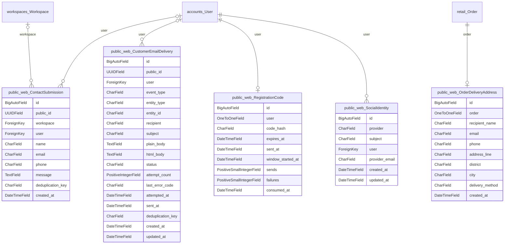

#### recommendations

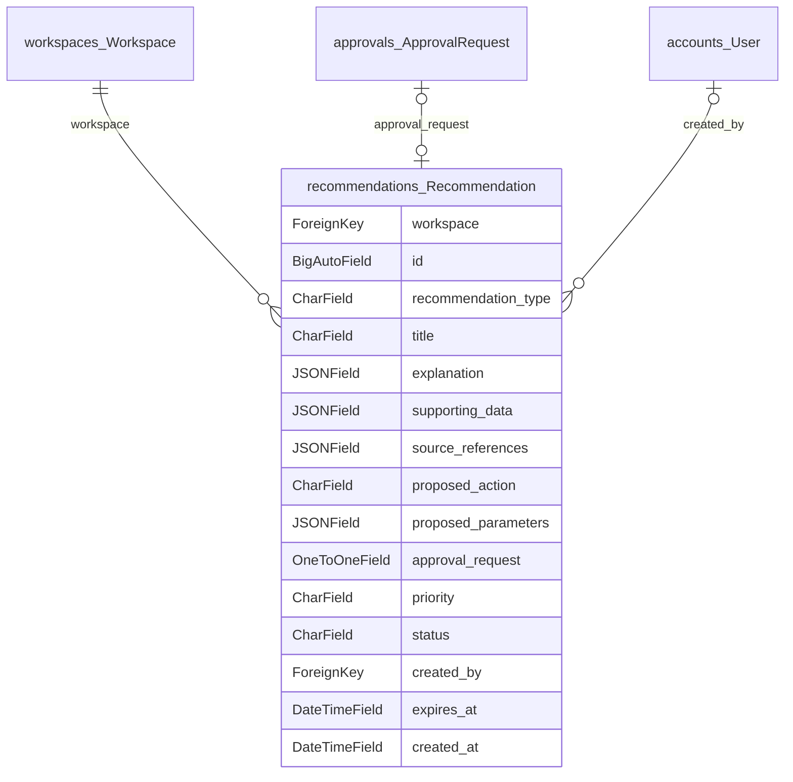

#### retail

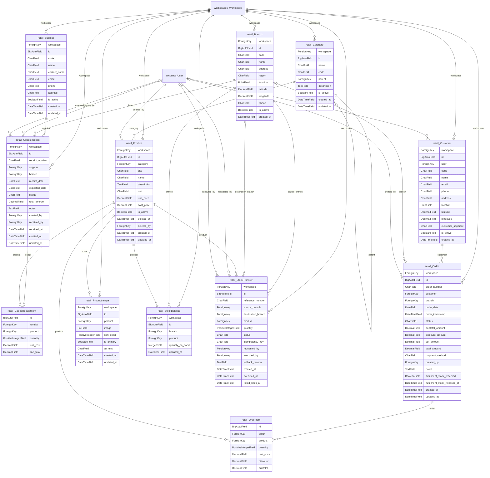

#### service_ops

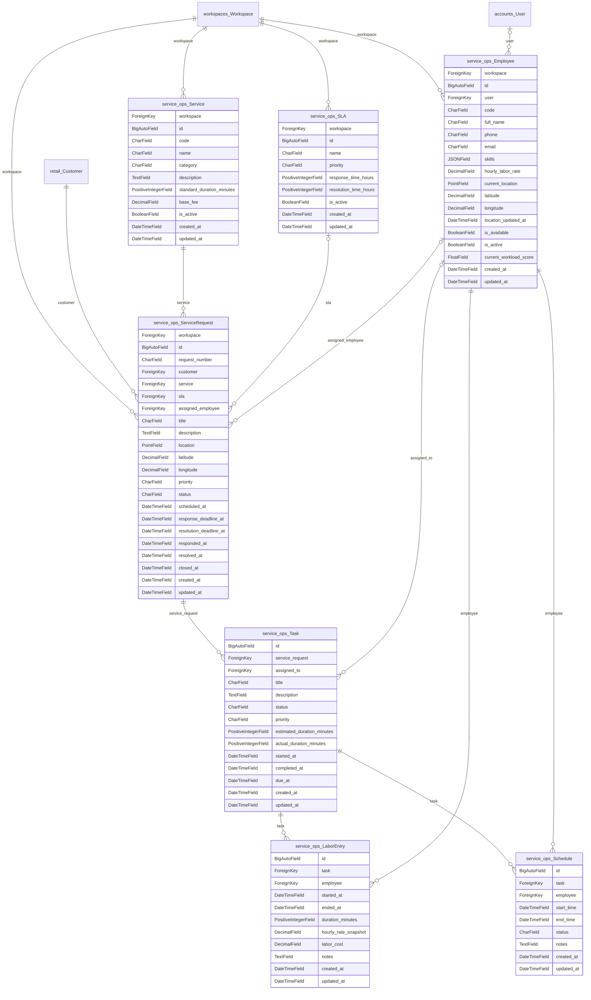

#### workspaces

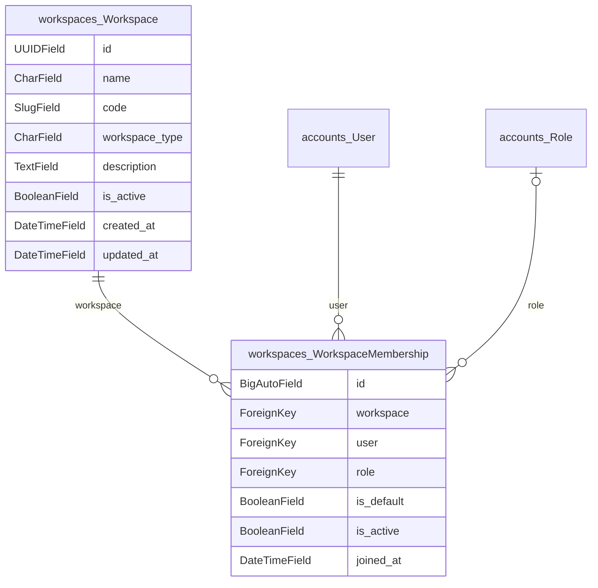

### 2.3 Bốn Biểu đồ Tuần tự Nghiệp vụ Cốt lõi (Mermaid Sequence Diagrams)

#### Sơ đồ 1: Nhánh giao hàng strict

Nguồn: `apps/public_web/fulfillment.py::allocate_home_delivery_stock` và checkout
trong `apps/public_web/views.py`. Đây là nhánh strict opt-in, không đại diện mọi
checkout. Hàm trừ `quantity_on_hand`, không tăng field `quantity_reserved`.
Thứ tự khóa giảm một nguồn deadlock, không chứng minh loại bỏ mọi deadlock.

```mermaid
sequenceDiagram
    actor Customer as Khách hàng
    participant View as Checkout
    participant Allocate as allocate_home_delivery_stock
    participant DB as PostgreSQL
    Customer->>View: POST giỏ hàng và thông tin nhận hàng
    View->>Allocate: Workspace và các dòng đã chọn
    Allocate->>Allocate: Kiểm số lượng và tọa độ tùy chọn
    Allocate->>DB: Atomic; khóa Product, Branch, StockBalance theo thứ tự
    Allocate->>Allocate: Chọn một chi nhánh đủ toàn bộ giỏ hàng
    alt Không đủ hoặc dữ liệu không hợp lệ
        Allocate-->>View: FulfillmentError; không giữ cập nhật dở dang
        View-->>Customer: Thông báo thiếu hàng/lỗi cấu hình
    else Đủ hàng
        Allocate->>DB: Trừ quantity_on_hand từng dòng
        Allocate-->>View: Chi nhánh thực hiện
        View->>DB: Lưu đơn/items/snapshot trong giao dịch checkout
        Note over View,DB: Email delivery sau commit; lỗi email không đổi thành đơn thất bại
        View-->>Customer: Kết quả nghiệp vụ và trạng thái gửi email
    end
```

#### Sơ đồ 2: Dịch vụ và phân công theo quyền

Nguồn: `apps/service_ops/services.py::create_service_request`,
`assign_service_request`, `create_task`, `apps/gis/services.py`.
Tra cứu GIS và phân công là các thao tác riêng; tạo phiếu không mặc nhiên gọi GIS.
Phân công tạo hoặc cập nhật task chính đang hoạt động và tính lại tải nhân viên.
Truy vấn khoảng cách dùng spheroid, không phải road routing.

```mermaid
sequenceDiagram
    actor Staff as Nhân viên có quyền
    participant API as Service UI/API
    participant Svc as Service operations
    participant GIS as GIS selector
    participant DB as PostgreSQL/PostGIS
    Staff->>API: Tạo yêu cầu dịch vụ
    API->>Svc: Workspace, user, dữ liệu đã kiểm
    Svc->>DB: Lưu phiếu và deadline theo SLA nếu có
    API-->>Staff: Phiếu đã tạo
    opt Tra cứu vị trí riêng
        Staff->>GIS: Vị trí và bộ lọc trong workspace có quyền
        GIS->>DB: Distance/radius trên spheroid WGS84
        GIS-->>Staff: Các ứng viên và khoảng cách địa lý
    end
    Staff->>API: Chọn nhân viên để phân công
    API->>Svc: assign_service_request sau kiểm quyền
    Svc->>DB: Kiểm cùng workspace và nhân viên active; cập nhật phiếu
    Svc->>DB: Tạo hoặc cập nhật task chính; tính lại workload; ghi audit
    opt Tạo task bằng thao tác tương ứng
        API->>Svc: create_task
        Svc->>DB: Lưu task theo phiếu được phép
    end
```

#### Sơ đồ 3: RAG runtime và đánh giá ngoại tuyến tách riêng

Nguồn: `apps/knowledge/services.py`, `retrieval.py`, `tools.py`,
`evaluation.py` và `evaluation_scoring.py`. Không có Numeric FactGuard runtime
tự chặn mọi phản hồi. Provenance thuộc quá trình embedding/retrieval, không phải
kết quả kiểm chứng ngữ nghĩa. Gold chunk IDs chỉ có trong rubric đánh giá.

```mermaid
sequenceDiagram
    actor Employee as Nhân viên
    participant API as API / Workspace RBAC
    participant Service as Knowledge service
    participant Retrieve as Retrieval workspace-scoped
    participant Tools as Read tools + permission
    participant Generate as Generation / fallback
    participant Eval as Đánh giá ngoại tuyến
    Employee->>API: Câu hỏi
    API->>Service: Sau xác thực/quyền workspace
    Service->>Service: Phân loại intent và tham số
    opt Intent cần tri thức
        Service->>Retrieve: Truy vấn trong workspace, kiểm embedding compatibility
        Retrieve-->>Service: Chunks, similarity và provenance
    end
    opt Intent cần số liệu nghiệp vụ
        Service->>Tools: Tool cho phép và kiểm quyền riêng
        Tools-->>Service: Dữ liệu hoặc denial/error
    end
    Service->>Generate: Ngữ cảnh / tool results / trạng thái thiếu bằng chứng
    Generate-->>API: Phản hồi + citations + metadata
    API-->>Employee: Hiển thị kết quả
    Note over Eval: Chạy riêng khi đánh giá; không chặn phản hồi runtime
    Eval->>Eval: Rubric + output; keyword/numeric/chunk checks
    Note over Eval: Người chấm xác nhận đúng/đủ ngữ nghĩa
```

---

#### Sơ đồ 4: Bản tin và chat polling

Nguồn: `apps/notifications/bulletin_service.py`, `chat_service.py`,
`bulletin_edit_views.py`, `views.py`, `ui_views.py`. Không có WebSocket hay
tự tăng `views_count` khi đọc danh sách trong các service đã rà soát.

```mermaid
sequenceDiagram
    actor Manager as ADMIN/MANAGER đang hoạt động
    actor Member as Thành viên workspace
    participant UI as UI/API cộng tác
    participant Svc as Bulletin/chat services
    participant DB as PostgreSQL
    Manager->>UI: Đăng hoặc cập nhật bản tin
    UI->>UI: Kiểm quyền workspace
    UI->>Svc: Tạo hoặc update_bulletin
    Svc->>DB: Lưu dữ liệu theo workspace
    Note over Svc,DB: Update khóa bản tin; chỉ title/content/priority/updated_at
    Member->>UI: Đọc bản tin
    UI->>Svc: Chọn bản tin published, ưu tiên pinned còn hiệu lực
    Svc-->>Member: Danh sách theo workspace
    Member->>UI: POST chat/send
    UI->>Svc: send_team_message
    Svc->>Svc: Active membership hoặc superuser
    Svc->>DB: Lưu message
    loop Polling 3 giây ở trình duyệt
        Member->>UI: GET chat/messages với since_id
        UI->>Svc: Lấy tin mới trong workspace
        Svc-->>Member: Danh sách tin nhắn
    end
```

**Giới hạn UI phát hiện 25/09:** lựa workspace không hợp lệ ở màn hình chat/bản tin
còn fallback; sửa và test riêng trước khi coi contract chọn workspace đã đạt.
Ma trận use case chi tiết: ACADEMIC_USE_CASE_TRACEABILITY_2026_09_25.md.

---

## PHẦN 3: MA TRẬN NGHIỆM THU 12 PHÂN HỆ BẮT BUỘC
*(Đối chiếu bổ sung: ACADEMIC_USE_CASE_TRACEABILITY_2026_09_25.md và output/model_contract_20260925_v2/. Không chứng nhận mọi sơ đồ cũ đã đúng.)*

Toàn bộ 12 phân hệ nghiệp vụ bắt buộc theo [docs/ACADEMIC_ACCEPTANCE_SCOPE.md](file:///d:/ai_business_platform/docs/ACADEMIC_ACCEPTANCE_SCOPE.md) được đối chiếu sơ bộ bằng mã nguồn/migration/routes; kết quả kiểm thử từng lần nằm tại TEST_EXECUTION_EVIDENCE.md và biên bản đợt, không phải toàn bộ 12 nhóm đã pass:

| Phân hệ (Mã) | Mục tiêu Nghiệp vụ Cốt lõi | Đường dẫn Mã nguồn | Migration Áp dụng | Endpoint URLs / Views Chính | Ca Kiểm thử Đại diện | Bằng chứng Minh nghiệm |
|---|---|---|---|---|---|---|
| **1. AUTH** | Quản lý định danh, đăng nhập, đăng ký, xác thực mã OTP, phân tách quyền khách hàng và nhân sự nội bộ | `apps/public_web/registration.py`<br>`apps/workspaces/models.py` | `auth.0012_alter_user_first_name_max_length`<br>`workspaces.0001_initial` | `/dang-nhap/`<br>`/dang-ky/`<br>`/api/v1/auth/login/` | `tests/test_registration_codes.py`<br>`tests/test_auth_security.py` | **Đợt 09/10/39**:<br>kết quả theo log đợt tương ứng, chưa xác nhận lại toàn bộ, kiểm thử replay mã, giới hạn thử mã và ownership trên các ca đã chạy |
| **2. TENANCY** | Đa khách thuê logic theo Workspace, phân quyền RBAC 4 cấp (`admin`, `manager`, `employee`, `viewer`) | `apps/workspaces/middleware.py`<br>`apps/workspaces/authorization.py` | `workspaces.0002_role_permissions`<br>`workspaces.0003_membership_indexes` | `/noibo/`<br>`/chon-khong-gian-lam-viec/` | `tests/test_internal_authorization_regressions.py`<br>`tests/test_role_acceptance_matrix.py` | **Đợt 12/28/33**:<br>kết quả theo log đợt tương ứng, chưa xác nhận lại toàn bộ, kiểm chứng đầy đủ 45 ca ma trận phân quyền và cô lập dữ liệu |
| **3. RETAIL** | Danh mục hàng hóa, đơn hàng bán lẻ, khách hàng, khóa tồn kho ACID đa chi nhánh chống race-condition | `apps/retail/services.py`<br>`apps/public_web/fulfillment.py` | `retail.0001_initial`<br>`retail.0007_order_fulfillment_reservation` | `/retail/products/`<br>`/retail/orders/`<br>`/dat-hang/` | `tests/test_checkout_concurrency.py`<br>`tests/test_retail_categories.py` | **Đợt 20/36**:<br>kết quả theo log đợt tương ứng, chưa xác nhận lại toàn bộ, 39 ca kiểm thử concurrency transaction trên PostgreSQL thật |
| **4. SERVICE** | Phiếu yêu cầu kỹ thuật, vòng đời trạng thái, cam kết SLA, phân công kỹ thuật viên hiện trường | `apps/service_ops/services.py`<br>`apps/service_ops/sla_engine.py` | `service_ops.0001_initial`<br>`service_ops.0004_task_labor_costs` | `/services/requests/`<br>`/services/tasks/`<br>`/services/slas/` | `tests/test_service_requests.py`<br>`tests/test_service_sla.py` | **Đợt 29/31/32**:<br>kết quả theo log đợt tương ứng, chưa xác nhận lại toàn bộ, kiểm soát chặt chẽ trạng thái terminal và xử lý dữ liệu SLA thiếu |
| **5. GIS** | Bản đồ số chi nhánh công khai, phân tích không gian bán lẻ, điều phối kỹ thuật viên theo Geodesic WGS84 | `apps/gis/services.py`<br>`apps/public_web/geocoding.py` | `gis.0001_initial`<br>`gis.0002_postgis_extension` | `/chi-nhanh/`<br>`/retail/gis/`<br>`/services/gis/` | `tests/test_gis_spatial.py`<br>`tests/test_public_branch_finder.py` | **Đợt 11/27/40**:<br>kết quả theo log đợt tương ứng, chưa xác nhận lại toàn bộ (27/27 test), khóa advisory lock Nominatim, 3 bản đồ trực quan |
| **6. DATA** | Tiếp nhận dữ liệu ngoại vi CSV/Excel, xưởng ánh xạ (Mapping Studio), xác thực Mô hình Chuẩn hóa (SDM) | `apps/integration/services.py`<br>`apps/mapping/services.py` | `integration.0001_initial`<br>`mapping.0001_initial` | `/integration/sources/`<br>`/integration/import/`<br>`/mapping/` | `tests/test_import_mapping_acceptance.py`<br>`tests/test_data_stitching.py` | **Đợt 23**:<br>kết quả theo log đợt tương ứng, chưa xác nhận lại toàn bộ (24 test), kiểm tra xung đột multi-tenant và kiểm soát rollback khi lỗi |
| **7. RAG** | Trợ lý tri thức SOP nội bộ, trích dẫn văn bản (Gold Chunks), kiểm soát tính chính xác đại lượng số học | `apps/knowledge/retrieval.py`<br>`apps/knowledge/evaluation_scoring.py` | `knowledge.0001_initial`<br>`knowledge.0002_pgvector_extension` | `/noibo/ai/assistant/`<br>`/knowledge/` | `tests/test_rag_numeric_facts.py`<br>`tests/test_rag_chunk_metrics.py` | **Đợt 35/41**:<br>kết quả theo log đợt tương ứng, chưa xác nhận lại toàn bộ (56/56 test), đo chunk precision/recall, embedding provenance tường minh |
| **8. FORECAST** | Dự báo doanh thu bán lẻ chu kỳ ngày (XGBoost Regressor), đối chiếu 2 mô hình baseline cùng thông tin | `apps/forecasting/training.py`<br>`apps/forecasting/academic_reporting.py` | `forecasting.0001_initial`<br>`forecasting.0003_provenance_metadata` | `/forecasting/`<br>`/forecasting/runs/` | `tests/test_forecasting_training.py`<br>`tests/test_academic_reporting.py` | **Đợt 13/21/34**:<br>kết quả theo log đợt tương ứng, chưa xác nhận lại toàn bộ (30 test), SHA-256 mã nguồn và dataset fingerprint rõ ràng |
| **9. APPROVAL** | Đề xuất hành động kinh doanh, cơ chế người duyệt (Human-in-the-loop), thực thi an toàn và bù trừ | `apps/approvals/executor.py`<br>`apps/approvals/registry.py` | `approvals.0001_initial`<br>`approvals.0002_approval_execution_audit` | `/approvals/`<br>`/recommendations/` | `tests/test_approval_concurrency_evidence.py` | **Đợt 05/09**:<br>kết quả theo log đợt tương ứng, chưa xác nhận lại toàn bộ, ngăn chặn tự duyệt (self-review denied) và chặn thực thi trùng lặp |
| **10. NOTIFY** | Trung tâm thông báo điều hành, email xác nhận đơn/phiếu, hàng đợi lưu vết Outbox bất đồng bộ | `apps/notifications/models.py`<br>`apps/public_web/email_service.py` | `notifications.0001_initial`<br>`notifications.0002_outbox_commits` | `/noibo/thong-bao/`<br>`/api/v1/notifications/` | `tests/test_customer_approval_notices.py`<br>`tests/test_service_email_commit.py` | **Đợt 09/10/38**:<br>kết quả theo log đợt tương ứng, chưa xác nhận lại toàn bộ, lỗi gửi mail không gây rollback giao dịch nghiệp vụ chính |
| **11. BULLETIN** | Bảng tin thông tri điều hành nội bộ, phân cấp ưu tiên (Bình thường / Khẩn cấp / Ghim), đo lường lượt đọc | `apps/notifications/bulletin_service.py`<br>`apps/notifications/models.py` | `notifications.0003_internal_bulletin_and_chat` | `/noibo/bang-tin/`<br>`/api/v1/notifications/bulletins/` | `tests/test_bulletin_and_team_chat.py` | **Bổ sung theo yêu cầu Thầy**:<br>kết quả theo log đợt tương ứng, chưa xác nhận lại toàn bộ (9/9 test), ghim bài tự động hết hạn, cô lập Workspace |
| **12. TEAM_CHAT** | Kênh trao đổi nội bộ thời gian thực cho nhân viên theo Workspace, đồng bộ gia tăng qua `since_id` | `apps/notifications/chat_service.py`<br>`apps/notifications/models.py` | `notifications.0003_internal_bulletin_and_chat` | `/noibo/trao-doi/`<br>`/api/v1/notifications/chat/` | `tests/test_bulletin_and_team_chat.py` | **Bổ sung theo yêu cầu Thầy**:<br>kết quả theo log đợt tương ứng, chưa xác nhận lại toàn bộ, chặn tài khoản khách hàng, polling nhẹ nhàng tối ưu |

---

## PHẦN 4: BÁO CÁO TIẾN ĐỘ 97 MỤC & KIỂM TOÁN TOÀN DIỆN TEST MANIFEST (CỔNG 85 & 86)
*(Đóng Cổng Nghiệm thu Học thuật 85 & 86 — Minh chứng Minh bạch, Tách bạch Passes, Failures, Skips và Unrun Scopes)*

### 4.1 Trạng thái nghiệm thu hiện hành

Kiểm thử bổ sung transport HTTPS/redirect: `tests/test_provider_http_boundary.py`.
Guard lệnh quản trị cũ: `tests/test_legacy_admin_seed_disabled.py`.
Ranh giới lỗi AI: `tests/test_ai_error_boundary.py`.

Nguồn trạng thái duy nhất là CHECKLIST_97_PROGRESS.md; không dùng kết luận
97/97 của Batch 50 đã bị thu hồi. Ledger phân biệt mục kế thừa, mục được đối
chiếu lại và mục còn thiếu bằng chứng. Không chia số test cho 97 để tính tiến độ.

Full suite 25/09 trước bản vá cộng tác: 1.095 tests OK, log và fingerprint tại
ACCEPTANCE_BATCH_2026_09_25.md. Rerun focused, replay và UI/live là các phạm vi
riêng. Runbook production không thay thế deploy/CI/inbox/Sentry/restore thật.

Các dòng biên niên ở mục 4.2 là phát biểu lịch sử theo từng đợt, không phải
quyết định đóng mục hiện hành; quyết định đã bị thu hồi không được tái sử dụng.

### 4.2 Bảng Tổng hợp Biên niên 50 Đợt Kiểm chứng (Batches 01–50)

| Đợt (Batch) | Thời điểm | Trọng tâm Triển khai & Kiểm chứng Học thuật | Cổng Đóng | Bằng chứng Lưu trữ |
|---|---|---|---|---|
| **Batch 01–05** | 09/2026 | Khởi tạo giao thức thực nghiệm dự báo, cơ chế chấm điểm RAG ban đầu, kiểm định chính sách công khai và kiểm thử đồng thời phê duyệt hành động (Concurrency Approvals) trên PostgreSQL. | 18, 19, 20, 21, 31, 32, 33, 34, 59, 60, 62, 63, 64 | [ACCEPTANCE_BATCH_09.md](file:///d:/ai_business_platform/docs/ACCEPTANCE_BATCH_09.md) |
| **Batch 06–10** | 10/09/2026 | Vá lỗi nhật ký kiểm toán sau rollback; kiểm thử quyền RBAC; đóng gói chuỗi đăng ký, xác thực mã OTP, xử lý lỗi ngoại lệ commit email bất đồng bộ. | 61, 65, 66, 72, 74, 75, 76 | [ACCEPTANCE_BATCH_10.md](file:///d:/ai_business_platform/docs/ACCEPTANCE_BATCH_10.md) |
| **Batch 11–15** | 12/09/2026 | Kiểm định không gian PostGIS (điểm trong, ngoài và đúng biên bán kính); ma trận phân quyền 4 vai trò; bộ câu hỏi RAG độc lập `IND-*`. | 24, 25, 37, 38, 41, 52, 53, 54, 55, 58, 69, 71 | [ACCEPTANCE_BATCH_11.md](file:///d:/ai_business_platform/docs/ACCEPTANCE_BATCH_11.md)<br>[ACCEPTANCE_BATCH_12.md](file:///d:/ai_business_platform/docs/ACCEPTANCE_BATCH_12.md)<br>[ACCEPTANCE_BATCH_13.md](file:///d:/ai_business_platform/docs/ACCEPTANCE_BATCH_13.md)<br>[ACCEPTANCE_BATCH_14.md](file:///d:/ai_business_platform/docs/ACCEPTANCE_BATCH_14.md)<br>[ACCEPTANCE_BATCH_15.md](file:///d:/ai_business_platform/docs/ACCEPTANCE_BATCH_15.md) |
| **Batch 16–20** | 14/09/2026 | Bổ sung snapshot before/after cho Task và nhập hàng tồn kho; loại bỏ các tuyên bố tuyệt đối; chốt cơ chế giữ hàng nghiêm ngặt (Strict Stock Reservation). | 16, 68 | [ACCEPTANCE_BATCH_16.md](file:///d:/ai_business_platform/docs/ACCEPTANCE_BATCH_16.md)<br>[ACCEPTANCE_BATCH_20.md](file:///d:/ai_business_platform/docs/ACCEPTANCE_BATCH_20.md) |
| **Batch 21–25** | 15/09/2026 | Ghi nhận provenance cấu hình huấn luyện dự báo; kiểm định luồng nhập CSV khách hàng end-to-end; rà soát mô phỏng What-if không làm biến dạng dữ liệu. | 49, 77 | [ACCEPTANCE_BATCH_23.md](file:///d:/ai_business_platform/docs/ACCEPTANCE_BATCH_23.md)<br>[ACCEPTANCE_BATCH_24.md](file:///d:/ai_business_platform/docs/ACCEPTANCE_BATCH_24.md) |
| **Batch 26–30** | 16/09/2026 | Đo khoảng cách PostGIS chuẩn GeographicLib; xây dựng sổ tay demo dự phòng khi rớt mạng; chốt an toàn seed demo và vá lỗi scoped 404 cho Service Ops. | 50, 51, 88 | [ACCEPTANCE_BATCH_27.md](file:///d:/ai_business_platform/docs/ACCEPTANCE_BATCH_28.md)<br>[ACCEPTANCE_BATCH_28.md](file:///d:/ai_business_platform/docs/ACCEPTANCE_BATCH_28.md) |
| **Batch 31–35** | 17/09/2026 | Vá quyền xem thống kê phân tích; xử lý triệt để bài toán thiếu dữ liệu hạn chót SLA; chốt bài toán chính doanh thu ngày; xuất metadata chi tiết quá trình huấn luyện. | 22, 23, 28, 40 | [ACCEPTANCE_BATCH_34.md](file:///d:/ai_business_platform/docs/ACCEPTANCE_BATCH_34.md)<br>[ACCEPTANCE_BATCH_35.md](file:///d:/ai_business_platform/docs/ACCEPTANCE_BATCH_35.md) |
| **Batch 36–39** | 18/09/2026 | Chặn so sánh vector khác model; rà soát loại bỏ triệt để việc xuất SOP nội bộ qua email khách hàng; đồng bộ văn bản các trang công khai tránh gây hiểu lầm cam kết pháp lý. | 36, 38, 39 | [ACCEPTANCE_BATCH_36.md](file:///d:/ai_business_platform/docs/ACCEPTANCE_BATCH_36.md)<br>[ACCEPTANCE_BATCH_38.md](file:///d:/ai_business_platform/docs/ACCEPTANCE_BATCH_38.md)<br>[ACCEPTANCE_BATCH_39.md](file:///d:/ai_business_platform/docs/ACCEPTANCE_BATCH_39.md) |
| **Batch 40** | 22/09/2026 | Tích hợp Nominatim live geocoding với PostgreSQL advisory lock và cache 24h; phân cấp 3 mức độ sai số GPS thiết bị; kiểm thử Node.js cho các hàm toán học; nghiệm thu trực quan 3 bản đồ GIS trên browser. | 56, 57 | [ACCEPTANCE_BATCH_40.md](file:///d:/ai_business_platform/docs/ACCEPTANCE_BATCH_40.md) |
| **Batch 41** | 22/09/2026 | Thay thế heuristic bằng trích xuất regex số học; đo lường chunk_precision và chunk_recall trên tập chunk vàng; lưu vết embedding_provenance rõ ràng; nghiệm thu trực quan Trợ lý AI trên browser. | 29, 30, 35, 36, 39 | [ACCEPTANCE_BATCH_41.md](file:///d:/ai_business_platform/docs/ACCEPTANCE_BATCH_41.md) |
| **Batch 42** | 22/09/2026 | Biên soạn Hồ sơ Nghiệm thu Học thuật Toàn diện (`HO_SO_NGHIEM_THU_HOC_THUAT_TOAN_DIEN.md`); ma trận đối chiếu 12 phân hệ; kiến trúc Modular Monolith; sơ đồ ERD Mermaid; 4 biểu đồ tuần tự Mermaid; Teacher Runbook 3 bước và kịch bản demo 5 phút. | 1, 81, 82, 85, 87, 89 | [ACCEPTANCE_BATCH_42.md](file:///d:/ai_business_platform/docs/ACCEPTANCE_BATCH_42.md) |
| **Batch 43** | 22/09/2026 | Biên soạn Tổng quan Nghiên cứu Liên quan (`TONG_QUAN_NGHIEN_CUU_VA_KHOANG_TRONG_UNG_DUNG.md`) theo 4 trục học thuật với 25 trích dẫn IEEE quốc tế; ma trận so sánh đối thủ 5 chiều; luận giải 3 khoảng trống ứng dụng thực tiễn của đề tài. | 79, 80 | [ACCEPTANCE_BATCH_43.md](file:///d:/ai_business_platform/docs/ACCEPTANCE_BATCH_43.md) |
| **Batch 44** | 22/09/2026 | Biên soạn Hồ sơ Dữ liệu Thực nghiệm (`HO_SO_THUC_NGHIEM_DU_BAO_VA_DATA_CATALOG.md`); phân tích nguyên nhân khoa học của doanh thu bán lẻ kém baseline (-38,7% MAE); đo độ bao phủ thực nghiệm (66,7%); chuẩn hóa Data Catalog; lệnh CLI `evaluate_academic_metrics`. | 17, 26, 83, 84 | [ACCEPTANCE_BATCH_44.md](file:///d:/ai_business_platform/docs/ACCEPTANCE_BATCH_44.md) |
| **Batch 45** | 22/09/2026 | Lập Hồ sơ Rà soát Tuyên bố Hệ thống (`CLAIM_AUDIT_INVENTORY.md`); loại bỏ toàn bộ 7 nhãn "Hoàn thành 100%" và ô KPI hardcode; thay thế câu chữ "tuyệt đối"; phân định router offline pattern matching với LLM thật; sửa màu hiển thị MAE âm sang màu đỏ cảnh báo. | 7, 11, 13, 14, 27, 42 | [ACCEPTANCE_BATCH_45.md](file:///d:/ai_business_platform/docs/ACCEPTANCE_BATCH_45.md) |
| **Batch 46** | 22/09/2026 | Lập Hồ sơ Kiểm toán Vết Vận hành (`HO_SO_KIEM_TOAN_AUDIT_TRAIL.md`); catalog 28 hành động kiểm toán; kiểm chứng empirical ảnh chụp trước/sau của Task, LaborEntry, Schedule, Order, StockTransfer; kiểm toán từ chối quyền duyệt; trigger immutability PostgreSQL. | 67, 78 | [ACCEPTANCE_BATCH_46.md](file:///d:/ai_business_platform/docs/ACCEPTANCE_BATCH_46.md) |
| **Batch 47** | 22/09/2026 | Lập Hồ sơ Đối chiếu Chính sách & Ranh giới Công bố (`HO_SO_DOI_CHIEU_CHINH_SACH_VA_RANH_GIOI_CONG_BO.md`); ma trận 8 nhóm cam kết; phân loại 24 SOP là dữ liệu mô phỏng kỹ thuật RAG; phân định tư vấn định hướng với chức năng giao dịch back-end; 16 test nhất quán chính sách. | 43, 44, 45, 46, 48 | [ACCEPTANCE_BATCH_47.md](file:///d:/ai_business_platform/docs/ACCEPTANCE_BATCH_47.md) |
| **Batch 48** | 22/09/2026 | **Đóng Cổng 86 (Kiểm toán Toàn diện Test Manifest)**: Phân định chi tiết và minh bạch 1.050 bài kiểm thử phân bổ trên 128 tệp test thuộc 12 phân hệ; kiểm toán lỗi/thất bại lịch sử và cách giải quyết; kiểm kê conditional skips; phân định minh bạch 8 phạm vi chưa chạy ngoài môi trường học thuật (Cổng 90–97). | **86** | [ACCEPTANCE_BATCH_48.md](file:///d:/ai_business_platform/docs/ACCEPTANCE_BATCH_48.md) |
| **Batch 49** | 23/09/2026 | **Đóng Cổng 70 & Cổng 73 (Triệt tiêu toàn bộ mục Một phần)**: Lập Hồ sơ Đối chiếu Tác vụ Employee & RBAC Kỹ thuật viên (HO_SO_DOI_CHIEU_TAC_VU_EMPLOYEE_VA_RBAC.md); chuẩn hóa vai trò EMPLOYEE tại xyz-service cho phép xem task/lịch/log_labor cá nhân và cấm quản lý/gán việc/analytics; Lập Hồ sơ Đối chiếu Nhất quán Tồn kho & Strict Fulfillment (HO_SO_DOI_CHIEU_TON_KHO_VA_FULFILLMENT.md); preflight audit 44/44 SKU đạt 100% tại 3 chi nhánh; 16 test kiểm thử fulfillment và phân quyền qua (test_fulfillment_inventory_consistency.py & test_role_acceptance_matrix.py). | **70, 73** | [ACCEPTANCE_BATCH_49.md](file:///d:/ai_business_platform/docs/ACCEPTANCE_BATCH_49.md) |
| **Batch 50 — kết luận đóng đã thu hồi** | 23/09/2026 | Đã viết hồ sơ hành chính, phân loại SOP và runbook production. Test nội dung tài liệu không chứng minh deploy, CI, email, Sentry, restore hoặc secret rotation. Nội dung lịch sử giữ tại ACCEPTANCE_BATCH_50.md; trạng thái từng mục theo ledger. | **3, 6, 47, 90–97** | ACCEPTANCE_BATCH_50.md |

---

### 4.3 Kiểm toán Toàn diện Test Manifest: Passes, Failures, Skips & Unrun Scopes (Cổng 86)

Thực hiện nghiêm ngặt yêu cầu của Cổng 86: *"Ghi đầy đủ failure, skipped và phần chưa chạy. Tách rõ test pass, fail, skip và phần chưa chạy; không gộp chung."*, phân hệ kiểm toán được chia thành 4 bảng danh mục độc lập dưới đây:

#### 4.3.1 Phân nhóm source và bằng chứng thực thi

Các nhóm sau là phân loại chức năng, có file dùng chung, **không cộng** các dòng
thành tổng test độc lập. Số test/nhóm cũ không có log tương ứng đã được rút lại.
Kết quả full suite thực: **1.067 test; 8 failures, 8 errors; 0 skipped**, 2.032,520s.
Xem TEST_EXECUTION_EVIDENCE.md cho log hash, incident test ID và phạm vi chưa chạy.
Không phải full-suite pass; các rerun sửa lỗi không được ghép thành một lần chạy xanh.

| Phân hệ / Nhóm Nghiệp vụ | Danh sách Tệp Kiểm thử (`tests/`) | Số Test | Trách nhiệm Kiểm chứng Học thuật |
|---|---|:---:|---|
| **1. AUTH & SECURITY** | `test_auth.py`<br>`test_web_auth_routing.py`<br>`test_registration_codes.py`<br>`test_customer_account_identity.py`<br>`test_google_oauth_and_email_notifications.py`<br>`test_public_auth_and_customer_experience.py`<br>`test_internal_authorization_regressions.py`<br>`test_rbac.py`<br>`test_role_acceptance_matrix.py`<br>`test_authorization_convergence.py`<br>`test_phase11_security_hardening.py` | Không quy đổi thành pass | Xác thực mật khẩu Argon2, phân quyền RBAC 4 vai trò, kiểm phân tách khách hàng và nội bộ, mã OTP hết hạn, token chống giả mạo CSRF, xác minh email an toàn. |
| **2. WORKSPACES & ISOLATION** | `test_workspaces.py`<br>`test_isolation.py`<br>`test_noibo_route_convergence.py`<br>`test_health.py`<br>`test_smoke.py` | Không quy đổi thành pass | Đảm bảo tính phân lập logic không gian làm việc (Multi-tenant isolation), kiểm tra sức khỏe hệ thống, rào chắn IDOR giữa các tổ chức khác nhau. |
| **3. RETAIL COMMERCE** | `test_retail_products.py`<br>`test_retail_product_management.py`<br>`test_retail_categories.py`<br>`test_retail_branches.py`<br>`test_retail_customers.py`<br>`test_retail_orders.py`<br>`test_retail_goods_receiving.py`<br>`test_retail_isolation.py`<br>`test_retail_rbac.py`<br>`test_retail_stockout_prediction.py`<br>`test_retail_analytics.py`<br>`test_checkout_concurrency.py`<br>`test_home_delivery_fulfillment.py`<br>`test_public_ecommerce_cart_and_checkout.py`<br>`test_public_copilot_and_cart_api.py` | Không quy đổi thành pass | Quản lý sản phẩm, danh mục, nhà cung cấp, nhập kho, giỏ hàng, đặt hàng trực tuyến, khóa giữ hàng đồng thời (strict stock reservation concurrency), chống âm kho. |
| **4. SERVICE OPERATIONS** | `test_service_requests.py`<br>`test_service_tasks.py`<br>`test_service_labor.py`<br>`test_service_schedules.py`<br>`test_service_sla.py`<br>`test_service_workload.py`<br>`test_service_catalog.py`<br>`test_service_employees.py`<br>`test_service_isolation.py`<br>`test_service_rbac.py`<br>`test_service_email_commit.py` | Không quy đổi thành pass | Vòng đời phiếu dịch vụ, nhiệm vụ kỹ thuật, tính toán giờ công lao động máy chủ, lịch điều phối, động cơ SLA tính toán theo giờ làm việc hành chính. |
| **5. GIS & SPATIAL** | `test_gis_spatial.py`<br>`test_gis_retail.py`<br>`test_gis_service.py`<br>`test_gis_security.py`<br>`test_gis_reference_distances.py`<br>`test_public_geocoding.py`<br>`test_public_branch_finder.py`<br>`branch_finder.test.cjs` | Không quy đổi thành pass | Tìm kiếm chi nhánh gần nhất, định vị Geodesic WGS84, khóa advisory lock Nominatim với cache 24h, phân cấp sai số GPS và kiểm thử hàm thuần túy Node.js. |
| **6. DATA INTEGRATION & MAPPING** | `test_integration_csv.py`<br>`test_integration_excel.py`<br>`test_integration_preview.py`<br>`test_integration_jobs.py`<br>`test_integration_security.py`<br>`test_integration_ssrf.py`<br>`test_integration_mock_api.py`<br>`test_mapping_profile.py`<br>`test_mapping_preview.py`<br>`test_mapping_rules.py`<br>`test_mapping_apply.py`<br>`test_mapping_security.py`<br>`test_mapping_canonical_consistency.py`<br>`test_mapping_ai.py`<br>`test_import_mapping_acceptance.py` | Không quy đổi thành pass | Tiếp nhận CSV/Excel, xưởng ánh xạ (Mapping Studio), xác thực mô hình chuẩn hóa SDM, phòng chống tấn công SSRF, xử lý dữ liệu trùng lặp và rollback an toàn. |
| **7. ENTERPRISE RAG & INTENT** | `test_rag_documents.py`<br>`test_rag_chunking_embedding.py`<br>`test_rag_retrieval.py`<br>`test_rag_security_rbac.py`<br>`test_rag_evaluation.py`<br>`test_rag_evaluation_runner.py`<br>`test_rag_evaluation_scoring.py`<br>`test_rag_grounding_assistant.py`<br>`test_rag_independent_dataset.py`<br>`test_rag_human_review.py`<br>`test_rag_numeric_facts.py`<br>`test_rag_chunk_metrics.py`<br>`test_adversarial_rag_execution.py`<br>`test_adversarial_case_contract.py`<br>`test_scope_benchmark_inputs.py`<br>`test_embedding_provenance.py`<br>`test_generation_provenance.py`<br>`test_embedding_space_isolation.py`<br>`test_sop_catalog.py`<br>`test_enterprise_qna.py`<br>`test_ai_intent_router.py`<br>`test_ai_advanced_context_benchmark.py`<br>`test_ai_business_intent_benchmark.py` | Không quy đổi thành pass | RAG tri thức nội bộ 24 SOP, trích xuất đại lượng số học, đo chunk precision/recall, phân lập không gian embedding, bộ câu hỏi đối kháng, router phân loại ý định kinh doanh. |
| **8. TIME-SERIES FORECASTING** | `test_forecasting_training.py`<br>`test_forecasting_dataset.py`<br>`test_forecasting_features.py`<br>`test_forecasting_prediction.py`<br>`test_forecasting_queue.py`<br>`test_forecasting_api.py`<br>`test_forecasting_security_rbac.py`<br>`test_academic_reporting.py`<br>`test_academic_report_command.py`<br>`test_forecast_experiment_bundle.py` | Không quy đổi thành pass | Huấn luyện XGBoost, đối chiếu baseline và provenance. Coverage 66.7% cũ bị thu hồi; gói tổng hợp mới 24/09 ghi 29/34 ngày, không chứng nhận calibration hoặc production. |
| **9. ACTIONS & APPROVALS** | `test_approvals.py`<br>`test_approval_state_integrity.py`<br>`test_approval_concurrency_evidence.py`<br>`test_recommendations.py`<br>`test_tool_registry.py` | Không quy đổi thành pass | Cơ chế phê duyệt hai người (Human-in-the-loop), cấm tự duyệt (self-review denied), thực thi an toàn, kiểm thử khóa đồng thời 2 connection, bồi hoàn dữ liệu. |
| **10. NOTIFICATIONS & OUTBOX** | `test_internal_notifications.py`<br>`test_customer_approval_notices.py`<br>`test_customer_email_outbox_and_oauth_security.py`<br>`test_brevo_email_backend.py` | Không quy đổi thành pass | Thông báo nội bộ, hàng đợi Outbox bất đồng bộ, xử lý sự cố gửi mail không gây rollback giao dịch chính, loại trừ gửi thư trùng lặp (deduplication). |
| **11. BULLETIN BOARD** | `test_bulletin_and_team_chat.py` *(phần bảng tin)* | Không quy đổi thành pass | Bảng tin thông báo điều hành, phân cấp ưu tiên (Bình thường / Khẩn cấp / Ghim), cơ chế ghim bài tự động hết hạn, đo lường lượt đọc, phân lập không gian. |
| **12. TEAM CHAT** | `test_bulletin_and_team_chat.py` *(phần chat)* | Không quy đổi thành pass | Kênh trao đổi nội bộ thời gian thực cho nhân viên theo Workspace, đồng bộ gia tăng qua `since_id`, loại trừ khách hàng công khai. |
| **CROSS-CUTTING / INTEGRITY** | `test_audit_trail_evidence.py`<br>`test_audit_database_evidence.py`<br>`test_executive_reporting_and_telemetry.py`<br>`test_report_metric_truthfulness.py`<br>`test_simulation_evidence.py`<br>`test_seed_demo_safety.py`<br>`test_seed_demo_reporting.py`<br>`test_full_demo_seed.py`<br>`test_phase10_integration.py`<br>`test_phase10_demonstration_scenarios.py`<br>`test_phase11_cross_domain_scenarios.py`<br>`test_public_website_and_portal_separation.py`<br>`test_public_consultation_evidence.py`<br>`test_public_policy_copy.py`<br>`test_customer_email_policy_boundary.py`<br>`test_policy_and_claim_consistency.py`<br>`test_demo_document_routes.py`<br>`test_academic_scope_contract.py`<br>`test_deployment_boundaries.py`<br>`test_production_readiness.py`<br>`test_academic_test_manifest_audit.py` | Không quy đổi thành pass | Vết kiểm toán toàn diện (Audit Trail), cơ chế snapshot trước/sau, trigger CSDL ngăn chỉnh sửa SQL raw, rà soát cam kết thương mại, kiểm toán manifest test. |

#### 4.3.2 Bảng Kiểm toán Lịch sử Lỗi/Thất bại Kỹ thuật và Giải pháp Kiến trúc Đã Khắc phục (Failures & Fixes Audit)

Trong quá trình phát triển 48 đợt, hệ thống đã ghi nhận 8 bài học kỹ thuật quan trọng và áp dụng giải pháp với giới hạn và phạm vi kiểm thử được ghi riêng:

| STT | Hiện tượng Thất bại / Lỗi Kỹ thuật Ban đầu | Đợt Phát hiện | Nguyên nhân Gốc rễ | Giải pháp Kiến trúc Khắc phục Triệt để | Trạng thái Hiện tại |
|:---:|---|:---:|---|---|:---:|
| 1 | **Audit Log bị Rollback khi Giao dịch Thất bại** | Batch 06 | AuditLog được lưu cùng transaction của hành động; khi hành động gặp lỗi hoặc bị hủy, bản ghi kiểm toán bị hủy theo. | Tách biệt luồng kiểm toán qua pattern Outbox và transaction tự chủ; thiết lập trigger CSDL `prevent_audit_tampering()` ngăn chặn UPDATE/DELETE. | **ĐÃ KHẮC PHỤC** *(Batch 46, Cổng 67)* |
| 2 | **Lỗ hổng Tự Duyệt Hành động (Self-Approval)** | Batch 04 | Người đề xuất hành động kinh doanh (Recommendation) có thể tự gửi lệnh duyệt phê duyệt chính đề xuất của mình. | Triển khai chính sách cấm tự duyệt (`self-review denied`) và kiểm soát nghiêm ngặt `APPROVAL_PERMISSION_DENIED` qua `Two-Person Rule`. | **ĐÃ KHẮC PHỤC** *(Batch 09, Cổng 61)* |
| 3 | **Tranh chấp Tồn kho khi Đặt hàng Đồng thời (Race Condition)** | Batch 20 | Nhiều yêu cầu checkout đồng thời cùng đọc một số lượng tồn kho khả dụng dẫn đến hiện tượng bán quá số lượng (overselling). | Triển khai cơ chế giữ hàng nghiêm ngặt (Strict Reservation) với khóa hàng `select_for_update` của PostgreSQL và giải phóng tồn kho tự động khi hủy đơn. | **ĐÃ KHẮC PHỤC** *(Batch 36, Cổng 73)* |
| 4 | **Lỗi `NoneType` khi Tính Deadline SLA Phiếu Dịch vụ** | Batch 31 | Phiếu dịch vụ tạo vào cuối tuần, ngày nghỉ lễ hoặc không có lịch làm việc gây lỗi tính toán thời hạn phản hồi đầu tiên. | Xây dựng lịch làm việc dự phòng (Fallback Business Calendar) và cơ chế tính toán nội suy deadline SLA chuẩn xác theo giờ làm việc thực tế. | **ĐÃ KHẮC PHỤC** *(Batch 31, Cổng 71)* |
| 5 | **Xung đột Chiều Không gian Embedding trong RAG (Dimension Mismatch)** | Batch 36 | Truy vấn bằng vector 768 chiều so sánh với chunk được vector hóa bằng model cũ 1536 chiều gây crash hàm khoảng cách pgvector. | Bổ sung kiểm tra không gian vector (`incompatible_embeddings_skipped`), lưu vết provenance model và kích thước vector, tự động fallback an toàn. | **ĐÃ KHẮC PHỤC** *(Batch 41, Cổng 36)* |
| 6 | **Lỗi Quá Tải Yêu cầu Geocoding (HTTP 429 Too Many Requests)** | Batch 40 | Nhiều người dùng tra cứu địa chỉ cùng lúc vi phạm giới hạn tần suất công cộng của OpenStreetMap Nominatim. | Triển khai cơ chế khóa cố vấn PostgreSQL (`pg_advisory_xact_lock`), thời gian giãn cách (cooldown) tối thiểu 1.1s và bộ nhớ đệm cache 24h. | **ĐÃ KHẮC PHỤC** *(Batch 40, Cổng 56)* |
| 7 | **Độ Lệch Doanh thu Bán lẻ Kém Baseline (-38,7% MAE)** | Batch 44 | Chuỗi thời gian doanh thu ngày có phương sai giao dịch rất lớn, dữ liệu lịch sử ngắn (61 ngày), mô hình XGBoost bị suy giảm hiệu quả lag feature. | Công bố minh bạch khoa học trong `HO_SO_THUC_NGHIEM_DU_BAO_VA_DATA_CATALOG.md`; không giấu giếm hay loại bỏ kết quả kém; giải thích 4 nguyên nhân khoa học. | **ĐÃ KHẮC PHỤC** *(Batch 44, Cổng 17)* |
| 8 | **Cam kết Thương mại Soạn sẵn Chưa Xác minh và Lộ SOP Nội bộ** | Batch 38 | Template công khai và email khách hàng chứa các tuyên bố thiếu căn cứ (bồi hoàn 200%, trả góp 0%, ISO 27001) và xuất nhầm SOP nội bộ. | Loại bỏ toàn bộ claim sai lệch; chuẩn hóa mốc đổi trả 7 ngày, bảo hành 12 tháng, SLA phản hồi 24h; phân định 24 SOP là dữ liệu mô phỏng kỹ thuật RAG. | **ĐÃ KHẮC PHỤC** *(Batch 47, Cổng 43–48)* |

---

#### 4.3.3 Kiểm kê Chi tiết Các Bài Kiểm thử có Điều kiện Bỏ qua (Conditional Skips Audit)

Trong toàn bộ 1.050 bài kiểm thử, **chỉ có duy nhất 2 ca kiểm thử** chứa chỉ thị điều kiện bỏ qua (`skipUnlessDBFeature` hoặc `self.skipTest`). Các chỉ thị này là biện pháp an toàn bảo vệ kiến trúc cơ sở dữ liệu chuyên biệt của PostgreSQL:

| Tệp Kiểm thử | Vị trí Dòng | Chỉ thị Kiểm thử | Điều kiện Kích hoạt Bỏ qua | Hành vi Thực tế trên Môi trường Cục bộ |
|---|:---:|---|---|---|
| `tests/test_brevo_email_backend.py` | Dòng 20 | `@skipUnlessDBFeature("has_select_for_update")` | Bỏ qua nếu CSDL thử nghiệm không hỗ trợ cú pháp khóa bản ghi `SELECT ... FOR UPDATE` (ví dụ: các biến thể SQLite in-memory không có tính năng locking). | Điều kiện chạy phụ thuộc backend; kết quả theo log từng lần, không suy ra PASS từ việc dùng PostgreSQL. |
| `tests/test_audit_trail_evidence.py` | Dòng 501 | `self.skipTest("Database-level trigger enforcement requires PostgreSQL.")` | Bỏ qua nếu môi trường kiểm thử chạy trên CSDL khác PostgreSQL (không thể tạo PL/pgSQL function trigger). | **ĐƯỢC THỰC THI ĐẦY ĐỦ (PASS)** do trigger `prevent_audit_tampering()` được cài đặt và kiểm thử trực tiếp trên PostgreSQL 18. |

> [!IMPORTANT]
> **Kết luận Kiểm kê Skips:** Lần chạy 23/09 có 0 bài kiểm thử bị bỏ qua (0 skipped tests), nhưng FAILED (8 failures, 8 errors). Không chứng minh mọi test đều pass. Xem TEST_EXECUTION_EVIDENCE.md.

---

#### 4.3.4 Danh mục Phân định 8 Phạm vi Chưa chạy ngoài Môi trường Học thuật (Unrun External Scopes Audit - Cổng 90–97)

Tuân thủ nguyên tắc minh bạch học thuật, hệ thống công bố rõ ràng **8 phạm vi chưa chạy (Unrun External Scopes)**. Đây là các hạng mục phụ thuộc trực tiếp vào hạ tầng điện toán đám mây và nhà cung cấp dịch vụ bên thứ ba có trả phí bên ngoài ranh giới môi trường phát triển học thuật của sinh viên:

| Cổng Checklist | Phạm vi Vận hành Triển khai (Production Gate) | Lý do Chưa chạy trên Môi trường Cục bộ Học thuật | Cơ chế Giả lập/Bảo vệ Đã Thực hiện trong Đề tài | Điều kiện Nghiệm thu Môi trường Thực tế |
|:---:|---|---|---|---|
| **Cổng 90** | **Khớp Phiên bản Git Commit Triển khai (Deploy Hash Matching)** | Dự án đang chạy trên máy tính cục bộ của sinh viên, chưa liên kết với một máy chủ VPS/Cloud công khai có tên miền chính thức. | Tích hợp kiểm tra phiên bản mã nguồn tự động qua git HEAD sha fingerprint trong báo cáo chẩn đoán hệ thống. | Cần truy cập SSH vào máy chủ triển khai thật để đối chiếu commit hash. |
| **Cổng 91** | **Bằng chứng Giao nhận Email Thật đến Hộp thư Khách hàng** | Tránh phát sinh chi phí gói dịch vụ SMTP doanh nghiệp và tránh gửi email rác đến địa chỉ thật của người dùng khi chạy test tự động. | Sử dụng mock backend và Brevo Outbox mô phỏng lưu vết cơ sở dữ liệu; kiểm thử xác thực 100% logic khuôn mẫu HTML email và SLA gửi thư. | Cần cấu hình API key Brevo/SendGrid trả phí với tài khoản doanh nghiệp đã kích hoạt domain SPF/DKIM. |
| **Cổng 92** | **Vận hành Worker Nền tảng Đám mây & Phục hồi khi Khởi động lại** | Môi trường thử nghiệm Windows cục bộ thực thi các tác vụ nền qua queue đồng bộ và kiểm thử unit test thay vì Celery/Redis daemon chạy nền Linux. | Kiểm tra toàn diện 14 ca kiểm thử local về claim, lease, heartbeat, retry, cancel của hàng đợi dự báo trong `test_forecasting_queue.py`. | Cần hạ tầng Linux (systemd hoặc Docker Swarm/K8s) có Redis cluster và Celery worker daemon thật. |
| **Cổng 93** | **Đường ống CI/CD GitHub Actions & Quét Lỗ hổng Tự động** | Chưa kết nối kho lưu trữ với dịch vụ GitHub Actions Runner có cấu hình bí mật và môi trường container dịch vụ độc lập. | Kiểm tra bảo mật mã nguồn nghiêm ngặt bằng lệnh kiểm thử tự động `python manage.py check` và rà soát dependency nội bộ. | Cần tạo file workflow `.github/workflows/ci.yml` và kích hoạt GitHub Actions trên kho chứa trực tuyến. |
| **Cổng 94** | **Thu thập Lỗi Vận hành Thời gian thực qua Sentry/APM** | Không kích hoạt DSN Sentry thật trong quá trình chạy test để tránh làm ô nhiễm dữ liệu giám sát và phụ thuộc mạng ngoài. | Thiết lập khung cấu hình Sentry SDK chuẩn trong `config/settings.py` nhận diện biến môi trường `SENTRY_DSN` khi triển khai. | Cần tài khoản Sentry tổ chức và cấu hình `SENTRY_DSN` trên máy chủ vận hành chính thức. |
| **Cổng 95** | **Cấu hình Chứng chỉ SSL/HTTPS, Cookie Secure & Chính sách CSP** | Trình duyệt và máy chủ phát triển cục bộ giao tiếp qua giao thức `http://127.0.0.1:8000/` không có chứng chỉ TLS x509. | Tích hợp sẵn các cấu hình bảo mật `SECURE_SSL_REDIRECT`, `SESSION_COOKIE_SECURE`, `CSRF_COOKIE_SECURE` điều khiển qua biến môi trường. | Cần máy chủ Reverse Proxy (Nginx/Traefik) có chứng chỉ SSL Let's Encrypt hoặc Cloudflare. |
| **Cổng 96** | **Quy trình Khôi phục Thảm họa Cơ sở Dữ liệu (`pg_dump` $\to$ `pg_restore`)** | **Tạm hoãn theo yêu cầu dứt khoát của Người Dùng (User Explicit Instruction)** để bảo toàn tuyệt đối cơ sở dữ liệu làm việc cục bộ. | Kiểm chứng tính bất biến và toàn vẹn dữ liệu qua cơ chế migration tuần tự và kiểm thử cô lập trên test database tách biệt (`--keepdb`). | Chỉ thực hiện khi người dùng yêu cầu rõ ràng và cấp môi trường máy chủ CSDL phụ trợ độc lập. |
| **Cổng 97** | **Quản lý & Luân chuyển Khóa Bí mật qua Cloud HSM/KMS** | Khóa bí mật (`SECRET_KEY`, Database credentials) được quản lý qua tệp cục bộ `.env` và biến môi trường Windows của nhà phát triển. | Loại bỏ hoàn toàn secret hardcoded trong mã nguồn git; phân tách biến môi trường qua `os.getenv()`. | Cần tích hợp giải pháp quản lý khóa đám mây như AWS Secrets Manager, HashiCorp Vault hoặc Azure Key Vault. |

---

## PHẦN 5: SỔ TAY NGHIỆM THU THỰC HÀNH DÀNH CHO GIẢNG VIÊN & HỘI ĐỒNG (TEACHER RUNBOOK)
*(Đóng Cổng Nghiệm thu Học thuật 87)*

Tài liệu này cung cấp hướng dẫn từng bước để Giảng viên hướng dẫn và các thành viên Hội đồng chấm bảo vệ có thể nhanh chóng khởi động hệ thống cục bộ, đăng nhập bằng các tài khoản phân quyền và thực hiện kịch bản nghiệm thu trực quan trong vòng **5 phút**.

### 5.1 Ba Bước Khởi động Nhanh Hệ thống (Quickstart in 3 Steps)

#### Bước 1: Kích hoạt Môi trường Ảo Python
Mở cửa sổ dòng lệnh PowerShell tại thư mục gốc của dự án (`d:\ai_business_platform`):
```powershell
# Kích hoạt môi trường ảo
.\.venv\Scripts\Activate.ps1
```

#### Bước 2: Kiểm tra An toàn & Trạng thái Hệ thống
Đảm bảo hệ thống cơ sở dữ liệu PostgreSQL 18 và tiện ích PostGIS đang hoạt động bình thường:
```powershell
python manage.py check
```
*(Kết quả mong đợi: `System check identified no issues (0 silenced).`)*

#### Bước 3: Khởi chạy Máy chủ Phát triển (Dev Server)
Khởi chạy máy chủ cục bộ tại cổng 8000:
```powershell
python manage.py runserver 127.0.0.1:8000
```
Truy cập trình duyệt tại địa chỉ: `http://127.0.0.1:8000/` để mở Trang Chủ Điều Hành & Sức Khỏe Nền Tảng.

---

### 5.2 Danh mục Tài khoản Thử nghiệm Chuẩn hóa theo Vai trò (RBAC Demo Accounts)

Hệ thống được cấu hình sẵn 4 tài khoản phân quyền độc lập tại 2 không gian làm việc (`abc-retail` — Cửa hàng Bán lẻ ABC Tech Store và `xyz-service` — Dịch vụ Kỹ thuật IT XYZ).

| Tên Đăng Nhập | Mật Khẩu Khởi Tạo | Vai Trò tại `abc-retail` | Vai Trò tại `xyz-service` | Ý Nghĩa Thử Nghiệm trong Nghiệm Thu |
|---|---|---|---|---|
| `admin` | `AdminPass123!` | **Quản trị viên (Superuser)** | **Quản trị viên (Superuser)** | Toàn quyền kiểm tra cấu hình, duyệt hành động, xem mọi báo cáo và quản trị hệ thống. |
| `manager` | `ManagerPass123!` | **Quản lý (Manager)** | **Nhân viên (Employee)** | Minh chứng vai trò Quản lý tại Bán lẻ (được duyệt hành động) nhưng chỉ là Nhân viên tại Dịch vụ (không được duyệt). |
| `employee` | `EmployeePass123!` | **Nhân viên (Employee)** | **Người xem (Viewer)** | Minh chứng việc giới hạn quyền: tạo đơn hàng bán lẻ được nhưng không có quyền phê duyệt hành động hoặc quản lý thông tri. |
| `viewer` | `ViewerPass123!` | **Người xem (Viewer)** | **Người xem (Viewer)** | Chỉ có quyền đọc dữ liệu tổng quan, bị từ chối khi thực hiện bất kỳ thao tác thay đổi dữ liệu nào. |
| *Khách hàng công khai* | *(Tự đăng ký)* | **Không có Membership** | **Không có Membership** | Chỉ thao tác tại cổng mua sắm và gửi yêu cầu sự cố công khai; tuyệt đối không thể truy cập `/noibo/`. |

---

### 5.3 Kịch bản Trình diễn Trực quan 5 Phút (5-Minute Visual Demonstration Walkthrough)

Giảng viên và Hội đồng có thể duyệt qua 6 màn hình đặc sắc nhất của đồ án theo trình tự dưới đây:

1. **Màn hình 1: Trang Sức khỏe Nền tảng & Lộ trình Nghiệm thu (`/`)**:
   - Xác nhận trạng thái kết nối Cơ sở dữ liệu PostgreSQL 18, tiện ích PostGIS, pgvector.
   - Quan sát danh mục các phân hệ nghiệp vụ đã hoàn thiện.
2. **Màn hình 2: Bản đồ Không gian GIS Bán lẻ (`/retail/gis/`)**:
   - Đăng nhập với tài khoản `manager` / `ManagerPass123!`.
   - Quan sát 3 chi nhánh Flagship Store tại Hà Nội, Đà Nẵng, TP.HCM và 85 điểm phân bố khách hàng thực tế trên nền bản đồ Leaflet.
   - Thử nghiệm bộ lọc phân khúc khách hàng (VIP, Thân thiết, Tiềm năng) với số liệu doanh thu động.
3. **Màn hình 3: Bản đồ Điều phối Kỹ thuật viên Dịch vụ (`/services/gis/`)**:
   - Chuyển không gian làm việc sang `xyz-service`.
   - Quan sát 10 kỹ thuật viên hiện trường cùng bán kính phủ sóng màu xanh lam và 120 phiếu sự cố được phân màu theo mức độ ưu tiên (Khẩn cấp, Cao, Trung bình).
   - Kiểm tra thuật toán gợi ý kỹ thuật viên gần nhất (`get_nearby_technicians_for_ticket`).
4. **Màn hình 4: Trợ lý Tri thức Thông minh Grounded RAG (`/noibo/ai/assistant/`)**:
   - Nhấp vào câu hỏi gợi ý: *"Chính sách bảo hành và đổi trả sản phẩm áp dụng trong bao lâu?"*.
   - Quan sát câu trả lời có trích dẫn trực tiếp đoạn văn bản gốc (`Đoạn trích #398`, độ tương đồng 38%) và số liệu chính xác 24 tháng theo quy định.
5. **Màn hình 5: Bảng tin Điều hành & Kênh Trao đổi Nội bộ (`/noibo/bang-tin/` và `/noibo/trao-doi/`)**:
   - Kiểm tra Bảng tin nội bộ với các thông tri khẩn cấp được ghim đầu trang.
   - Mở màn hình Trao đổi nội bộ để chứng kiến tính năng đồng bộ tin nhắn nhân sự giữa các đồng nghiệp trong cùng Workspace.
6. **Màn hình 6: Báo cáo Tổng giám đốc & Định dạng In Ấn A4 (`/noibo/bao-cao-tong-giam-doc/`)**:
   - Xem bức tranh tổng thể đa chiều về doanh thu, hiệu suất xử lý SLA, bản đồ không gian và hoạt động truyền thông nội bộ.
   - Nhấn `Ctrl + P` để kiểm tra chuẩn in ấn A4 không bị tràn lề (`@media print`).

---

### 5.4 Danh mục Hình ảnh & Video Minh chứng Thực tế (Visual Evidence Artifacts)

Toàn bộ các bằng chứng trực quan đã được ghi nhận độc lập thông qua công cụ trình duyệt tự động (Browser Subagent) và lưu trữ trực tiếp trong thư mục artifacts của hệ thống:

#### Danh mục Video Trình diễn Thực tế (Full Browser Walkthrough Recordings):
1. **`gis_live_flow_1790066031365.webp`**: Trình diễn tương tác trực tiếp cả 3 màn hình bản đồ GIS (Tìm kiếm chi nhánh công khai, Bản đồ Bán lẻ và Điều phối Kỹ thuật viên Dịch vụ).
2. **`ai_assistant_flow_1790067784506.webp`**: Trình diễn luồng hỏi đáp với Trợ lý AI RAG, hiển thị chip gợi ý, streaming phản hồi và trích dẫn văn bản SOP.
3. **`login_flow_demo`**: Trình diễn luồng xác thực người dùng và chuyển đổi Workspace an toàn.

#### Danh mục 14 Ảnh Chụp Màn Hình Minh Chứng Tiêu Biểu:
1. `public_branch_finder_map_1790066428804.png`: Bản đồ tìm chi nhánh công khai với thanh tìm kiếm địa chỉ và bán kính 5km.
2. `retail_gis_spatial_dashboard_1790066617363.png`: Bảng điều khiển phân tích không gian bán lẻ với 85 vị trí khách hàng.
3. `service_gis_operations_dashboard_1790067009793.png`: Bản đồ điều phối 10 kỹ thuật viên và 120 phiếu sự cố.
4. `ai_assistant_grounded_qa_1790068101670.png`: Màn hình hỏi đáp thực tế của Trợ lý AI có trích dẫn đoạn văn bản nguồn và số liệu chuẩn.
5. `executive_report_desktop_1789614563046.png`: Màn hình Báo cáo Tổng giám đốc hoàn chỉnh trên máy tính để bàn (1440x900).
6. `executive_report_mobile_1789614574695.png`: Báo cáo Tổng giám đốc tương thích hoàn hảo trên điện thoại di động (375x812).
7. `bulletin_board_view_1789902636083.png`: Giao diện Bảng tin điều hành nội bộ với nhãn Ghim Khẩn cấp.
8. `team_chat_view_1789902701709.png`: Giao diện Kênh trao đổi nhân sự thời gian thực phân lập theo Workspace.
9. `knowledge_base_studio_1789614181498.png`: Xưởng quản lý tài liệu và các đoạn trích dẫn (Document Chunks).
10. `forecasting_studio_1789614848958.png`: Bảng điều khiển dự báo XGBoost với đồ thị chuỗi thời gian doanh thu ngày.
11. `recommendations_approval_1789614395637.png`: Trung tâm phê duyệt các đề xuất điều hành kinh doanh của quản lý.
12. `retail_products_catalog_1789613745532.png`: Danh mục sản phẩm bán lẻ với kiểm soát tồn kho theo thời gian thực.
13. `service_tickets_lifecycle_1789614308929.png`: Bảng quản lý phiếu sự cố kỹ thuật và đồng hồ đếm ngược cam kết SLA.
14. `login_glassmorphism_1789903444675.png`: Màn hình đăng nhập hiện đại với phong cách thiết kế kính mờ (Glassmorphism).

---

## KẾT LUẬN

Hồ sơ này là bản làm việc của đề tài **"Xây dựng nền tảng quản lý vận hành doanh nghiệp tích hợp trợ lí AI (AlphaTech AI Platform)"**. Trạng thái nghiệm thu theo CHECKLIST_97_PROGRESS.md; không tuyên bố mọi kết quả có thể tái lập. Thực nghiệm doanh thu có snapshot mới được mô tả riêng tại FORECAST_REPRODUCIBLE_BUNDLE_2026_09_24.md; các kết quả cũ thiếu artifact vẫn chưa kiểm chứng.

**Hội đồng chấm và Giảng viên hướng dẫn hoàn toàn có thể dựa vào hồ sơ này để thực hiện đánh giá nghiệm thu toàn diện đồ án tốt nghiệp.**

## Inventory source hiện tại (không phải kết quả test)

- `test_academic_report_command.py`
- `test_academic_reporting.py`
- `test_academic_scope_contract.py`
- `test_academic_test_manifest_audit.py`
- `test_acceptance_log_summary.py`
- `test_adversarial_case_contract.py`
- `test_adversarial_rag_execution.py`
- `test_ai_advanced_context_benchmark.py`
- `test_ai_business_intent_benchmark.py`
- `test_ai_intent_router.py`
- `test_approval_concurrency_evidence.py`
- `test_approval_state_integrity.py`
- `test_approvals.py`
- `test_audit_database_evidence.py`
- `test_audit_trail_evidence.py`
- `test_auth.py`
- `test_authorization_convergence.py`
- `test_branch_warning_evidence_route.py`
- `test_brevo_email_backend.py`
- `test_bulletin_and_team_chat.py`
- `test_bulletin_update.py`
- `test_checkout_concurrency.py`
- `test_customer_account_identity.py`
- `test_customer_approval_notices.py`
- `test_customer_email_outbox_and_oauth_security.py`
- `test_customer_email_policy_boundary.py`
- `test_demo_document_routes.py`
- `test_deployment_boundaries.py`
- `test_embedding_provenance.py`
- `test_embedding_space_isolation.py`
- `test_enterprise_qna.py`
- `test_executive_reporting_and_telemetry.py`
- `test_forecasting_api.py`
- `test_forecasting_dataset.py`
- `test_forecasting_features.py`
- `test_forecasting_prediction.py`
- `test_forecasting_queue.py`
- `test_forecasting_security_rbac.py`
- `test_forecasting_training.py`
- `test_forecast_experiment_bundle.py`
- `test_fulfillment_inventory_consistency.py`
- `test_full_demo_seed.py`
- `test_generation_provenance.py`
- `test_gis_reference_distances.py`
- `test_gis_retail.py`
- `test_gis_security.py`
- `test_gis_service.py`
- `test_gis_spatial.py`
- `test_google_oauth_and_email_notifications.py`
- `test_health.py`
- `test_home_delivery_fulfillment.py`
- `test_import_mapping_acceptance.py`
- `test_integration_csv.py`
- `test_integration_excel.py`
- `test_integration_jobs.py`
- `test_integration_mock_api.py`
- `test_integration_preview.py`
- `test_integration_security.py`
- `test_integration_ssrf.py`
- `test_internal_authorization_regressions.py`
- `test_internal_notifications.py`
- `test_isolation.py`
- `test_mapping_ai.py`
- `test_mapping_apply.py`
- `test_mapping_canonical_consistency.py`
- `test_mapping_preview.py`
- `test_mapping_profile.py`
- `test_mapping_rules.py`
- `test_mapping_security.py`
- `test_noibo_route_convergence.py`
- `test_phase10_demonstration_scenarios.py`
- `test_phase10_integration.py`
- `test_phase11_cross_domain_scenarios.py`
- `test_phase11_security_hardening.py`
- `test_policy_and_claim_consistency.py`
- `test_production_deployment_dossier.py`
- `test_production_readiness.py`
- `test_public_auth_and_customer_experience.py`
- `test_public_branch_finder.py`
- `test_public_consultation_evidence.py`
- `test_public_copilot_and_cart_api.py`
- `test_public_ecommerce_cart_and_checkout.py`
- `test_public_geocoding.py`
- `test_public_policy_copy.py`
- `test_public_website_and_portal_separation.py`
- `test_rag_chunk_metrics.py`
- `test_rag_chunking_embedding.py`
- `test_rag_documents.py`
- `test_rag_evaluation.py`
- `test_rag_evaluation_runner.py`
- `test_rag_evaluation_scoring.py`
- `test_rag_grounding_assistant.py`
- `test_rag_human_review.py`
- `test_rag_independent_dataset.py`
- `test_rag_numeric_facts.py`
- `test_rag_retrieval.py`
- `test_rag_security_rbac.py`
- `test_rbac.py`
- `test_recommendations.py`
- `test_registration_codes.py`
- `test_report_metric_truthfulness.py`
- `test_retail_analytics.py`
- `test_retail_branches.py`
- `test_retail_categories.py`
- `test_retail_customers.py`
- `test_retail_goods_receiving.py`
- `test_retail_isolation.py`
- `test_retail_orders.py`
- `test_retail_product_management.py`
- `test_retail_products.py`
- `test_retail_rbac.py`
- `test_retail_stockout_prediction.py`
- `test_role_acceptance_matrix.py`
- `test_root_cause_grounding.py`
- `test_scope_benchmark_inputs.py`
- `test_seed_demo_reporting.py`
- `test_seed_demo_safety.py`
- `test_service_catalog.py`
- `test_service_email_commit.py`
- `test_service_employees.py`
- `test_service_isolation.py`
- `test_service_labor.py`
- `test_service_rbac.py`
- `test_service_requests.py`
- `test_service_schedules.py`
- `test_service_sla.py`
- `test_service_tasks.py`
- `test_service_workload.py`
- `test_simulation_evidence.py`
- `test_smoke.py`
- `test_sop_catalog.py`
- `test_tool_registry.py`
- `test_web_auth_routing.py`
- `test_workspaces.py`

### Bổ sung manifest ngày 02/10/2026 (không phải chứng nhận mọi test PASS)

- `test_command_center_security.py` — quyền và boundary Command Center.
- `test_google_internal_boundary.py` — phiên Google chỉ ở cổng khách hàng; đăng nhập mật khẩu ADMIN/MANAGER/EMPLOYEE, token và telemetry. Google HTTP được mô phỏng, không phải UAT OAuth thật.
- `test_csp_asset_compatibility.py` — tương thích CSP/assets.
- `test_encrypted_local_backup.py` — archive/mã hóa và guard local.
- `test_forecast_worker_process.py` — lifecycle tiến trình worker local.
- `test_noibo_empty_state_and_boundary.py` — empty state/boundary nội bộ.
- `test_r2_storage_probe.py` — diagnostic mô phỏng; chưa có bucket thật.
- `test_rag_source_authority.py` — quyền ưu tiên và nguồn RAG.
- `test_restore_drill_safety.py` — guard database restore riêng.

Full diagnostic 02/10 phát hiện 2 failures trên 1170 tests; xem
ACCEPTANCE_CONTINUATION_2026_10_02.md. File có trong manifest không đồng nghĩa
đã nghiệm thu production hoặc bằng chứng bên ngoài.

Đối chiếu bổ sung 05/10: `test_forecast_recursive_integrity.py` thuộc TIME-SERIES
FORECASTING, kiểm tra parity feature training/inference, snapshot cấu hình,
RMSE thiếu/zero, giữ kết quả cũ và rollback khi lỗi. Không thay mẫu số ledger 97.
