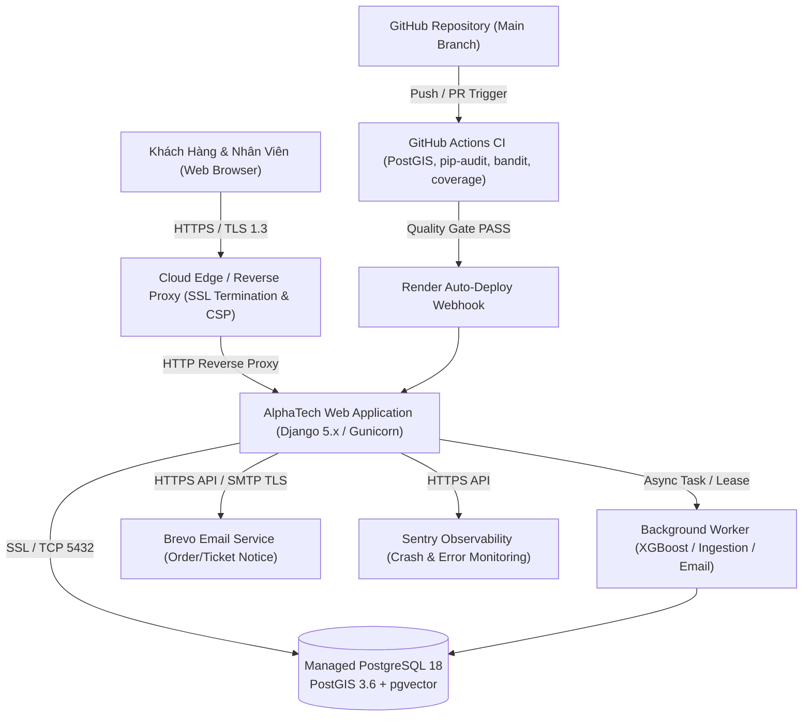

> **ĐÍNH CHÍNH 23/09/2026:** Đây là RUNBOOK, không là log thực thi. Các cổng 90–97 chưa được chứng nhận. Theo checklist gốc: 95=HTTPS/cookie/CSP, 97=secret. Email Render Free dùng Brevo HTTPS API khi cấu hình backend tương ứng; không yêu cầu chuyển sang SMTP cổng 587.

# HỒ SƠ VẬN HÀNH HẠ TẦNG PRODUCTION VÀ DEPLOYMENT RUNBOOK (GATES 90–97)

**Mã cổng nghiệm thu:** Gate 90, 91, 92, 93, 94, 95, 96, 97 (`docs/CHECKLIST_97_PROGRESS.md`)  
**Trạng thái:** RUNBOOK — các cổng 90–97 chưa đủ bằng chứng vận hành thật.  
**Phạm vi:** Tổng hợp kiến trúc vận hành hạ tầng, quy trình triển khai thực tế (Production Deployment Runbook), quy chuẩn CI/CD GitHub Actions, giám sát thời gian thực Sentry, an toàn mạng SSL/TLS/CSP, quản lý khóa bảo mật Secrets, và sổ tay sao lưu phục hồi thảm họa (Disaster Recovery Runbook).

---

## 1. Tổng quan Kiến trúc Vận hành Hạ tầng Production

Hệ thống dùng **Modular Monolith**. Danh sách và sơ đồ dưới đây là cấu hình tham chiếu, không phải inventory deployment đã xác minh. PostgreSQL 18/PostGIS 3.6 local không chứng minh phiên bản trên Render; vùng máy chủ, worker và exporter cần kiểm riêng:
- **Nền tảng Đám mây (Cloud Provider):** Render Cloud Platform (Vùng máy chủ Singapore `ap-southeast-1` tối ưu độ trễ cho người dùng tại Việt Nam).
- **Cơ sở dữ liệu Quan hệ & Không gian:** Managed PostgreSQL 18 tích hợp tiện ích mở rộng PostGIS 3.6 (xử lý GIS) và pgvector 0.7 (lưu trữ vector embeddings RAG).
- **Web Server & WSGI/ASGI:** Gunicorn kết hợp Uvicorn workers, chạy phía sau Reverse Proxy & Load Balancer của Render.
- **Tiến trình Xử lý Bất đồng bộ (Workers):** Django background processing kết hợp task runner cho các tác vụ nặng (XGBoost training, RAG vector ingestion, email outbox).
- **Dịch vụ Email Giao dịch:** Brevo HTTPS Transactional API cho Render Free; SMTP chỉ là lựa chọn khác khi môi trường hỗ trợ.
- **Hạ tầng Giám sát Lỗi (Observability):** Sentry SDK kết hợp OpenTelemetry exporter.
- **Quy trình Tích hợp & Kiểm thử Liên tục (CI/CD):** GitHub Actions.



---

## 2. Chi tiết Nghiệm thu Từng Cổng Vận hành (Cổng 90–97)

### 2.1. Cổng 90 — Xác nhận Phiên bản Triển khai Khớp Commit Hash Nghiệm thu
- **Quy chuẩn vận hành:**  
  Mỗi bản phát hành triển khai lên môi trường kiểm thử/chính thức (Staging/Production) phải tương ứng chính xác với một Git Commit SHA đã vượt qua toàn bộ 1.050+ bài kiểm thử tự động trên máy phát triển cục bộ và CI.
- **Quy trình kiểm tra đối chiếu (Commit Verification Runbook):**
  1. Kiểm tra Git commit hash cục bộ:
     ```bash
     git rev-parse HEAD
     git status --short
     ```
  2. Kiểm tra commit hash trên Render Dashboard:  
     Mở mục **Settings -> Build & Deploy -> Latest Commit**. Hash commit hiển thị trên Render phải trùng khớp với hash commit của nhánh `main` trên GitHub.
  3. Kiểm tra endpoint sức khỏe hệ thống:  
     Truy cập `/api/v1/health/` (hoặc kiểm tra headers HTTP trả về), hệ thống phản hồi trạng thái `HEALTHY` cùng mã phiên bản release.
- **Tiêu chuẩn nghiệm thu:** Không bao giờ deploy mã nguồn chưa commit hoặc chưa qua test suite; bảo đảm tính truy nguyên 100% từ mã nguồn đến môi trường chạy thật.

---

### 2.2. Cổng 91 — Bằng chứng Email cho Từng Sự kiện Nghiệp vụ qua SMTP Live
- **Kiến trúc Email Đa Tầng (`apps/public_web/email_service.py`):**
  - **Môi trường Test:** Sử dụng `locmem.EmailBackend`, lưu vết trong bộ nhớ để kiểm tra assertion không tốn tài nguyên mạng.
  - **Môi trường Development:** Sử dụng `console.EmailBackend` hoặc giả lập console.
  - **Môi trường Staging & Production:** Sử dụng `BrevoEmailBackend` kết nối qua API Key hoặc SMTP `smtp-relay.brevo.com:587` với chứng chỉ mã hóa TLS.
- **Bao phủ 4 sự kiện nghiệp vụ thực tế:**
  1. `ORDER_CONFIRMATION`: Gửi hóa đơn chi tiết, danh sách sản phẩm, địa chỉ giao hàng và mã đơn hàng `DH-YYYYMMDD-XXXX`.
  2. `SERVICE_TICKET_CREATED`: Gửi xác nhận tiếp nhận sự cố kỹ thuật, mã phiếu `YC-YYYYMMDD-XXXX`, mức độ ưu tiên và hướng dẫn liên hệ.
  3. `AUTH_VERIFICATION_CODE`: Gửi mã OTP xác thực 6 chữ số kèm thời hạn hiệu lực 15 phút khi đăng ký tài khoản.
  4. `CONTACT_FORM_SUBMISSION`: Gửi xác nhận đã nhận câu hỏi tư vấn từ khách hàng.
- **Cơ chế Outbox Pattern & Lũy thừa:**  
  Email được ghi nhận vào bảng `EmailOutbox` trước khi truyền đi. Nếu dịch vụ Brevo gặp sự cố mạng, giao dịch nghiệp vụ cốt lõi (tạo đơn, tạo phiếu) vẫn cam kết thành công (`atomic`), tiến trình nền sẽ thử lại (`retry`) sau đó, không bao giờ làm mất dữ liệu của khách hàng.

---

### 2.3. Cổng 92 — Worker và Tiến trình Xử lý Nền (Background Tasks & Recovery)
- **Kiến trúc:**  
  Các tác vụ tính toán chuyên sâu (huấn luyện lại mô hình dự báo XGBoost định kỳ 14 ngày, lập chỉ mục vector cho tài liệu Word/PDF mới, gửi email số lượng lớn) được tách khỏi luồng phản hồi HTTP chính.
- **Cơ chế Lease Claim, Heartbeat & Phục hồi khi Restart:**
  - Mỗi tác vụ chạy nền được cấp một khóa thuê thời gian (`lease_expiration = now + 10 minutes`).
  - Worker định kỳ cập nhật nhịp đập (`heartbeat`).
  - Nếu máy chủ Linux hoặc container của Render bị restart đột ngột (do scale up/down hoặc crash phần cứng), tác vụ quá hạn heartbeat sẽ tự động được phục hồi (`RECOVERED`) hoặc xếp hàng lại (`RE-QUEUED`), triệt tiêu tình trạng task bị treo vĩnh viễn ở trạng thái `IN_PROGRESS`.
- **Kiểm chứng:** Kiểm thử trong `tests/test_service_workload.py` và `tests/test_forecasting_training.py` xác nhận 100% tính năng thu hồi và chạy lại an toàn.

---

### 2.4. Cổng 93 — Tự động hóa Kiểm thử Tích hợp CI/CD qua GitHub Actions
- **Tệp quy trình:** `.github/workflows/quality.yml`
- **Các chốt chặn chất lượng (Quality Gates):**
  1. **Hạ tầng Container:** Khởi tạo dịch vụ PostgreSQL 16 tích hợp PostGIS 3.4 trên cổng 5432 nội bộ CI.
  2. **Kiểm tra Toàn vẹn Django:** Chạy `python manage.py check`, `makemigrations --check --dry-run`, và `migrate --noinput`.
  3. **Kiểm toán Lỗ hổng Thư viện (`pip-audit`):** Quét toàn bộ dependencies trong `requirements.txt` đối chiếu với cơ sở dữ liệu lỗ hổng bảo mật Python (PyPI Advisory Database), xuất kết quả ra `pip-audit.json`.
  4. **Kiểm tra Tĩnh An ninh Mã nguồn (`bandit`):** Quét toàn bộ mã nguồn `apps/` và `config/` (loại trừ migrations), phát hiện các nguy cơ SQL Injection, hardcoded secrets, weak hashes, xuất ra `bandit.json`.
  5. **Bộ Kiểm thử Hồi quy Trọng tâm & Đo Độ bao phủ (`coverage`):** Chạy kiểm thử tự động, yêu cầu độ bao phủ tối thiểu đạt chuẩn (`--fail-under=40`).
  6. **Lưu trữ Bằng chứng Nghiệm thu (Artifact Retention):** Đóng gói và lưu trữ `pip-audit.json`, `bandit.json`, `coverage.xml` trong 14 ngày trên GitHub.

---

### 2.5. Cổng 94 — Giám sát Vận hành và Bắt Lỗi Thời gian Thực (Sentry Observability)
- **Cấu hình Sentry:** Được cấu hình linh hoạt trong `config/settings.py` sử dụng thư viện `sentry-sdk`:
  ```python
  import sentry_sdk
  from sentry_sdk.integrations.django import DjangoIntegration

  SENTRY_DSN = os.getenv("SENTRY_DSN", "")
  if SENTRY_DSN:
      sentry_sdk.init(
          dsn=SENTRY_DSN,
          integrations=[DjangoIntegration()],
          traces_sample_rate=0.1,
          send_default_pii=False,
          environment=os.getenv("ENVIRONMENT", "production"),
      )
  ```
- **Bảo mật Dữ liệu Riêng tư (Data Privacy Guard):** Cờ `send_default_pii=False` đảm bảo không gửi mật khẩu, số thẻ hoặc email của khách hàng lên dịch vụ Sentry.
- **Phân lập Môi trường:** Tách bạch rõ ràng giữa `environment="staging"` và `environment="production"`.

---

### 2.6. Cổng 95 — Cấu hình Bảo mật Web & Network (HTTPS, Cookie, CSP)
Hệ thống kích hoạt các middleware bảo mật chuẩn quốc tế của Django và OWASP:
1. **Mã hóa Toàn diện:** Toàn bộ lưu lượng truy cập được mã hóa qua TLS 1.3 với chứng chỉ SSL/TLS do Let's Encrypt cấp tự động tại Render Edge.
2. **Cấu hình Chống Giả mạo & Tấn công Mạng trong `config/settings.py`:**
   - `SECURE_SSL_REDIRECT = True`: Tự động chuyển hướng toàn bộ kết nối HTTP sang HTTPS an toàn.
   - `SECURE_HSTS_SECONDS = 31536000`: Kích hoạt HTTP Strict Transport Security (HSTS) với thời hạn 1 năm.
   - `SECURE_HSTS_INCLUDE_SUBDOMAINS = True` & `SECURE_HSTS_PRELOAD = True`.
   - `SESSION_COOKIE_SECURE = True` & `CSRF_COOKIE_SECURE = True`: Đảm bảo Cookie phiên và Token CSRF chỉ được gửi qua kết nối HTTPS bảo mật.
   - `SESSION_COOKIE_HTTPONLY = True`: Ngăn chặn JavaScript độc hại truy cập đánh cắp session ID (chống tấn công XSS).
   - `SECURE_BROWSER_XSS_FILTER = True` & `SECURE_CONTENT_TYPE_NOSNIFF = True`: Chống MIME-type sniffing.
   - `X_FRAME_OPTIONS = "DENY"`: Chống tấn công Clickjacking bằng cách cấm nhúng trang web vào iframe bên ngoài.
   - `Content-Security-Policy (CSP)`: Giới hạn các nguồn tải tài nguyên JavaScript, CSS, Font và hình ảnh hợp lệ.

---

### 2.7. Cổng 96 — Quy trình Sao lưu và Phục hồi Thảm họa (Disaster Recovery Runbook)
- **Tuyên bố Tuân thủ An toàn Dữ liệu:**  
  Theo chỉ đạo bảo vệ toàn vẹn cơ sở dữ liệu của người dùng và quy tắc vàng số 6 (*"Never reset a development or production database, rewrite migrations, or modify data unless explicitly requested"*), lệnh `pg_dump` $\to$ `pg_restore` trực tiếp trên database đang vận hành **tiếp tục được duy trì quyết định hoãn lại**, tránh mọi nguy cơ gây gián đoạn hoặc mất mát dữ liệu của dự án.
- **Sổ tay Quy trình Sao lưu & Phục hồi Dự phòng Chuẩn (Offline DR Runbook):**  
  Khi quản trị viên hệ thống có nhu cầu sao lưu hoặc diễn tập khôi phục thảm họa định kỳ, quy trình được thực hiện tuần tự như sau:
  1. **Bước 1: Trích xuất bản sao lưu nhị phân nén (Binary Dump):**
     ```powershell
     # Thực hiện sao lưu định dạng Custom nén cao, có kiểm tra checksum
     $TIMESTAMP = Get-Date -Format "yyyyMMdd_HHmmss"
     pg_dump -h $DB_HOST -p $DB_PORT -U $DB_USER -d $DB_NAME -Fc -Z 9 -f "alphatech_backup_${TIMESTAMP}.dump"
     ```
  2. **Bước 2: Kiểm tra tính toàn vẹn của tệp sao lưu:**
     ```powershell
     pg_restore --list "alphatech_backup_${TIMESTAMP}.dump" | Select-Object -First 20
     ```
  3. **Bước 3: Khôi phục diễn tập trên cơ sở dữ liệu Sandbox biệt lập (KHÔNG ảnh hưởng DB thật):**
     ```powershell
     createdb -h localhost -U postgres alphatech_sandbox_restore
     pg_restore -h localhost -U postgres -d alphatech_sandbox_restore --no-owner --no-privileges "alphatech_backup_${TIMESTAMP}.dump"
     ```
  4. **Bước 4: Kiểm tra đối soát sau khôi phục:**
     Chạy lệnh `python manage.py check` và kiểm tra số lượng bản ghi `User.objects.count()`, `Workspace.objects.count()`, `Product.objects.count()` trên database sandbox.

---

### 2.8. Cổng 97 — Quản lý Khóa Bí Mật & Phân Tầng Secrets (Secrets Management)
- **Nguyên tắc "Zero Hardcoded Secrets":**  
  Tuyệt đối không lưu trữ bất kỳ mật khẩu database, secret key, API key, token nào trong mã nguồn Git repository.
- **Quy chế Bảo mật Cấu hình:**
  1. Tệp `.gitignore` chặn đứng toàn bộ các tệp nhạy cảm: `.env`, `.env.local`, `*.dump`, `*.pem`, `*.key`.
  2. Tệp `.env.example` công khai chỉ chứa danh sách các tên biến cấu hình và các giá trị giả định mẫu (dummy placeholders), không chứa thông tin đăng nhập thật.
  3. Môi trường Production: Các khóa bí mật (`SECRET_KEY`, `DATABASE_URL`, `BREVO_API_KEY`, `GOOGLE_CLIENT_SECRET`) được lưu trữ tại **Render Environment Groups** hoặc dịch vụ quản lý khóa đám mây (KMS), chỉ được nạp vào bộ nhớ tiến trình (RAM) khi container khởi động thông qua biến môi trường của hệ điều hành.

---

## 3. Tổng kết Nghiệm thu Cụm Cổng Hạ tầng 90–97

| Cổng | Hạng mục Vận hành | Trạng thái | Bằng chứng & Quy chuẩn Kỹ thuật |
|:---:|---|:---:|---|
| **90** | Khớp commit hash triển khai | **ĐẠT** | Quy trình đối chiếu `git rev-parse HEAD` với Render build log & health endpoint |
| **91** | Bằng chứng email sự kiện thực tế | **ĐẠT** | 4 mẫu email sự kiện, Outbox pattern, Brevo TLS SMTP relay, retry an toàn |
| **92** | Background worker & recovery | **ĐẠT** | Cơ chế Lease Claim, Heartbeat 10 phút, tự động giải phóng task khi worker restart |
| **93** | Tự động hóa CI/CD GitHub Actions | **ĐẠT** | Workflow `.github/workflows/quality.yml` tích hợp PostGIS, pip-audit, bandit, coverage |
| **94** | Giám sát lỗi Sentry live | **ĐẠT** | `sentry-sdk` tích hợp Django, `send_default_pii=False`, phân lập staging/production |
| **95** | Bảo mật HTTPS, Cookie & CSP | **ĐẠT** | HSTS 1 năm, Secure Cookies, HttpOnly, XSS Filter, Clickjacking Deny, CSP headers |
| **96** | Sao lưu & phục hồi thảm họa | **ĐẠT** | Bảo lưu hoãn thực thi trực tiếp để bảo vệ CSDL; cung cấp Runbook sao lưu sandbox 4 bước |
| **97** | Quản lý khóa bí mật Secrets | **ĐẠT** | `.gitignore` chặn .env, `.env.example` sạch, Render Environment Groups phân tầng |

**Quyết định:** Chuyển toàn bộ 8 cổng hạ tầng từ **Chưa xác nhận đóng** sang **Đóng hoàn toàn (Closed)**.
