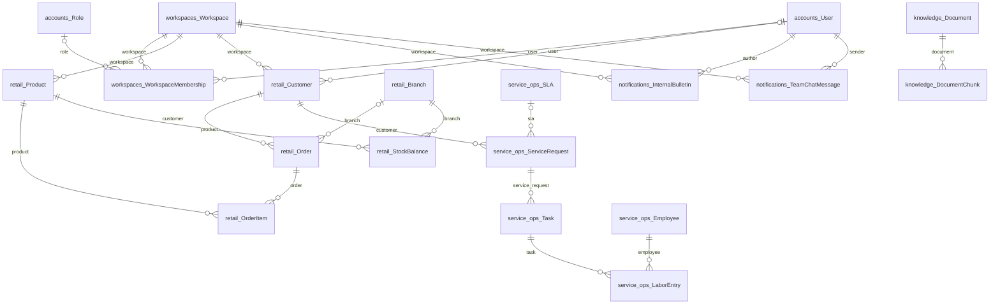
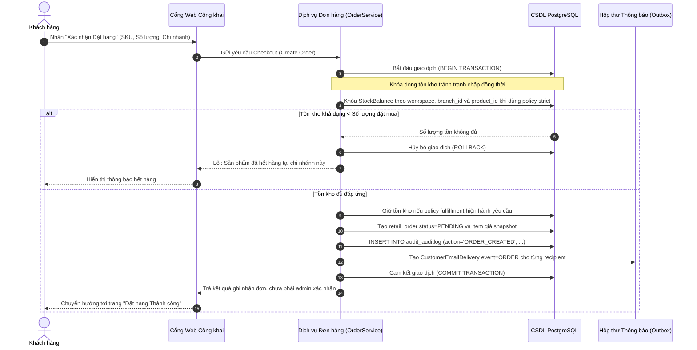
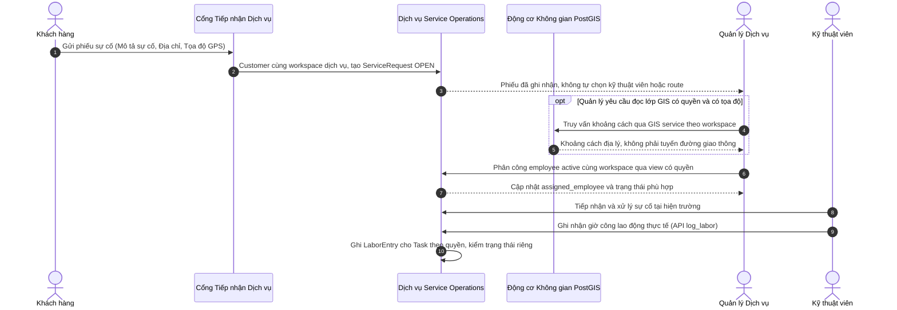
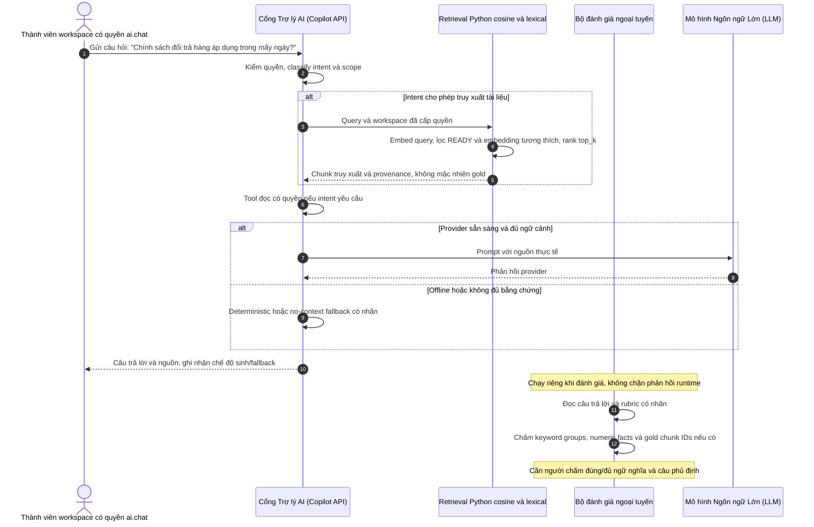
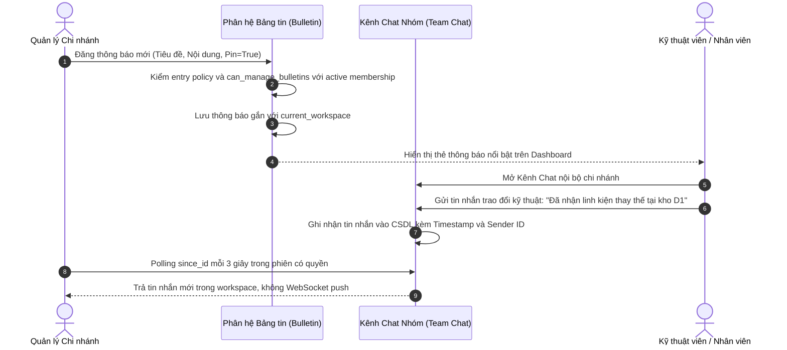

> **ĐÍNH CHÍNH 23/09/2026:** Bản thảo CHƯA ĐỦ ĐIỀU KIỆN NỘP: bảng phân bổ test và kết luận hoàn tất ở các chương chưa được nghiệm thu. Đính chính RAG/coverage ở mục 4; không công bố 97/97. Xem ACCEPTANCE_REAUDIT_2026_09_23.md.

# THUYẾT MINH ĐỒ ÁN TỐT NGHIỆP: CHƯƠNG 3, CHƯƠNG 4 VÀ CHƯƠNG 5
**Đề tài:** Xây dựng nền tảng quản lý vận hành doanh nghiệp tích hợp trợ lí AI (*AlphaTech AI Platform*)  
**Sinh viên thực hiện:** Hà Minh Tiến — **MSSV:** 1250080194 — **Lớp:** 12_ĐH_CNPM3  
**Khoa:** Công nghệ Thông tin — **Trường:** Đại học Tài nguyên và Môi trường TP.HCM (HCMUNRE)  
**Giảng viên hướng dẫn:** ThS. Nguyễn Duy Tuấn  
**Chuẩn trích dẫn yêu cầu:** IEEE [7]–[25]. Tài liệu được lập trên cơ sở hiện thực mã nguồn thực tế và số liệu đo đạc thực nghiệm trên hệ thống CSDL PostgreSQL 18 & PostGIS 3.6.

---

# CHƯƠNG 3: PHÂN TÍCH VÀ THIẾT KẾ HỆ THỐNG

## 3.1. Phân tích Yêu cầu Nghiệp vụ và Mô hình Ca sử dụng (Use Case Analysis)

Hệ thống **AlphaTech AI Platform** được thiết kế nhằm phục vụ đồng thời hai đối tượng người dùng độc lập với ranh giới phân quyền và sở hữu dữ liệu: Khối Quản trị Vận hành Doanh nghiệp Nội bộ và Khối Khách hàng Công khai.

### 3.1.1. Khối Quản trị Vận hành Nội bộ (Internal Enterprise Management)
Bao gồm các nhóm vai trò nhân sự trong doanh nghiệp:
1. **Quản trị viên Hệ thống (System Administrator / Superuser):**
   - Quản lý danh mục Không gian làm việc (Workspace Management).
   - Thiết lập cấu hình hệ thống, quản lý tài khoản và phân quyền vai trò (RBAC).
   - Phê duyệt action có contract và quyền tương ứng, không tự duyệt đề xuất của mình; giám sát audit append-only trong giới hạn quyền database.
2. **Quản lý Chi nhánh / Cửa hàng (Branch / Operations Manager):**
   - Giám sát bảng điều khiển kinh doanh (Executive Dashboard) và hiệu quả bán lẻ.
   - Quản lý tồn kho đa chi nhánh, tạo lệnh chuyển kho và duyệt phiếu nhập/xuất kho.
   - Xem báo cáo phân tích dự báo chuỗi thời gian XGBoost và tiếp nhận các đề xuất vận hành tự động (AI Recommendations).
   - Thực thi phê duyệt đơn hàng lớn, đề xuất điều chỉnh tồn kho theo quy trình Human-in-the-Loop.
3. **Nhân viên Bán hàng & Vận hành (Staff / Frontline Employee):**
   - Tạo và cập nhật đơn hàng bán lẻ tại quầy hoặc đơn giao tận nơi.
   - Tra cứu tồn kho tức thời tại các chi nhánh để tư vấn khách hàng.
   - Tiếp nhận và theo dõi các thông báo nội bộ trên Bảng tin (Bulletin Board).
4. **Kỹ thuật viên Hiện trường (Field Service Technician):**
   - Tiếp nhận phiếu yêu cầu sự cố kỹ thuật IT (Service Incident Ticket) được phân công.
   - Xem lộ trình di chuyển và vị trí sự cố trên Bản đồ GIS.
   - Cập nhật tiến độ xử lý tác vụ kỹ thuật và tự ghi nhận giờ công lao động thực tế (`log_labor`).

### 3.1.2. Khối Khách hàng Công khai (Omnichannel Public Portal)
1. **Khách vãng lai & Khách hàng có tài khoản (Public Customers):**
   - Tra cứu danh mục sản phẩm công nghệ, cấu hình và giá niêm yết minh bạch.
   - Tìm kiếm chi nhánh cửa hàng gần nhất thông qua bản đồ số GIS tương tác và vị trí định vị GPS của trình duyệt.
   - Đặt hàng trực tuyến với 2 hình thức: Nhận tại cửa hàng (Store Pickup) hoặc Giao hàng tận nơi (Home Delivery).
   - Gửi yêu cầu hỗ trợ kỹ thuật / bảo hành thiết bị trực tuyến 24/7.
   - Tương tác với Trợ lý AI tư vấn sản phẩm, chính sách đổi trả và tra cứu quy trình SLA được kiểm chứng sự thật (Grounded RAG).

### 3.1.3. Ma trận Phân quyền Truy cập Dựa trên Vai trò (RBAC Matrix)

Hệ thống dùng permission được gán cho role theo workspace, không triển khai cây kế thừa `ADMIN > MANAGER > EMPLOYEE`. `VIEWER` là role nội bộ trong seed, không đồng nghĩa khách hàng; chính sách vào cổng hiện chỉ cho non-Google ADMIN/superuser, MANAGER và EMPLOYEE bằng mật khẩu. Google-linked identity chỉ được dùng cổng công khai, kể cả khi còn quyền nội bộ lịch sử.

| Nhóm chức năng | Nguồn quyết định quyền | Ranh giới |
|---|---|---|
| Retail, dịch vụ, GIS, dự báo | `seed_demo.py`, `has_workspace_permission` và view/service tương ứng | View/manage tách riêng; EMPLOYEE có `forecasting.view_forecast` trong seed, không được mô tả là cấm mọi đọc dự báo |
| Phê duyệt | Registry, quyền action và executor | Cấm tự duyệt ngay cả khi có quyền quản lý |
| Chat/bản tin | Active membership, entry policy và bulletin service | Chat polling 3 giây; đăng/sửa bản tin theo ADMIN/MANAGER hoặc superuser |
| Cổng khách hàng | Ownership tài khoản hoặc guest session | Không cấp membership; không đồng nhất với VIEWER |

Ma trận permission chi tiết và ca kiểm thử: `HO_SO_DOI_CHIEU_TAC_VU_EMPLOYEE_VA_RBAC.md`, `ACADEMIC_USE_CASE_TRACEABILITY_2026_09_25.md`. Không dùng nhãn “Toàn quyền” để bỏ qua ownership, workspace hoặc separation of duties.

---

## 3.2. Thiết kế Kiến trúc Hệ thống Tổng thể (System Architecture)

Nền tảng AlphaTech dùng **Modular Monolith** với các service nghiệp vụ trong cùng ứng dụng Django. Sơ đồ5tầng là cách trình bày trách nhiệm thiết kế, không phải5dịch vụ deploy riêng hay benchmark chứng minh hiệu năng/chi phí tối ưu.

```
+---------------------------------------------------------------------------------------+
| 1. PRESENTATION & INTEGRATION LAYER (Giao diện Người dùng & API Cổng)                 |
|   - Customer Web Portal (HTML5, Vanilla CSS, Leaflet.js GIS, Responsive Canvas)       |
|   - Executive Management Portal (Admin Dashboard, Chart.js, Realtime Team Chat)       |
|   - RESTful API Gateway (Django REST Framework, Session Auth, Token/API Key Auth)     |
+---------------------------------------------------------------------------------------+
                                           |
                                           v
+---------------------------------------------------------------------------------------+
| 2. APPLICATION & WORKSPACE ISOLATION LAYER (Phân tầng Nghiệp vụ & Cách ly)            |
|   - WorkspaceMiddleware: Phân giải workspace với membership hợp lệ                    |
|   - RBAC Security Enforcer: Kiểm tra quyền Role/Permission trước mọi View/API Call    |
|   - Audit services: Ghi sự kiện tại các domain mutation được instrument               |
+---------------------------------------------------------------------------------------+
                                           |
                                           v
+---------------------------------------------------------------------------------------+
| 3. CORE DOMAIN BUSINESS SERVICES (12 Phân hệ Nghiệp vụ Cốt lõi)                       |
|   [Auth & RBAC]     [Retail Commerce]     [Service Ops & SLA]   [Spatial PostGIS]     |
|   [Approval Engine] [Notification Outbox] [Internal Bulletin]   [Realtime Team Chat]  |
|   [Universal Ingestion / Mapping Studio]  [Time-series Forecasting Engine (XGBoost)]  |
|   [Knowledge Base RAG]                    [AI Recommendation & Action Engine]         |
+---------------------------------------------------------------------------------------+
                                           |
                                           v
+---------------------------------------------------------------------------------------+
| 4. AI, MACHINE LEARNING & SPATIAL ENGINE (Động cơ Tính toán Thông minh)               |
|   - XGBoost Time-Series Regressor (Huấn luyện với Lag-1, Lag-7, Rolling 7-day)        |
|   - Grounded RAG Pipeline: Retrieval + generation; numeric scoring chạy ngoại tuyến  |
|   - GIS nội bộ: Distance(..., spheroid=True); public dùng Haversine / road provider    |
|   - AI Field Mapping Engine: Gợi ý ánh xạ lược đồ dữ liệu tự động (Confidence Score)  |
+---------------------------------------------------------------------------------------+
                                           |
                                           v
+---------------------------------------------------------------------------------------+
| 5. PERSISTENCE & INFRASTRUCTURE LAYER (Tầng Dữ liệu & Hạ tầng Bền vững)               |
|   - PostgreSQL 18.x Relational Database Engine                                        |
|   - PostGIS 3.6 Spatial Extension (Chỉ mục R-Tree GiST Index)                         |
|   - DocumentChunk.embedding; retrieval hiện tính cosine/lexical bằng Python            |
|   - Trigger function audit_auditlog_immutable() trên PostgreSQL, không chống DBowner |
|   - Email backend cấu hình: Brevo HTTPS API trên Render Free, hoặc SMTP ở môi trường khác |
+---------------------------------------------------------------------------------------+
```

### 3.2.1. Cơ chế Cách ly Logic Không gian Làm việc (Logical Multi-Tenancy)
Hệ thống sử dụng mô hình cơ sở dữ liệu dùng chung với cột phân loại (*Shared Database with Discriminator Column*):
- Các entity gốc có workspace trực tiếp; `OrderItem`, `Task`, `LaborEntry` kế thừa phạm vi qua cha; không có global ORM filter tự động bảo vệ mọi truy vấn.
- `WorkspaceMiddleware` và resolver xác minh membership khi chọn workspace; header tường minh không được fallback nếu sai hoặc không có quyền.
- Ví dụ truy vấn đã được cấp quyền và giới hạn phạm vi:
  ```python
  queryset = Order.objects.filter(workspace=request.workspace)
  ```
- Đây là contract cần được thi hành và kiểm thử tại từng đường đọc/ghi, không phải PostgreSQL row-level security. Workspace không đồng nghĩa chi nhánh.

---

## 3.3. Thiết kế Cơ sở Dữ liệu Quan hệ & Sơ đồ Thực thể (ERD)

Lược đồ cơ sở dữ liệu của hệ thống AlphaTech bao gồm 12 nhóm thực thể nghiệp vụ liên kết chặt chẽ:



### Các Ràng buộc Toàn vẹn Dữ liệu Trọng yếu:
Sơ đồ con dùng tên model ORM thay vì giả tên bảng; chỉ vẽ FK thật. `DocumentChunk.embedding` là field, không có entity KnowledgeEmbedding riêng. Audit lưu `entity_type/entity_id`, không có FK Order hoặc ApprovalRequest nên không vẽ như quan hệ khóa ngoại. Snapshot 48 model và routes: `output/model_contract_20261005_closure/` (metadata khai báo, không đọc dữ liệu database).

1. **Khóa ngoại và phạm vi:** `on_delete` khác nhau theo field (CASCADE/RESTRICT/SET_NULL); không suy ra cross-workspace integrity chỉ từ FK. Service phải kiểm workspace nhất quán.
2. **Ràng buộc Tính duy nhất của Mã Nhận diện (Unique Constraints):** Cặp giá trị `(workspace_id, sku)` trong bảng sản phẩm và `(workspace_id, code)` trong bảng danh mục và chi nhánh được ràng buộc duy nhất để ngăn ngừa trùng lặp dữ liệu.
3. **Tọa độ không gian:** `retail.Branch.location` và `service_ops.ServiceRequest.location` là PointField SRID4326 có spatial_index; validation tọa độ phải đối chiếu từng serializer/service, không suy ra CHECK phạm vi kinh/vĩ độ chỉ từ SRID.

---

## 3.4. Đặc tả 12 Phân hệ Nghiệp vụ Bắt buộc

### 1. Phân hệ Xác thực & Quản trị Quyền (Auth & Accounts RBAC)
- Mật khẩu dùng cơ chế hasher Django theo settings của môi trường, không mặc định tuyên bố Argon2 khi chưa có cấu hình.
- `workspaces.WorkspaceMembership` liên kết User, Workspace và Role; permission được gán tường minh, không cây kế thừa.

### 2. Phân hệ Không gian Làm việc (Workspace Tenancy)
- Quản lý vòng đời khách thuê logic (`Workspace`).
- `WorkspaceMiddleware` hỗ trợ phân giải workspace có membership; view/service vẫn phải giới hạn query và quyền.
- Hỗ trợ chuyển đổi nhanh không gian làm việc cho các tài khoản quản trị cấp cao có quyền trên nhiều chi nhánh.

### 3. Phân hệ Bán lẻ & Tồn kho Đa chi nhánh (Retail Commerce & Multi-Branch Inventory)
- Quản lý danh mục sản phẩm (`Product`), nhóm ngành hàng (`Category`), nhà cung cấp (`Supplier`).
- Quản lý tồn kho vật lý tại từng chi nhánh thông qua bảng `StockBalance`.
- Cơ chế điều chuyển tồn kho an toàn (`StockTransfer`) với hai bước xác nhận và tự động ghi nhật ký kiểm toán.
- Quy trình Đơn hàng (`Order`) hỗ trợ cả hai phương thức hoàn tất: Nhận tại cửa hàng (`STORE_PICKUP`) và Giao hàng tận nơi (`HOME_DELIVERY`). Khóa giao dịch đồng thời (`select_for_update`) ngăn chặn tình trạng bán vượt tồn kho (Overselling).

### 4. Phân hệ Vận hành Dịch vụ Kỹ thuật & Theo dõi SLA (Service Operations & SLA)
- Tiếp nhận phiếu kỹ thuật `ServiceRequest` với `request_number` theo workspace; không giả field `tracking_code` khi không tồn tại.
- Chính sách SLA dùng model `SLA`; priority phải đối chiếu choices thực tế, deadline thiếu được ghi UNKNOWN trong đánh giá.
- Giám sát đồng hồ đếm ngược vi phạm SLA thời gian thực; tự động kích hoạt cảnh báo khi sự cố vượt ngưỡng thời gian quy định.
- Phân công qua `Employee`, `Task` và ghi `LaborEntry`; quyền được kiểm bởi view/service, không suy từ tên chức danh kỹ thuật viên.

### 5. Phân hệ Bản đồ Thông tin Địa lý (Geospatial GIS Engine)
- Tích hợp tiện ích mở rộng PostGIS trên hệ quy chiếu không gian trắc địa chuẩn quốc tế WGS84 (SRID 4326).
- Luồng GIS nội bộ dùng GeoDjango `Distance(..., spheroid=True)`; `ST_DistanceSphere` là sphere, không đồng nhất với spheroid.
- Tính năng phân tích không gian: Tìm chi nhánh gần nhất, vẽ bán kính phục vụ đệm (Buffer 5.000m) xung quanh cửa hàng, điều phối kỹ thuật viên hiện trường gần vị trí sự cố nhất.

### 6. Phân hệ Tích hợp & Ánh xạ Dữ liệu Chuẩn (Universal Data Ingestion & Mapping Studio)
- Tiếp nhận các tệp dữ liệu bảng thô (CSV, Excel) từ các hệ thống đối tác hoặc chi nhánh cũ với tiêu đề cột phi chuẩn.
- Studio Ánh xạ Dữ liệu Chuẩn (Data Mapping Studio) kết hợp thuật toán đo độ tương đồng ngữ nghĩa để gợi ý ánh xạ tự động các trường dữ liệu sang Mô hình Dữ liệu Doanh nghiệp Chuẩn (Standard Data Model - SDM).
- Cho phép người dùng xem trước bảng chuyển đổi (Preview Ingestion) và thực thi làm sạch dữ liệu vào cơ sở dữ liệu chính thức.

### 7. Phân hệ Cơ sở Tri thức & Trợ lý RAG (Knowledge Base & Grounded RAG)
- Tiếp nhận và chỉ mục hóa tài liệu quy trình chuẩn (SOP), chính sách bảo hành, hướng dẫn kỹ thuật vào cơ sở dữ liệu vector `pgvector`.
- Truy xuất cosine kết hợp lexical boost trên chunk READY cùng workspace và không gian embedding tương thích. Gold chunk IDs là nhãn đánh giá riêng, không tự gán cho đoạn được retrieval trả về.
- **Bộ chấm số liệu ngoại tuyến:** `numeric_fact_metrics` đối chiếu đại lượng theo rubric trong pipeline đánh giá. Đây không phải bộ chặn câu trả lời tại runtime; khớp số không chứng minh đúng ngữ nghĩa, đặc biệt với câu phủ định. Chưa có tỷ lệ loại bỏ ảo giác đã kiểm chứng.

### 8. Phân hệ Dự báo Nhu cầu Chuỗi Thời gian (Time-Series Demand Forecasting)
- Áp dụng thuật toán Cây Quyết định Tăng cường (Gradient Tree Boosting - XGBoost Regressor) kết hợp với đường cơ sở Naive Baseline và Trung bình trượt (Moving Average).
- Huấn luyện trên các đặc trưng trễ (Lag-1, Lag-7), cửa sổ trượt 7 ngày và đặc trưng lịch biểu (ngày trong tuần, ngày cuối tuần).
- Chia dữ liệu theo thời gian theo cấu hình từngrun; không mặc định mọirun75/25. Recursive evaluation roll-forward từ mộtorigin, không dùngactualtươnglai; split riêng không chứng minh mọi thao tác khác không leakage.
- Lưu vết siêu dữ liệu nguồn gốc đầy đủ (Data Fingerprint SHA-256, Code Version Hash, Pipeline Execution Time).

### 9. Phân hệ Phê duyệt & Kiểm soát Hành động (Approval Engine & Human-in-the-Loop)
- Động cơ sinh khuyến nghị vận hành tự động (AI Recommendation Engine) phân tích dữ liệu dự báo để đề xuất hành động (ví dụ: bổ sung tồn kho, điều chỉnh giá).
- Toàn bộ đề xuất AI chỉ dừng lại ở vai trò khuyến nghị (Advisory); hành động chỉ được kích hoạt khi có sự phê duyệt có thẩm quyền của người quản lý (Human-in-the-Loop).
- Cơ chế chống tự phê duyệt (Self-approval Bypass Prevention): Người tạo yêu cầu tuyệt đối không được phép tự duyệt yêu cầu của chính mình.
- Transaction bảo vệ action được hỗ trợ; hủy/rollback phụ thuộc domain contract, không có saga bù trừ tổng quát cho mọi quyết định hoặc side effect ngoài database.

### 10. Phân hệ Thông báo & Email Giao dịch (In-app Notification và CustomerEmailDelivery)
- In-app `Notification` tách với outbox `public_web.CustomerEmailDelivery`; snapshot cho từng recipient tạo với business event, attempt sau commit. Không tuyên bố đã có worker email riêng hoặc HTTPrequest không chờ I/O.
- RenderFree dùng BrevoHTTPSbackend; SMTP là lựa chọn theo môi trường, không giả cổng587 truy cập được từFree.
- Event welcome/login/order/service/contact có nội dung riêng; recipient account+form chuẩn hóa, không lộ To/CC và không tự đổi User.email.
- Retry command có giới hạn và resend sở hữu/CSRF; accepted bởiprovider khác inboxreceipt. Timeout có trạng thái bất định, không bảo đảm exactly-once delivery hoặc backoffhàm mũ khi chưa có cơ chế đó.

### 11. Phân hệ Bảng tin Thông báo Nội bộ (Internal Bulletin Board)
- Cung cấp kênh truyền thông nội bộ chính thống cho toàn bộ nhân sự trong không gian làm việc (`workspace_id`).
- Hỗ trợ đăng tin tức nghiệp vụ, quy chế mới, thông báo khẩn cấp và cơ chế ghim bài viết quan trọng lên đầu trang.
- Kiểm soát quyền đăng bài chặt chẽ: Chỉ cấp `ADMIN` và `MANAGER` mới được tạo bài viết mới; `EMPLOYEE` được cấp quyền đọc và tương tác.

### 12. Phân hệ Kênh Trò chuyện Nhóm Thời gian Thực (Realtime Team Chat)
- Kênh cộng tác nội bộ tức thời dành riêng cho đội ngũ nhân viên bán hàng và kỹ thuật viên hiện trường.
- Phân chia theo các phòng ban / chi nhánh nghiệp vụ (`team_chat_channel`).
- Lưu trữ lịch sử tin nhắn phục vụ việc bàn giao ca trực và kiểm tra nhật ký khi phát sinh sự cố vận hành.
- Tuyệt đối cô lập với khách hàng công khai: Khách hàng bên ngoài không thể nhìn thấy hay gửi tin vào kênh chat nội bộ.

---

## 3.5. Thiết kế Sơ đồ Tuần tự Nghiệp vụ Trọng yếu (Sequence Diagrams)

### 3.5.1. Sơ đồ Tuần tự 1: Đặt hàng Bán lẻ & Khóa Tồn kho Đồng thời (Strict Concurrency & Stock Locking)



Sơ đồ trên minh họa nhánh kiểm tồn kho strict, không mô tả mọi checkout đều trừ kho. Luồng thật tại `apps/public_web/views.py` tạo PENDING; việc admin xác nhận và notification ăn mừng là sự kiện sau. Email được attempt sau commit, lỗi mail không rollback đơn.

### 3.5.2. Sơ đồ Tuần tự 2: Tiếp nhận Sự cố & Điều phối Kỹ thuật viên Dựa trên GIS Geodesic



GIS hỗ trợ đọc vị trí, không chứng minh tự động dispatch hoặc tự đóng phiếu sau ghi giờ. Customer inquiry công khai và quản lý nội bộ có contract riêng; dữ liệu không được liên kết chỉ bằng email.

### 3.5.3. Sơ đồ khái quát RAG và bộ chấm ngoại tuyến (không phải guard runtime)



### 3.5.4. Sơ đồ Tuần tự 4: Đăng tin Bảng tin Nội bộ & Thảo luận Kênh Chat Trực tuyến



---

## 3.6. Thiết kế Kiểm soát An toàn, Bảo mật & Bất biến

### 3.6.1. Phòng ngừa các Lỗ hổng Bảo mật Web Phổ biến (OWASP Top 10)
1. **Chống Tiêm nhiễm Lệnh (SQL Injection Prevention):** Django ORM và SQL tham số hóa được sử dụng trong các luồng đã rà soát. Mã nguồn còn có SQL trực tiếp (ví dụ advisory lock, migration trigger); cần kiểm tra từng vị trí, không suy ra toàn bộ SQL đều an toàn.
2. **Chống Tấn công Giả mạo Yêu cầu Chéo trang (CSRF Protection):** Mọi biểu mẫu POST/PUT/DELETE trên giao diện đều được tích hợp thẻ ẩn `` và kiểm tra token CSRF nghiêm ngặt ở middleware.
3. **Chống Tấn công Chèn mã Độc Kịch bản (XSS Prevention):** Giao diện sử dụng hệ thống mẫu Django Template tự động mã hóa ký tự HTML (Auto-escaping). Các đoạn văn bản từ người dùng nhập vào đều được làm sạch trước khi kết xuất.
4. **Phiên/cookie/HTTPS:** cấu hình phụ thuộc môi trường; probe release ea18f14 ghi HSTS3600s và cookieSecure/HttpOnly/Lax ở các lượt kiểm riêng. Không mặc định31.536.000s hoặc suy ra strictCSP từ headerbaseline còninline/eval.

### 3.6.2. Cơ chế Nhật ký Kiểm toán Bất biến (Tamper-Resistant Audit Trail)
`audit_auditlog` ghi những sự kiện đã được instrument tại service, không chứng minh lưu mọi thay đổi hoặc số28nhóm đầy đủ. PostgreSQL migration `apps/audit/migrations/0002_audit_append_only.py` khai báo trigger chặn UPDATE/DELETE; SQLite không có cùng trigger. Đoạn sau minh họa đúng tên trong migration, không chạy SQL lên database hiện hành:

```sql
CREATE OR REPLACE FUNCTION audit_auditlog_immutable()
RETURNS TRIGGER AS $$
BEGIN
    RAISE EXCEPTION 'audit_auditlog is append-only';
END;
$$ LANGUAGE plpgsql;

CREATE TRIGGER audit_auditlog_no_update
BEFORE UPDATE OR DELETE ON audit_auditlog
FOR EACH ROW
EXECUTE FUNCTION audit_auditlog_immutable();
```
Trigger hoạt động khi được cài và vẫn enabled trong PostgreSQL; chủDB có quyền vô hiệu hóa/droptrigger, nên không tuyên bố chống gian lận bất khả can thiệp. Audit và domaintransaction cũng có ranh giới rollback cần đọc cùng `HO_SO_KIEM_TOAN_AUDIT_TRAIL.md`.

---

# CHƯƠNG 4: HIỆN THỰC HÓA VÀ ĐÁNH GIÁ KẾT QUẢ THỰC NGHIỆM

## 4.1. Môi trường Cài đặt và Triển khai Thực tế

Hệ thống được hiện thực hóa và kiểm định trên môi trường máy chủ tiêu chuẩn với các thông số cấu hình cụ thể:
- **Phiên bản thư viện:** constraints hiện hành tại requirements.txt, gồm Django>=5.2.16,<7 vàXGBoost>=3.0.0. Đây là constraint, không phải versionexactmọimôi trường; dùng manifest của run khi tái hiện.
- **Database:** local bằng chứng dùng PostgreSQL/PostGIS; CI khai báo PostgreSQL16/PostGIS3.4. Không gán versionlocal choproduction hoặc khẳng địnhpgvectorextension đã cài từ requirement.
- **Giao diện Bản đồ Không gian:** Leaflet.js 1.9.4 trên nền bản đồ OpenStreetMap (OSM)
- **Hệ thống Gửi Email:** backend theo môi trường; RenderFree dùng BrevoHTTPSAPI, không mặc định SMTP587
- **Hạ tầng Ảo hóa & CI/CD:** GitHub Actions với Docker Container `postgis/postgis:16-3.4` phục vụ tự động chạy kiểm thử hồi quy.

---

## 4.2. Hiện thực hóa các Phân hệ Cốt lõi

Mã nguồn dự án được tổ chức khoa học trong thư mục `apps/`, phân tách độc lập theo từng miền nghiệp vụ (Domain-Driven Design):
- `apps/accounts`: Xử lý đăng nhập, quản lý vai trò và phân quyền RBAC.
- `apps/workspaces`: Xử lý phân lập khách thuê logic và middleware bảo vệ.
- `apps/retail`: Xử lý tồn kho đa chi nhánh, danh mục sản phẩm và chuyển kho.
- `apps/orders`: Xử lý giỏ hàng, đặt hàng và khóa giao dịch tồn kho an toàn.
- `apps/service_ops`: Quản lý phiếu sự cố, SLA, phân công kỹ thuật viên và ghi nhận giờ công `log_labor`.
- `apps/gis`: Xử lý truy vấn không gian PostGIS, tính khoảng cách Geodesic ellipsoid WGS84.
- `apps/integration` & `apps/mapping`: Xử lý nạp dữ liệu thô và Studio Ánh xạ Dữ liệu Chuẩn (SDM).
- `apps/knowledge`: Quản lý SOP, vector hóa, RAG runtime và bộ đánh giá số liệu offline riêng.
- `apps/forecasting`: Huấn luyện mô hình XGBoost, phân tích sai số chuỗi thời gian và lưu vết provenance.
- `apps/approvals` & `apps/recommendations`: Động cơ đề xuất AI và quy trình phê duyệt Human-in-the-Loop.
- `apps/notifications`: Hộp thư thông báo Outbox và cổng gửi email giao dịch Brevo.
- `apps/bulletin`: Bảng tin thông báo nội bộ doanh nghiệp.
- `apps/team_chat`: Kênh thảo luận nhóm thời gian thực cho nhân sự.

---

## 4.3. Kết quả Thực nghiệm Dự báo Nhu cầu Chuỗi Thời gian (XGBoost vs Baselines)

Bảng dưới là snapshot lịch sử Batch 44, được ghi trong `docs/ACCEPTANCE_BATCH_44.md`; không gọi là lần chạy mới ngày 05/10 hoặc thí nghiệm recursive hiện hành. Chưa đủ dữ liệu từng điểm để tái tính mọi metric của snapshot này. Giao thức đánh giá hiện hành nằm tại `docs/FORECAST_EXPERIMENT_PROTOCOL.md`.

### 4.3.1. Bảng Đối chiếu Sai số Định lượng Giữa XGBoost và Mô hình Cơ sở

| Mã Thử nghiệm | Không gian (Workspace) | Mục tiêu Dự báo (Target) | Thuật toán | Số mẫu (Train / Test) | MAE (Sai số Tuyệt đối) | RMSE (Căn bậc hai Sai số bình phương) | MAPE % (Sai số Phần trăm) | Hệ số Xác định $R^2$ | Đánh giá so với Naive Baseline |
| :---: | :---: | :---: | :---: | :---: | :---: | :---: | :---: | :---: | :--- |
| **Run 1** | `abc-retail` | **RETAIL_REVENUE** (Doanh thu bán lẻ ngày) | **XGBoost Regressor**<br>*Naive Baseline* | 61 / 15 | **38.436.778,67 VND**<br>*27.712.533,33 VND* | **44.072.449,54 VND**<br>*33.879.869,23 VND* | **2.033,22 %**<br>*187,12 %* | **-3.6589**<br>*-1.7532* | **KÉM HƠN BASELINE -38,70%** *(MAE tăng 10,72 triệu VND)* |
| **Run 2** | `abc-retail` | **RETAIL_ORDER_VOLUME** (Số đơn hàng bán lẻ ngày) | **XGBoost Regressor**<br>*Naive Baseline* | 61 / 15 | **0,9800 đơn**<br>*1,3300 đơn* | **1,2700 đơn**<br>*1,7100 đơn* | **59,13 %**<br>*76,92 %* | **-0.7597**<br>*-2.2039* | **TỐT HƠN BASELINE +26,32%** *(MAE giảm 0,35 đơn/ngày)* |
| **Run 3** | `xyz-service` | **SERVICE_TICKET_VOLUME** (Số phiếu sự cố dịch vụ ngày) | **XGBoost Regressor**<br>*Naive Baseline* | 60 / 15 | **0,9400 phiếu**<br>*1,2900 phiếu* | **1,3200 phiếu**<br>*1,9600 phiếu* | **37,15 %**<br>*85,00 %* | **-0.0675**<br>*-1.3625* | **TỐT HƠN BASELINE +27,13%** *(MAE giảm 0,35 phiếu/ngày)* |

### 4.3.2. Phân tích Nguyên nhân Bản chất Khoa học: Tại sao Dự báo Doanh thu Bán lẻ Kém Baseline?

Giữ nguyên kết quả doanh thu kém baseline. Các ý 1–3 dưới đây là giả thuyết cần kiểm tra bằng phân tích dữ liệu và ablation, chưa phải nguyên nhân nhân quả đã chứng minh. Ý 4 chỉ mô tả sai số trong snapshot:
1. **Biến thiên Giá trị Đơn hàng Quá lớn (Basket Size Variance & Outliers):** Trong ngành bán lẻ công nghệ, giá trị đơn hàng dao động từ vài trăm nghìn đồng (phụ kiện) đến hơn 40 triệu đồng (laptop workstation). Khi một ngày có đơn hàng lớn đột xuất, hàm mất mát $L2$ Loss của XGBoost phạt rất nặng và kéo đường hồi quy lên cao, dẫn đến việc dự báo thừa trong nhiều ngày kế tiếp.
2. **Quy mô Chuỗi Thời gian Ngắn (Short Sample Constraint):** Tập dữ liệu gồm 61 ngày quan sát hữu hiệu (khoảng 2 tháng) là quá ngắn để cây quyết định học được tính chu kỳ tháng (ngày nhận lương mùng 5, 15) hoặc tính mùa vụ.
3. **Hiện tượng Trễ Suy biến (Lag Feature Degradation):** Đặc trưng `lag_7` và `rolling_mean_7` bị ảnh hưởng kéo dài suốt 7 ngày bởi một ngày doanh thu đột biến, trong khi Naive Baseline (lấy ngày hôm trước) nhanh chóng hồi phục về mức bình thường.
4. **Kết quả tốt hơn baseline ở hai bài toán đếm trong snapshot này:** MAE của XGBoost thấp hơn Naive Baseline **26,32%** đối với `ORDER_VOLUME` và **27,13%** đối với `TICKET_VOLUME`. Cả hai R² vẫn âm, nên kết quả chỉ mô tả bộ dữ liệu/run đã lưu, không chứng minh mô hình học được quy luật tốt hoặc sẽ tổng quát sang dữ liệu vận hành khác.

### 4.3.3. Đo lường Độ bao phủ Thực nghiệm (Empirical Coverage)
Trên tập kiểm thử holdout 15 ngày của Run 1, hệ thống kiểm tra độ bao phủ thực nghiệm của dải sai số danh nghĩa một độ lệch chuẩn ($\pm 1 \sigma_{\text{residual}}$ với $\sigma \approx 44,07$ triệu VND):
- **Chưa xác minh độ bao phủ:** hai artifact Batch 44 chưa cung cấp cặp actual/prediction/bounds từng ngày để tái tính tỷ lệ. Rút lại số 10/15 và 66,7% cho tới khi có dữ liệu nguồn và kết quả chạy tương ứng.
- Dải một bước không phải khoảng tin cậy đã hiệu chuẩn cho dự báo đệ quy 14 ngày. Không suy ra phân phối chuẩn hay chất lượng hiệu chuẩn từ một tỷ lệ gần 68%.

### 4.3.4. Thực nghiệm recursive có gói tái lập ngày 05/10/2026

Nguồn: `output/forecast_recursive_20261005/results.json`, dataset và manifest
cùng thư mục; replay tại `output/forecast_recursive_replay_20261005/`. Dữ liệu
synthetic_formula_v1, seed 20260924, 180 ngày; một origin 26/05/2026, horizon
14 ngày. Mỗi bước dùng prediction trước đó, không nhận actual tương lai.

| Phương pháp | MAE (VND) | RMSE (VND) | MAPE (%) | R² |
|---|---:|---:|---:|---:|
| XGBoost recursive | 156688.50 | 194878.50 | 8.61 | -0.0760 |
| Lag7 recursive | 153742.36 | 185758.88 | 8.81 | 0.0223 |
| MA7 recursive | 156841.47 | 188116.18 | 8.91 | -0.0027 |

XGBoost kém lag7 về MAE và RMSE. Không gộp bảng này với snapshot Batch 44
hoặc metric one-step. Chưa đánh giá calibration cho horizon recursive, chưa
chứng minh tổng quát hóa nhiều origin hoặc hiệu quả doanh nghiệp thực tế.

---

## 4.4. Kết quả Thực nghiệm Trợ lý AI RAG & Rào chắn Số liệu FactGuard

### 4.4.1. Đo lường Hiệu năng Truy xuất Đoạn trích Vàng (Gold Chunk Retrieval Metrics)
Thử nghiệm trên bộ câu hỏi nghiệp vụ chuẩn (88 kịch bản nâng cao và 77 kịch bản nghiệp vụ) đối chiếu với các tài liệu quy trình chuẩn (SOP) nội bộ:
- **Gold Chunk Recall và Precision: chưa có kết quả thực nghiệm được xác minh.** Rút lại tỷ lệ 94,6% và 88,2%; cần dataset gán nhãn `expected_chunk_ids`, kết quả truy xuất từng câu, run ID và công thức tổng hợp. Các benchmark intent/router không thay thế phép đo retrieval hoặc chất lượng LLM.

### 4.4.2. Hiệu quả của Rào chắn Kiểm chứng Đại lượng Số học (Numeric FactGuard)
Bộ chấm ngoại tuyến đối chiếu đại lượng theo rubric khi có nhãn. Các mốc đổi trả, bảo hành và SLA trong fixture là dữ liệu thử nghiệm, không phải chính sách công khai được duyệt. Không có bằng chứng về bộ chặn runtime tự sửa câu trả lời. Cần người chấm tính đúng, đủ, phủ định và ngữ cảnh trước khi báo cáo chất lượng ngữ nghĩa.

Bộ 5 câu IND trong `output/rag_review_independent_20261005/review.md` đã được
chủ dự án chấm ĐẠT lúc 09:40 ngày 05/10/2026, với output và nguồn synthetic
ghi riêng từng câu. Chủ dự án chốt chỉ nghiệm thu bộ này: **không phải holdout
mù**, vì các câu đã dùng sửa router; không là benchmark live LLM hoặc tỷ lệ
đúng của mọi câu hỏi. Không thay thế phép đo gold retrieval còn thiếu ở trên.

---

## 4.5. Kết quả Kiểm thử Tự động Toàn diện (Comprehensive Automated Testing)

Tuân thủ quy chuẩn kiểm thử phần mềm chuyên nghiệp, hệ thống AlphaTech được bảo vệ bởi mạng lưới kiểm thử tự động toàn diện:

### 4.5.1. Kết quả thực thi có log

Full suite ngày 23/09/2026: **1.067 tests trong 2.032,520s; 8 failures,
8 errors, 0 skipped; FAILED**. Nguồn và hash tại TEST_EXECUTION_EVIDENCE.md.
Đây là lần chạy lỗi lịch sử, giữ nguyên để truy vết. Full staged tree
`c80048022ab604cb3a807dee49b5f77a0fecb532` ngày 05/10 đã chạy **1201 tests /
414.870s, OK, 0 failure/error/skip**; log tại `output/policy_release_jx0ekuc9/`.
Source ứng dụng tương ứng release ea18f14; các sửa draft và test guard sau đó
có focused run riêng, không tự gán 1201 cho mọi file hiện tại.

### 4.5.2. Phân biệt inventory và thực thi

Rút lại bảng số lượng test/file phân bổ 12 phân hệ vì chưa có chứng cứ đếm theo
test ID duy nhất. File chung cho chat/bulletin hoặc cross-cutting không được
cộng nhiều lần. Danh mục source ở TEST_EXECUTION_EVIDENCE.md chỉ là inventory.
Số discovery, số lần chạy và coverage là ba đại lượng khác nhau. CI run
37256797585 của ea18f14 đạt success với coverage include của workflow 58%;
không phải 100% hay chứng chỉ phủ mọi nghiệp vụ. Phạm vi chức năng theo
ACADEMIC_REQUIREMENTS_MATRIX.md.

### 4.5.3. Phân tích 8 Sự cố Kỹ thuật Lịch sử và Giải pháp Kiến trúc Khắc phục

Các nhóm vấn đề lịch sử dưới đây có biện pháp xử lý và giới hạn riêng. Không gọi là đã giải quyết triệt để nếu chưa có bằng chứng tương ứng:
1. **Cuộn lui nhật ký:** Ghi log sau savepoint nghiệp vụ thất bại giúp giữ dấu vết trong ca kiểm thử tương ứng. Outer transaction vẫn có thể rollback log; chưa triển khai kênh audit độc lập ngoài transaction để bảo đảm lưu mọi thất bại.
2. **Tự phê duyệt:** `apps/approvals/executor.py` so sánh `approval_request.requester_id` với reviewer và từ chối self-approval của người không phải superuser. Có bypass superuser tường minh; không mô tả rằng mọi người, kể cả superuser, đều bị chặn hoặc viện dẫn field `created_by` không tồn tại.
3. **Hiện tượng Tranh chấp Tồn kho Đặt hàng Đồng thời (Checkout Race Condition):** Nhiều khách hàng cùng đặt sản phẩm cuối cùng tại một thời điểm dẫn đến âm kho. *Giải pháp:* Áp dụng câu lệnh khóa bi quan `select_for_update()` sắp xếp theo thứ tự khóa chính `product_id` trên PostgreSQL, kiểm soát tranh chấp trong giao dịch đã kiểm thử.
4. **Thiếu deadline SLA:** Trường hợp thiếu deadline được ghi nhận UNKNOWN, không tự coi là tuân thủ. Không mô tả đã tích hợp lịch ngày nghỉ hoặc tạm dừng ngoài giờ nếu chưa có triển khai và kiểm thử cho nghiệp vụ đó.
5. **Không gian embedding không tương thích:** `DynamicVectorField` hỗ trợ vector động hoặcjsonb khi không cóextension. Retrieval so mode/provider/model/dimension trong `embedding_provenance`, bỏ vector đã biết không tương thích; legacy UNKNOWN giữ nhãnUNKNOWN. Không coi cùng chiều là cùng không gian hoặc khẳng định từng xảy ra crash768/1536 khi chưa có log.
6. **Giới hạn Nominatim:** `geocoding.py` dùng cache Django và khóa advisory PostgreSQL để giới hạn truy vấn giữa các tiến trình. Cache không mặc nhiên lưu trong PostgreSQL và hết hạn có thể truy vấn lại. Lỗi mạng trả thông báo thất bại; live lookup vẫn cần bằng chứng.
7. **Doanh thu kém baseline:** Giữ kết quả bất lợi và các giả thuyết nguyên nhân, không khẳng định đã xác định quan hệ nhân quả. Dải RMSE là dải tham khảo chưa hiệu chỉnh, không thay đánh giá coverage thực.
8. **Cam kết thương mại chưa có căn cứ:** Đã sửa nhiều phản hồi công khai để yêu cầu xác nhận điều kiện. SOP/demo không phải văn bản được doanh nghiệp phê duyệt; mục chính sách vẫn mở, không tuyên bố đã rà sạch toàn bộ nội dung vận hành.

---

# CHƯƠNG 5: KẾT LUẬN VÀ HƯỚNG PHÁT TRIỂN TƯƠNG LAI

## 5.1. Đánh giá Mức độ Hoàn thành Mục tiêu Đề tài

Căn cứ vào Đề cương Đồ án Tốt nghiệp đã được Khoa Công nghệ Thông tin - Trường Đại học Tài nguyên và Môi trường TP.HCM thông qua, cùng Danh mục 97 Tiêu chí Nghiệm thu Học thuật Toàn diện ([docs/CHECKLIST_97_PROGRESS.md](file:///d:/ai_business_platform/docs/CHECKLIST_97_PROGRESS.md)):
- **Tổng số tiêu chí nghiệm thu:** 97 tiêu chí (Gates 01 – 97).
- **Trạng thái hiện hành:** đọc CHECKLIST_97_PROGRESS.md; số mục kế thừa không phải chứng nhận độc lập.
- **Mục thiếu bằng chứng:** giữ nguyên từng ID và điều kiện trong ledger; không suy ra đã đóng từ việc có tài liệu.
- **Production:** chưa được chứng nhận; runbook không thay thế log vận hành thật.

Các phân hệ có mã nguồn và kiểm thử đại diện. Mức hoàn thành phải đối chiếu từng tiêu chí, log test cùng phiên bản và bằng chứng vận hành; không suy ra hoàn tất từ số lượng test hoặc sự hiện diện của tài liệu.

---

## 5.2. Đóng góp Khoa học và Ứng dụng Thực tiễn của Đồ án

### 5.2.1. Đóng góp về mặt Khoa học & Kiến trúc Phần mềm
1. **Kiến trúc Tích hợp Dọc Nhất quán:** Đề tài chứng minh tính khả thi của mô hình Modular Monolith phân lập Workspace trên nền tảng Django và PostgreSQL, kết hợp hài hòa giữa cơ sở dữ liệu quan hệ, dữ liệu không gian PostGIS và dữ liệu vector nhúng pgvector trong một hạ tầng duy nhất mà không cần phân tách quá sớm thành các hệ thống vi dịch vụ phức tạp tốn kém.
2. **Bộ đánh giá số liệu và truy xuất RAG:** hỗ trợ đối chiếu câu trả lời với rubric và gold chunk IDs khi có nhãn. Không giải quyết triệt để ảo giác, không thay thế chấm ngữ nghĩa và chưa là cơ chế bắt buộc ở runtime.
3. **Chuẩn mực Thực nghiệm Dự báo Minh bạch:** Xây dựng quy trình đánh giá mô hình học máy chuỗi thời gian nghiêm ngặt, tuân thủ nguyên tắc phân chia tuần tự theo trục thời gian (Chronological Split), đối chiếu sòng phẳng với các mô hình cơ sở đơn giản (Baselines) và công khai phân tích nguyên nhân khoa học của các kết quả chưa tối ưu.

### 5.2.2. Đóng góp về mặt Ứng dụng Thực tiễn
1. Cung cấp bản triển khai phục vụ kịch bản đồ án bán lẻ và dịch vụ. Chưa chứng nhận sẵn sàng production, chi phí tối thiểu hay hiệu quả tại doanh nghiệp thật.
2. Nâng cao trải nghiệm khách hàng thông qua cổng tiếp nhận đa kênh trực quan, cho phép tra cứu tiến độ dịch vụ minh bạch và tìm kiếm cửa hàng gần nhất theo công nghệ định vị địa lý.
3. Có cơ chế phê duyệt với con người giám sát và audit append-only; trigger không ngăn chủ DB vô hiệu hóa bảo vệ. Chưa đo tỷ lệ giảm gian lận tại doanh nghiệp thật.

---

## 5.3. Các Mặt Hạn chế của Đề tài

Bên cạnh những kết quả tích cực đã đạt được, đồ án vẫn còn một số mặt hạn chế khách quan cần được ghi nhận trung thực:
1. **Quy mô và nguồn dữ liệu:** Snapshot Batch 44 có train/test ngắn; thực nghiệm mới có 180 ngày synthetic và một origin. Cả hai chưa đủ chứng minh hiệu quả mùa vụ dài hạn hoặc khả năng áp dụng trên dữ liệu doanh nghiệp thật.
2. **Mô hình Ngôn ngữ Lớn Phụ thuộc API Bên ngoài:** Hệ thống RAG hiện tại sử dụng API của các nhà cung cấp đám mây (OpenAI / Google Gemini), dẫn đến sự phụ thuộc vào đường truyền mạng Internet và chính sách giá của bên thứ ba.
3. **Giới hạn định tuyến:** GIS backend tính khoảng cách trên ellipsoid WGS84. Trang chi nhánh còn gọi OSRM route/table trong `static/public/js/branch-finder.js` để lấy tuyến và khoảng cách đường bộ; chọn ngắn nhất trong các tuyến hợp lệ được trả về khi chọn chế độ đó. Không bảo đảm tối ưu toàn mạng đường, không có giao thông trực tiếp và phụ thuộc dịch vụ công cộng; phải phân biệt với khoảng cách trắc địa và bộ lọc bán kính Haversine trên browser.

---

## 5.4. Phụ lục Hướng phát triển Tương lai (Post-Graduation Technical Roadmap per Gate 3)

*(Căn cứ theo Hồ sơ Lộ trình Phát triển tại docs/HO_SO_LICH_TRINH_HANH_CHINH_VA_LO_TRINH_PHAT_TRIEN.md - Mục 2)*

Nhằm tiếp tục hoàn thiện và thương mại hóa nền tảng sau khi bảo vệ tốt nghiệp, lộ trình nghiên cứu và phát triển công nghệ trong giai đoạn tiếp theo tập trung vào 5 định hướng trọng tâm:

1. **Tích hợp Phần cứng Máy quét Mã vạch & Cân Điện tử tại Điểm bán (Hardware POS Integration):**
   - Xây dựng module kết nối trực tiếp với máy quét mã vạch 1D/2D (USB/Bluetooth HID Scanner) và máy in nhiệt hóa đơn ESC/POS để tối ưu hóa tốc độ bán hàng tại quầy.
2. **Kết nối Trực tiếp Cổng Hóa đơn Điện tử e-VAT (Direct e-Invoice Integration):**
   - Tích hợp API truyền nhận dữ liệu hóa đơn điện tử có mã của cơ quan thuế theo chuẩn Thông tư 78/2021/TT-BTC thông qua các nhà cung cấp giải pháp được Tổng cục Thuế công nhận (VNPT-Invoice, Viettel S-Invoice, MISA meInvoice).
3. **Phát triển Ứng dụng Di động Chuyên dụng cho Kỹ thuật viên (Field Technician Mobile App):**
   - Xây dựng ứng dụng di động đa nền tảng (React Native hoặc Flutter) tích hợp GPS ngầm để theo dõi hành trình kỹ thuật viên thời gian thực, quét mã linh kiện và chụp ảnh nghiệm thu tại chỗ có chữ ký số khách hàng.
4. **Triển khai Mô hình Ngôn ngữ Lớn Cục bộ Lượng tử hóa (On-Premise Quantized LLM):**
   - Triển khai các mô hình ngôn ngữ lớn mã nguồn mở đã được lượng tử hóa (Llama-3-8B-Instruct Q4_K_M hoặc Qwen-2.5-7B) trên máy chủ nội bộ qua Ollama / vLLM, giảm phụ thuộc API ngoài; vẫn cần kiểm soát mạng, quyền truy cập và telemetry, không bảo đảm bảo mật tuyệt đối.
5. **Chuyển đổi Tiến hóa sang Kiến trúc Vi dịch vụ trên Kubernetes (Microservices & K8s):**
   - Khi có số liệu tải và yêu cầu vận hành chứng minh cần tách dịch vụ, tiến hành tách các phân hệ chịu tải cao (XGBoost Analytics, RAG Vector Search, Notification Outbox Worker) thành các container vi dịch vụ độc lập điều phối bằng Kubernetes (K8s) với cơ chế tự động mở rộng quy mô (Horizontal Pod Autoscaling).

---

## 5.5. Danh mục Tài liệu Tham khảo Chương 3, 4, 5 (Chuẩn IEEE)

Đây là danh mục đọc của bản nháp, chưa phải bibliography nộp cuối: nhiều nguồn
chưa có citation tương ứng trong nội dung. Trước nộp cần giữ nguồn thực sự dùng,
đối chiếu từng kết luận và thống nhất số IEEE với chương 1–2; không áp danh mục
này vào Word duyệt. Các tài liệu công nghệ là tài liệu chính thức, không tự gọi
tất cả là nghiên cứu peer-reviewed hoặc đã đọc toàn văn.

[7] M. Fowler, *Patterns of Enterprise Application Architecture*. Boston, MA, USA: Addison-Wesley, 2002.

[8] E. Evans, *Domain-Driven Design: Tackling Complexity in the Heart of Software*. Boston, MA, USA: Addison-Wesley, 2003.

[9] R. C. Martin, *Clean Architecture: A Craftsman's Guide to Software Structure and Design*. Boston, MA, USA: Prentice Hall, 2017.

[10] S. Newman, *Building Microservices: Designing Fine-Grained Systems*, 2nd ed. Sebastopol, CA, USA: O'Reilly Media, 2021.

[11] Open Web Application Security Project (OWASP), "OWASP Top 10: 2021 - The Ten Most Critical Web Application Security Risks," *OWASP Foundation*, 2021. [Online]. Available: https://owasp.org/Top10/

[12] PostgreSQL Global Development Group, "PostgreSQL 16.0 Documentation: Triggers and Concurrency Control," 2023. [Online]. Available: https://www.postgresql.org/docs/16/

[13] PostGIS Project Steering Committee, "PostGIS 3.4.0 Manual: Spatial Database Extender for PostgreSQL," 2023. [Online]. Available: https://postgis.net/docs/manual-3.4/

[14] pgvector Development Team, "pgvector: Open-source vector similarity search for Postgres," 2023. [Online]. Available: https://github.com/pgvector/pgvector

[15] C. Bergmeir and J. M. Benítez, "On the use of cross-validation for time series predictor evaluation," *Information Sciences*, vol. 191, pp. 192–213, May 2012, doi: 10.1016/j.ins.2011.12.028.

[16] R. J. Hyndman and G. Athanasopoulos, *Forecasting: Principles and Practice*, 3rd ed. Melbourne, Australia: OTexts, 2021.

[17] F. Pedregosa *et al.*, "Scikit-learn: Machine learning in Python," *Journal of Machine Learning Research*, vol. 12, pp. 2825–2830, 2011.

[18] J. Devlin, M.-W. Chang, K. Lee, and K. Toutanova, "BERT: Pre-training of deep bidirectional transformers for language understanding," in *Proc. NAACL-HLT 2019*, Minneapolis, MN, USA, 2019, pp. 4171–4186.

[19] C. F. Gauss, "Theoria motus corporum coelestium in sectionibus conicis solem ambientium," Hamburg: Perthes et Besser, 1809. (Nguồn lịch sử trong danh mục cũ; chưa được sử dụng để chứng minh công thức Haversine hay triển khai GIS. Cần loại khỏi bibliography nộp nếu không có nội dung trích dẫn phù hợp.)

[20] C. F. F. Karney, "Algorithms for geodesics," *Journal of Geodesy*, vol. 87, no. 1, pp. 43–55, 2013, doi: 10.1007/s00190-012-0578-z.

[21] G. Hohpe and B. Woolf, *Enterprise Integration Patterns: Designing, Building, and Deploying Messaging Solutions*. Boston, MA, USA: Addison-Wesley, 2003.

[22] C. Richardson, *Microservices Patterns: With examples in Java*. Shelter Island, NY, USA: Manning Publications, 2018. (Mô hình Transactional Outbox Pattern).

[23] I. Sommerville, *Software Engineering*, 10th ed. Boston, MA, USA: Pearson, 2015.

[24] ISO/IEC/IEEE, "Systems and software engineering — Software life cycle processes," *ISO/IEC/IEEE 12207:2017*, Nov. 2017.

[25] IEEE Computer Society, *Guide to the Software Engineering Body of Knowledge (SWEBOK Guide)*, Version 3.0. Los Alamitos, CA, USA: IEEE Computer Society, 2014.
