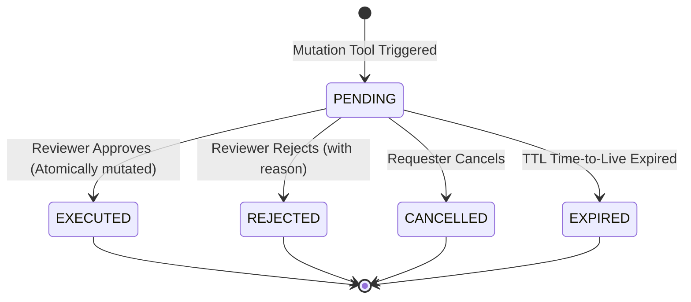

# Human Approval Workflow & Idempotency Governance Specification

## 1. Principles of Human-in-the-Loop Governance
All state-modifying actions initiated by AI assistants or operational decision support systems require explicit authorization from human managers.

Key invariants:
1. **Separation of Duties**: The user proposing a mutation cannot approve their own request unless they are an active superuser.
2. **Deterministic Idempotency**: Every approval request carries an `idempotency_key`. Repeated calls return cached execution results without re-executing mutations.
3. **Atomic Execution**: Approvals execute within a single database transaction (`@transaction.atomic`) with row-level locks (`select_for_update`) to prevent double-spending or race condition executions.
4. **Comprehensive Audit Trail**: Every status transition (`PENDING` $\to$ `APPROVED` $\to$ `EXECUTED` or `REJECTED`) is recorded in the immutable `AuditLog`.

---

## 2. Approval Request State Machine



### State Definitions
- `PENDING`: Waiting for human review in the Approval Center.
- `APPROVED` / `EXECUTED`: Approved by authorized reviewer and mutation successfully committed.
- `REJECTED`: Declined by reviewer with mandatory business justification.
- `CANCELLED`: Withdrawn by original requester.
- `EXPIRED`: System timed out the request due to policy SLA.

---

## 3. ApprovalRequest Data Model
Inherits `WorkspaceScopedModel`:
- `id`: Auto-incrementing primary key.
- `workspace`: Multi-tenant workspace reference.
- `requester`: Foreign key to `User` who submitted the request.
- `proposed_action`: Whitelisted tool name (e.g. `dispatch_technician`).
- `parameters`: JSON dictionary with validated input payload.
- `reason`: Justification text explaining why action is requested.
- `risk_level`: `LOW`, `MEDIUM`, `HIGH`, `CRITICAL`.
- `status`: Current lifecycle state (`ApprovalStatus`).
- `reviewer`: Foreign key to `User` who decided the request.
- `review_timestamp`: DateTime when human decision occurred.
- `decision_reason`: Human note explaining approval or rejection.
- `idempotency_key`: Unique string token preventing duplicate executions.
- `execution_result`: Cached JSON output from the tool execution.
- `executed_at`: Timestamp of successful execution.

---

## 4. Replay Protection & Idempotency
When an approval request in status `EXECUTED` is approved again (e.g. due to network retry or client replay), the engine intercepts the call before executing the tool handler:
```python
if approval_request.status == ApprovalStatus.EXECUTED:
    return {
        "status": "EXECUTED",
        "approval_id": approval_request.id,
        "result": approval_request.execution_result,
        "idempotent_replay": True,
        "message": "Approval request has already been executed.",
    }
```
No database mutation occurs a second time.
