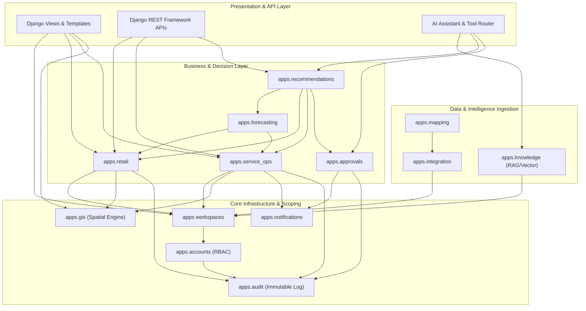

# Modular Monolith Architecture & App Boundaries

## 1. Architectural Philosophy

The **AI Business Operations Platform** is designed as a **Django Modular Monolith**. Each business capability is encapsulated within an isolated Django app located under the `apps/` directory.

### Core Principles
1. **Loose Coupling & High Cohesion**: Each application owns its specific business domain, data models, and service interfaces.
2. **Explicit Dependency Hierarchy**: Dependencies flow strictly downward from high-level orchestrators (AI, Workspaces) to domain modules (Retail, Service), down to infrastructure modules (Accounts, GIS, Audit).
3. **No Circular Dependencies**: Apps must never cross-import each other directly. Cross-domain interactions occur strictly through explicit **Service Layer** functions or decoupled signals.
4. **Thin Views, Rich Services**: Views and API ViewSets only handle request parsing, authentication/permission checks, and response formatting. All business logic lives in `services.py` or domain managers.

---

## 2. Directory Layout & Module Inventory

```text
apps/
├── accounts/         # Identity, Authentication, Roles & Permissions (RBAC)
├── workspaces/       # Dual Workspace Scope (Retail vs Service) & Tenancy Isolation
├── retail/           # Retail Domain: Products, Categories, Orders, Customers, Branches
├── service_ops/      # Service Operations Domain: Service Requests, Tasks, Schedules, SLA
├── gis/              # Spatial Queries, GeoDjango geometry utilities, Map layer APIs
├── integration/      # Data Ingestion: CSV/Excel loaders, Mock API Connectors, Import Jobs
├── mapping/          # Data Mapping Engine: Field/Type/Value Mapping & Standard Model Transforms
├── knowledge/        # Document Ingestion, Chunking, Embeddings, pgvector Storage & Retrieval
├── forecasting/      # XGBoost Feature Pipelines, Training, Evaluation, Prediction Engine
├── recommendations/  # Deterministic Business Rules Engine & Decision Support
├── approvals/        # Human-in-the-Loop Approval Workflows & State Machine
├── notifications/    # In-app alerts, SLA breach warnings & Approval notifications
└── audit/            # Immutable logging for user actions and AI tool executions
```

---

## 3. Detailed Module Specifications

### 3.1 `apps.accounts`
- **Responsibility**: User management, authentication, role assignment, and granular permissions.
- **Owned Entities**: `User`, `Role`, `Permission`, `UserRole`.
- **Allowed Dependencies**: Django core auth, `apps.audit`.
- **Forbidden Dependencies**: `apps.retail`, `apps.service_ops`, `apps.ai_assistant`, `apps.forecasting`.
- **Public Service Interfaces**:
  - `accounts.services.authenticate_user(username, password)`
  - `accounts.services.assign_role(user, role_name, workspace)`
  - `accounts.services.has_permission(user, permission_codename, workspace)`

### 3.2 `apps.workspaces`
- **Responsibility**: Workspace lifecycle, workspace switching, and tenancy context management.
- **Owned Entities**: `Workspace`, `WorkspaceMembership`.
- **Allowed Dependencies**: `apps.accounts`, `apps.audit`.
- **Forbidden Dependencies**: `apps.retail`, `apps.service_ops`, `apps.forecasting`.
- **Public Service Interfaces**:
  - `workspaces.services.get_active_workspace(request)`
  - `workspaces.services.switch_workspace(user, workspace_id)`
  - `workspaces.services.validate_workspace_access(user, workspace_id)`

### 3.3 `apps.retail`
- **Responsibility**: Core commercial retail operations, catalog, transactions, and sales metrics.
- **Owned Entities**: `Category`, `Product`, `RetailCustomer`, `Branch`, `Order`, `OrderItem`.
- **Allowed Dependencies**: `apps.workspaces`, `apps.gis`, `apps.audit`.
- **Forbidden Dependencies**: `apps.service_ops`, `apps.forecasting`, `apps.recommendations`, `apps.ai_assistant`.
- **Public Service Interfaces**:
  - `retail.services.create_order(workspace, order_data)`
  - `retail.services.get_sales_timeseries(workspace, start_date, end_date, branch_id=None)`
  - `retail.services.get_branch_sales_kpi(workspace, branch_id)`

### 3.4 `apps.service_ops`
- **Responsibility**: Service desk operations, field dispatching, employee scheduling, and SLA tracking.
- **Owned Entities**: `Service`, `ServiceCustomer`, `ServiceRequest`, `Task`, `Employee`, `Schedule`, `SLA`.
- **Allowed Dependencies**: `apps.workspaces`, `apps.gis`, `apps.notifications`, `apps.audit`.
- **Forbidden Dependencies**: `apps.retail`, `apps.forecasting`, `apps.recommendations`, `apps.ai_assistant`.
- **Public Service Interfaces**:
  - `service_ops.services.create_service_request(workspace, request_data)`
  - `service_ops.services.assign_task(task_id, employee_id, assigned_by)`
  - `service_ops.services.calculate_sla_status(service_request_id)`
  - `service_ops.services.get_technician_workload(workspace, employee_id)`

### 3.5 `apps.gis`
- **Responsibility**: Spatial query engine, spatial indexes, distance/radius filtering, GeoJSON serializers.
- **Owned Entities**: Spatial mixins and spatial query utilities (`LocationModelMixin`).
- **Allowed Dependencies**: GeoDjango (`django.contrib.gis`), PostGIS.
- **Forbidden Dependencies**: Business domains (`apps.retail`, `apps.service_ops`, `apps.forecasting`).
- **Public Service Interfaces**:
  - `gis.services.find_points_within_radius(queryset, point, radius_meters)`
  - `gis.services.calculate_distance_matrix(origin_point, destination_points)`
  - `gis.services.aggregate_by_bounding_box(queryset, bbox_polygon)`

### 3.6 `apps.integration`
- **Responsibility**: Ingesting external data from CSV, Excel, and mock REST APIs; managing import jobs.
- **Owned Entities**: `DataSource`, `ImportJob`, `RawDataRecord`.
- **Allowed Dependencies**: `apps.workspaces`, `apps.audit`.
- **Forbidden Dependencies**: `apps.ai_assistant`, `apps.forecasting`.
- **Public Service Interfaces**:
  - `integration.services.create_import_job(datasource_id, file_obj, user)`
  - `integration.services.run_import_job(job_id)`

### 3.7 `apps.mapping`
- **Responsibility**: Schema transformation from raw/legacy fields into Standard Data Model format.
- **Owned Entities**: `MappingRule`, `FieldMapping`, `ValueMapping`, `TransformationPipeline`.
- **Allowed Dependencies**: `apps.workspaces`, `apps.integration`, `apps.audit`.
- **Forbidden Dependencies**: `apps.forecasting`, `apps.ai_assistant`.
- **Public Service Interfaces**:
  - `mapping.services.apply_mapping_rule(raw_record, mapping_rule_id)`
  - `mapping.services.validate_transformed_payload(standard_model_type, payload)`

### 3.8 `apps.knowledge` (RAG Subsystem)
- **Responsibility**: Managing organizational documents, text chunking, embedding generation, pgvector similarity retrieval.
- **Owned Entities**: `KnowledgeBase`, `Document`, `DocumentChunk`.
- **Allowed Dependencies**: `apps.workspaces`, `apps.accounts`, `apps.audit`.
- **Forbidden Dependencies**: `apps.retail`, `apps.service_ops`, `apps.forecasting`.
- **Public Service Interfaces**:
  - `knowledge.services.ingest_document(workspace, file_obj, metadata)`
  - `knowledge.services.retrieve_relevant_chunks(workspace, query_text, top_k=5, min_score=0.7)`

### 3.9 `apps.forecasting` (XGBoost Subsystem)
- **Responsibility**: Tabular dataset compilation, feature engineering, time-series training, evaluation metrics, and prediction.
- **Owned Entities**: `ForecastModelConfig`, `ForecastRun`, `ForecastEvaluationMetric`.
- **Allowed Dependencies**: `apps.workspaces`, `apps.retail`, `apps.service_ops`, `apps.audit`.
- **Forbidden Dependencies**: `apps.recommendations`, `apps.ai_assistant`.
- **Public Service Interfaces**:
  - `forecasting.services.generate_feature_dataset(workspace, domain, target_metric)`
  - `forecasting.services.train_forecast_model(workspace, domain, model_config)`
  - `forecasting.services.predict_future_values(workspace, domain, horizon_days=7)`

### 3.10 `apps.recommendations`
- **Responsibility**: Combining forecast outputs, real-time business telemetry, and business rules to formulate actionable recommendations.
- **Owned Entities**: `BusinessRule`, `Recommendation`.
- **Allowed Dependencies**: `apps.workspaces`, `apps.forecasting`, `apps.retail`, `apps.service_ops`, `apps.gis`, `apps.approvals`, `apps.audit`.
- **Forbidden Dependencies**: `apps.ai_assistant`.
- **Public Service Interfaces**:
  - `recommendations.services.evaluate_business_rules(workspace, domain)`
  - `recommendations.services.generate_dispatch_recommendation(service_request_id)`
  - `recommendations.services.generate_sales_recommendation(workspace, branch_id)`

### 3.11 `apps.approvals`
- **Responsibility**: State machine for human-in-the-loop validation of impactful system or AI recommendations.
- **Owned Entities**: `ApprovalRequest`, `ApprovalDecisionLog`.
- **Allowed Dependencies**: `apps.workspaces`, `apps.accounts`, `apps.notifications`, `apps.audit`.
- **Forbidden Dependencies**: `apps.ai_assistant`.
- **Public Service Interfaces**:
  - `approvals.services.submit_for_approval(workspace, action_type, payload, requested_by)`
  - `approvals.services.approve_request(approval_id, approver_user, comment=None)`
  - `approvals.services.reject_request(approval_id, approver_user, reason)`

### 3.12 `apps.notifications`
- **Responsibility**: Dispatching notifications to users regarding SLA breaches, task assignments, and pending approvals.
- **Owned Entities**: `Notification`.
- **Allowed Dependencies**: `apps.workspaces`, `apps.accounts`.
- **Forbidden Dependencies**: None.
- **Public Service Interfaces**:
  - `notifications.services.send_notification(recipient, title, message, level="info", link=None)`

### 3.13 `apps.audit`
- **Responsibility**: Append-only immutable logging of user activities, data mutations, and AI tool invocations.
- **Owned Entities**: `AuditLog`.
- **Allowed Dependencies**: None (independent foundation module).
- **Forbidden Dependencies**: All business modules.
- **Public Service Interfaces**:
  - `audit.services.log_action(user, workspace, action, entity_type, entity_id, changes=None, ip_address=None)`

---

## 4. Module Dependency Graph



---

## 5. Architectural Invariants
1. **Unidirectional Flow**: Infrastructure $\to$ Domains $\to$ Decision Engine $\to$ Presentation/AI.
2. **Data Isolation**: Every business entity query MUST be filtered by `workspace_id`.
3. **No Direct SQL Execution**: All SQL mutations must occur via Django ORM transactions with model validation.
