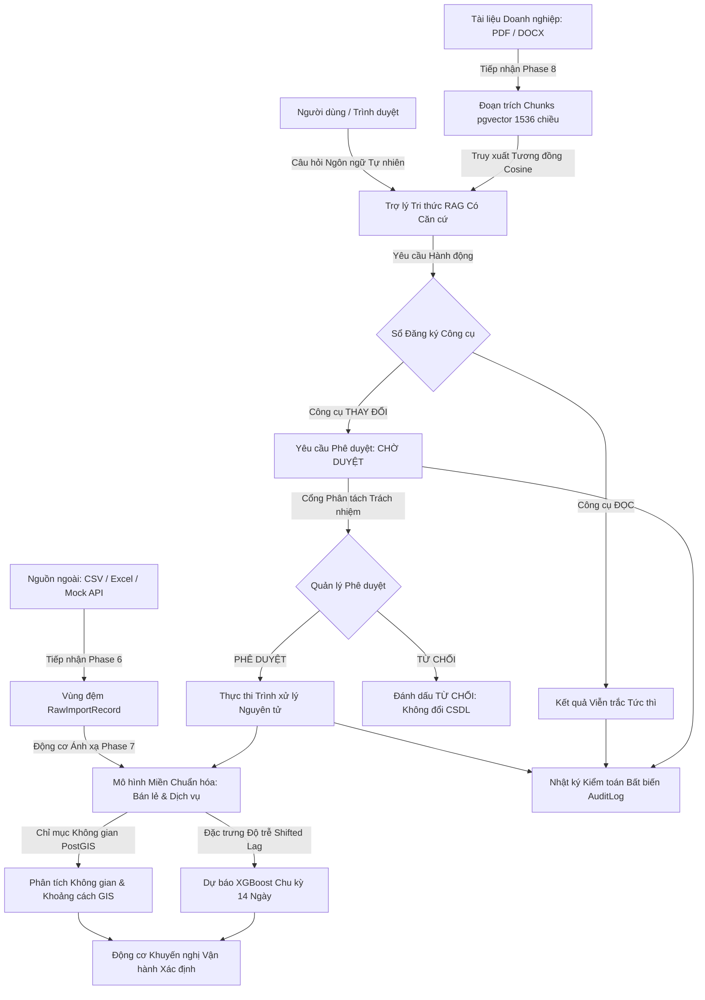

# Nền tảng Vận hành Doanh nghiệp Thông minh
## Tóm tắt Toàn diện Dự án & Đặc tả Kiến trúc Hệ thống

**Năm học**: 2025–2026  
**Loại hình Hệ thống**: Kiến trúc Đơn khối Dạng mô-đun (Modular Monolith) với Quản trị AI, Trí tuệ Không gian & Phân tích Dự báo  
**Ngôn ngữ & Framework Chính**: Python 3.14 / Django 6.0 / Django REST Framework  
**Động cơ Không gian & Vector**: PostgreSQL 18 / PostGIS / pgvector  

---

## 1. Bài toán Đặt ra (Problem Statement)
Các doanh nghiệp vừa và nhỏ (SMEs) hoạt động trong lĩnh vực chuỗi cửa hàng thương mại hoặc mạng lưới dịch vụ kỹ thuật thường gặp phải các rào cản phân mảnh công cụ:
1. **Các Ốc đảo Dữ liệu Phân tán (Data Silos)**: Sổ bán hàng, bảng tính bên ngoài, phiếu hỗ trợ hiện trường và nhật ký công việc của kỹ thuật viên tồn tại ở các định dạng rời rạc, không tương thích.
2. **Thiếu Nhận biết Không gian (Lack of Spatial Awareness)**: Nhu cầu khách hàng và hoạt động hiện trường mang tính địa lý rõ rệt, tuy nhiên các hệ thống ERP/CRM cũ lại thiếu phân tích trắc địa lân cận tích hợp.
3. **AI Thiếu Kiểm soát & Nguy cơ Ảo giác (Hallucinatory AI)**: Việc đưa AI tạo sinh thông thường hoặc các tác tử tự trị truy cập trực tiếp vào cơ sở dữ liệu doanh nghiệp gây ra rủi ro ảo giác, rò rỉ dữ liệu hoặc thay đổi CSDL trái phép gây phá hủy dữ liệu.
4. **Hộp Đen Ra Quyết định (Black-Box Decision Making)**: Các mô hình học máy thường thất bại trong vận hành thực tế vì người vận hành không thể giải thích *lý do tại sao* một hành động được khuyến nghị hoặc *bằng chứng nào* hỗ trợ quyết định đó.

---

## 2. Giải pháp Đề xuất (Proposed Solution)
**Nền tảng Vận hành Doanh nghiệp Thông minh** giải quyết triệt để các thách thức này bằng cách hợp nhất tiếp nhận dữ liệu, ánh xạ chuẩn hóa, truy vấn không gian GIS, khuyến nghị xác định, dự báo chuỗi thời gian và RAG doanh nghiệp dưới một kiến trúc **Quản trị AI có Con người Kiểm duyệt (Human-in-the-Loop AI Governance Monolith)**:

$$\text{Dữ liệu Thô} \to \text{Tiếp nhận} \to \text{Ánh xạ Dữ liệu} \to \text{Mô hình Chuẩn hóa} \to \text{GIS / Tri thức} \to \text{Trí tuệ AI} \to \text{Khuyến nghị} \to \text{Con người Phê duyệt} \to \text{Công cụ Kiểm soát} \to \text{Kiểm toán}$$

Các Nguyên tắc & Ràng buộc Kiến trúc Bất biến:
- **Tuyệt đối Không cho AI Thay đổi Trực tiếp CSDL**: Các mô hình ngôn ngữ và tác tử tự trị không có quyền thực thi lệnh SQL trực tiếp hay gọi ORM thay đổi dữ liệu. Mọi thay đổi trạng thái đều bắt buộc tạo một bản ghi `ApprovalRequest` ở trạng thái `CHỜ XỬ LÝ` (`PENDING`) và phải được người quản lý có thẩm quyền phê duyệt.
- **Khuyến nghị Có Khả năng Giải trình Minh bạch**: Mọi đề xuất tự động đều bắt buộc xuất ra cấu trúc giải trình 4 phần: `what` (đề xuất), `why` (lý do), `evidence` (bằng chứng), và `expected_effect` (tác động kỳ vọng).
- **Phân tách Đa Người dùng Nghiêm ngặt (Strict Multi-Tenancy)**: Mọi bản ghi nghiệp vụ đều được gắn chặt với phạm vi không gian làm việc (workspace) thông qua rào chắn xác thực phiên và mã hóa an toàn.

---

## 3. Đối tượng Người dùng & Phân quyền Truy cập (RBAC)
Nền tảng thực thi Kiểm soát Truy cập Dựa trên Vai trò (RBAC) với 4 vai trò vận hành:
1. **Quản trị viên Hệ thống (`ADMIN`)**: Cấu hình không gian làm việc, quản lý tài khoản người dùng, thiết lập kết nối dữ liệu và giám sát toàn bộ nhật ký kiểm toán hệ thống.
2. **Quản lý Vận hành (`MANAGER`)**: Xem xét các chỉ số phân tích vận hành, theo dõi phân bố GIS, phê duyệt hoặc từ chối các đề xuất thay đổi của AI, và điều phối lịch trình.
3. **Nhân viên Thương mại / Kỹ thuật (`EMPLOYEE`)**: Tạo đơn hàng bán lẻ, thực hiện các công việc kỹ thuật được giao, ghi nhận giờ công và truy vấn trợ lý tri thức AI.
4. **Kiểm toán viên / Người xem (`VIEWER`)**: Quyền chỉ đọc đối với bảng điều khiển thương mại, báo cáo tuân thủ và bản đồ GIS; dữ liệu định danh cá nhân nhạy cảm (PII) của khách hàng được tự động che giấu.

---

## 4. Miền Vận hành Thương mại Bán lẻ (Retail Domain)
Tập trung vào hoạt động bán hàng, phân bổ doanh thu chi nhánh và phân tích quan hệ khách hàng:
- **Các Thực thể Nghiệp vụ**: `Category` (Danh mục), `Product` (Sản phẩm), `Customer` (Khách hàng), `Branch` (Chi nhánh cửa hàng với tọa độ PostGIS), `Order` (Đơn hàng), `OrderItem` (Chi tiết đơn hàng).
- **Tính Toàn vẹn & Giá trị Tiền tệ**: Tính toán số tiền hoàn toàn trên máy chủ (`DecimalField(max_digits=14, decimal_places=2)`) với giao dịch cơ sở dữ liệu nguyên tử (atomic transactions).
- **Phân tích Báo cáo**: Số liệu bán hàng thời gian thực, giá trị đơn hàng trung bình (AOV), xếp hạng doanh thu chi nhánh và trích xuất chuỗi thời gian lịch sử.

---

## 5. Miền Vận hành Dịch vụ Kỹ thuật CNTT (Service Operations)
Tập trung vào vòng đời phiếu yêu cầu sự cố, điều phối kỹ sư hiện trường và theo dõi chi phí nhân công theo 4 danh mục kỹ thuật CNTT chuẩn hóa:
1. `INSTALLATION`: Cài đặt hệ thống — Lắp đặt tủ rack, triển khai hạ tầng mạng, cấu hình máy trạm.
2. `MAINTENANCE`: Bảo trì hệ thống — Vệ sinh phần cứng, cập nhật bản vá firmware, kiểm tra hệ thống làm mát định kỳ.
3. `DATABASE_CONSULTING`: Tư vấn CSDL — Tối ưu hóa hiệu năng, điều chỉnh lược đồ, chẩn đoán chỉ mục.
4. `DEVICE_REPAIR`: Sửa chữa thiết bị — Thay thế linh kiện, hàn mạch điện tử, chẩn đoán bo mạch chủ.
- **Các Thực thể Nghiệp vụ**: `Service` (Dịch vụ), `Employee` (Kỹ sư với đơn giá giờ công & kỹ năng), `SLA` (Cam kết thời hạn phản hồi/giải quyết), `ServiceRequest` (Phiếu sự cố), `Task` (Công việc), `Schedule` (Lịch điều phối), `LaborEntry` (Ghi nhận giờ công).
- **Tự động Tính Chi phí Nhân công**: `labor_cost = hours_spent * employee.hourly_labor_rate` được thực thi chặt chẽ qua giao dịch backend.

---

## 6. Động cơ Tiếp nhận Dữ liệu (Data Integration - Phase 6)
Cung cấp khả năng nạp dữ liệu hàng loạt an toàn từ các nguồn bên ngoài:
- **Định dạng Hỗ trợ**: Tệp CSV phân tách (hỗ trợ tự động nhận diện bảng mã đa luồng), bảng tính Excel `.xlsx`/`.xls` (`openpyxl`), và Mock REST API của đối tác.
- **Rào chắn An toàn**:
  - Giới hạn kích thước tệp tải lên tối đa 10 MB.
  - Chặn các phần mở rộng nguy hiểm (`.py`, `.exe`, `.sh`, `.bat`, `.html`).
  - Phòng chống tấn công SSRF: chặn truy cập loopback (`127.0.0.1`), dải mạng riêng tư RFC 1918 và địa chỉ siêu dữ liệu đám mây (`169.254.169.254`).
- **Vùng đệm Staging Thô**: Lưu trữ các dòng thô vào `RawImportRecord` mà không từ chối cấu trúc ban đầu, bảo toàn bằng chứng nguồn để kiểm toán.

---

## 7. Xưởng Ánh xạ Dữ liệu & Chuyển đổi Chuẩn hóa (Mapping Studio - Phase 7)
Chuyển đổi lược đồ dữ liệu thô bên ngoài thành Mô hình Dữ liệu Chuẩn hóa (Standard Data Model - SDM) của nền tảng:
- **Thực thể Chuẩn hóa**: 10 lược đồ định nghĩa chuẩn (`Customer`, `Product`, `Order`, `OrderItem`, `Branch`, `Service`, `Employee`, `ServiceRequest`, `Task`, `LaborEntry`).
- **Các Loại Quy tắc**: `FIELD_MAPPING`, `TYPE_CONVERSION`, `VALUE_MAPPING`, `BUSINESS_FORMULA`, và `AI_ASSISTED_MAPPING`.
- **Bộ Đánh giá AST An toàn**: Đánh giá công thức toán học và chuỗi ký tự bằng danh sách trắng Abstract Syntax Tree. Tuyệt đối từ chối `eval()`, `exec()`, `__import__`, duyệt thuộc tính hoặc gọi hàm tùy tiện.
- **Kiểm duyệt Con người**: Các gợi ý ánh xạ của AI mặc định ở trạng thái `CHỜ XÁC NHẬN` (`PENDING_CONFIRMATION`), yêu cầu người vận hành phê duyệt trước khi kích hoạt.

---

## 8. Động cơ Không gian GIS & Phân tích Vùng lân cận (Phase 5)
Khai thác sức mạnh GeoDjango và PostGIS để gắn kết hình học địa lý trực tiếp vào dữ liệu kinh doanh:
- **Hệ Tọa độ Tham chiếu**: WGS 84 (`SRID 4326`) sử dụng trường điểm 2D `PointField`.
- **Truy vấn Không gian Bán lẻ**: Tạo cấu trúc GeoJSON FeatureCollection cho mạng lưới chi nhánh, mật độ tập trung khách hàng và bản đồ nhiệt doanh thu theo khu vực.
- **Tìm kiếm Lân cận Dịch vụ**: Tính toán khoảng cách trắc địa mặt cầu (`ST_Distance`) để tìm kỹ sư có trình độ gần nhất cho các sự cố khẩn cấp trong phạm vi bán kính (ví dụ: 25 km).
- **Che giấu Dữ liệu Định danh (Privacy Masking)**: Dữ liệu cá nhân nhạy cảm của khách hàng (họ tên, số điện thoại, email, địa chỉ) được tự động ẩn đi đối với người dùng không có quyền `can_view_pii`.

---

## 9. Trợ lý Tri thức RAG Có Căn cứ Doanh nghiệp (Phase 8)
Hệ thống truy xuất tri thức doanh nghiệp được neo đậu chặt chẽ vào tài liệu quy trình nội bộ:
- **Quy trình Tiếp nhận**: Bộ trích xuất đa định dạng (`.pdf`, `.docx`, `.txt`), phân đoạn văn bản theo cửa sổ trượt ngữ nghĩa (500 tokens, độ gối 100 tokens).
- **Lưu trữ Vector**: Lưu vector embedding 1536 chiều trong PostgreSQL thông qua tiện ích `pgvector`.
- **Truy xuất Lai (Hybrid Retrieval)**: Kết hợp tìm kiếm khoảng cách cosine tương đồng ngữ nghĩa với bộ lọc siêu dữ liệu theo không gian làm việc.
- **Tạo Sinh Có Căn cứ**: Tạo câu trả lời thực tế, trích dẫn chính xác tiêu đề tài liệu nguồn và mã định danh đoạn trích (chunk IDs).
- **Phòng chống Ảo giác Bất biến**: Nếu các đoạn trích tìm được không đạt ngưỡng tương đồng tin cậy, hệ thống phát ra câu trả lời mặc định xác định:
  > *"Không tìm thấy thông tin đủ tin cậy trong tài liệu của doanh nghiệp."*

---

## 10. Tích hợp Mô hình Ngôn ngữ Lớn (LLM)
- **Vai trò**: Hiểu ngôn ngữ tự nhiên, nhận diện ý định (intent detection) và tổng hợp câu trả lời có căn cứ.
- **Tuyệt đối Không có Quyền Thay đổi Dữ liệu**: Mô hình LLM **không có bất kỳ quyền ghi nào** vào cơ sở dữ liệu. Mọi ý định thay đổi dữ liệu đều được chuyển đổi thành các lệnh gọi công cụ có kiểm soát (controlled tools).

---

## 11. Phân tích Dự báo Chuỗi Thời gian với XGBoost (Phase 9)
Đường ống huấn luyện mô hình cây quyết định tăng cường gradient (Gradient Boosted Trees) phục vụ dự báo chuỗi thời gian:
- **Các Chỉ số Dự báo**: `RETAIL_REVENUE` (doanh thu bán lẻ ngày - VND), `RETAIL_ORDER_VOLUME` (số lượng đơn hàng ngày), `SERVICE_TICKET_VOLUME` (số lượng phiếu sự cố ngày).
- **Kỹ thuật Đặc trưng Chống Rò rỉ Dữ liệu**: Đặc trưng độ trễ tự hồi quy ($t-1, t-7, t-14$) và thống kê trượt ($\mu_7, \sigma_7$) đều được tính toán nghiêm ngặt dựa trên `shift(1)`.
- **Chia Tập Dữ liệu Theo Trình tự Thời gian**: Giữ nguyên trật tự thời gian (80% đầu để huấn luyện, 20% cuối để kiểm thử); nghiêm cấm xáo trộn ngẫu nhiên (random shuffling).
- **Dự báo Chu kỳ 14 Ngày**: Phép chiếu đệ quy về tương lai với ràng buộc giá trị không âm và dải dự báo xấp xỉ 95% dựa trên độ lệch chuẩn phần dư tập kiểm thử.

---

## 12. Động cơ Khuyến nghị Vận hành (Phase 10)
Hệ thống hỗ trợ ra quyết định kinh doanh mang tính xác định, kết hợp số liệu thực tế, khoảng cách GIS và dự báo tương lai:
- **Công thức Tính điểm Minh bạch**:
  $$\text{Điểm Ứng viên} = 0.40 \times S_{\text{khoảng\_cách}} + 0.40 \times S_{\text{tải\_công\_việc}} + 0.20 \times S_{\text{kỹ\_năng}}$$
- **Hợp đồng Giải trình Minh bạch**: Mọi khuyến nghị đều xuất ra cấu trúc JSON chuẩn gồm: `what` (đề xuất), `why` (lý do), `evidence` (bằng chứng số liệu/GIS), và `expected_effect` (tác động kỳ vọng).

---

## 13. Công cụ Gọi Có Kiểm soát & Sổ Đăng ký Công cụ (Phase 10)
Sổ đăng ký tập trung định nghĩa các thao tác được phép thực thi trên nền tảng:
- **Công cụ ĐỌC (`READ`)**: Truy vấn dữ liệu an toàn (`get_sales_summary`, `get_technician_workload`, `query_nearby_technicians`), thực thi ngay lập tức.
- **Công cụ THAY ĐỔI (`MUTATION`)**: Các hành động có rủi ro cao (`dispatch_technician`, `update_order_status`, `schedule_task`, `adjust_product_price`), hệ thống tự động chặn thực thi trực tiếp và tạo một bản ghi `ApprovalRequest` ở trạng thái `CHỜ XỬ LÝ`.

---

## 14. Quy trình Phê duyệt & Phân tách Trách nhiệm (Phase 10)
Thực thi cơ chế quản trị doanh nghiệp đối với các hệ thống tự động:
- **Các Trạng thái Phê duyệt**: `CHỜ XỬ LÝ` (`PENDING`) $\to$ `ĐÃ PHÊ DUYỆT` (`APPROVED`) $\to$ `ĐÃ THỰC HIỆN` (`EXECUTED`) (hoặc `TỪ CHỐI` - `REJECTED`).
- **Phân tách Trách nhiệm (Separation of Duties)**: Người dùng tạo yêu cầu thay đổi không thể tự phê duyệt yêu cầu của chính mình (trừ khi là siêu quản trị viên superuser).
- **Chống Trùng lặp (Idempotency Replay Protection)**: Quá trình thực thi công cụ kiểm tra `idempotency_key`. Nếu yêu cầu bị gửi lại, hệ thống trả về kết quả đã lưu đệm mà không gây tác dụng phụ trùng lặp.

---

## 15. Nhật ký Kiểm toán Bất biến (Audit Logging - Phase 3–11)
Mọi hành động liên quan đến an ninh, nạp dữ liệu, thay đổi quy tắc ánh xạ, truy vấn AI, tạo yêu cầu phê duyệt và thực thi công cụ đều được ghi nối tiếp vào `apps.audit.models.AuditLog`. Các bản ghi này tuyệt đối không thể sửa hoặc xóa thông qua các API.

---

## 16. Kiến trúc Bảo mật & Gia cố Hệ thống (Phase 11)
- **Cơ chế Xác thực**: Xác thực Phiên (Session Authentication cho giao diện web) + Xác thực Mã DRF Token cho API. Loại trừ hoàn toàn JWT để ngăn chặn rủi ro lộ mã không thể thu hồi.
- **Bảo mật Cookie**: `SESSION_COOKIE_HTTPONLY = True`, `CSRF_COOKIE_HTTPONLY = False` (chủ động để JavaScript đọc token CSRF an toàn), `SESSION_COOKIE_SAMESITE = 'Lax'`.
- **Tiêu đề An toàn (Security Headers)**: `X_FRAME_OPTIONS = 'DENY'`, `SECURE_CONTENT_TYPE_NOSNIFF = True`.
- **Chính sách Bảo mật Nội dung (CSP)**: Được kích hoạt ở chế độ Báo cáo (`CSP_REPORT_ONLY = True`) để đảm bảo không chặn nhầm bản đồ Leaflet hoặc biểu đồ Chart.js.

---

## 17. Sơ đồ Kiến trúc & Đường ống Hoạt động Toàn diện

---

## 18. Tóm tắt Ngăn xếp Kỹ thuật
- **Backend**: Python 3.14, Django 6.0, Django REST Framework
- **Cơ sở dữ liệu & Không gian**: PostgreSQL 18, PostGIS 3.6, pgvector
- **Khoa học Dữ liệu & Học máy**: XGBoost, Scikit-learn, Pandas, NumPy
- **Giao diện & Trực quan hóa**: Django HTML5 Server-Rendered, CSS thuần (Vanilla CSS), Leaflet.js, Chart.js
- **Kiểm thử**: Django Test Runner, `rest_framework.test.APIClient` (276 bài kiểm thử tự động, tỷ lệ vượt qua 100%)
- **Triển khai**: Chạy cục bộ trên Windows/Linux, Docker & Docker Compose (`docker-compose.yml`)

---

## 19. Lộ trình Tương lai & Các Hạng mục Ngoài Phạm vi
Tuân thủ Hiến pháp Dự án và Khóa Phạm vi V1, các nội dung sau được dời lại sau V1:
- Các framework đa tác tử tự do (Autogen, CrewAI).
- Định tuyến không gian phức tạp (pgRouting, thuật toán người giao hàng TSP).
- Thuật toán ghép cặp Hungarian (Bipartite matching).
- Phát hiện bất thường bằng Isolation Forest.
- Quản lý kho bãi chuyên sâu theo vị trí thùng hàng & chuỗi cung ứng phức tạp.
- Cụm phân tán đám mây đa vùng (multi-region active-active cloud clustering).
