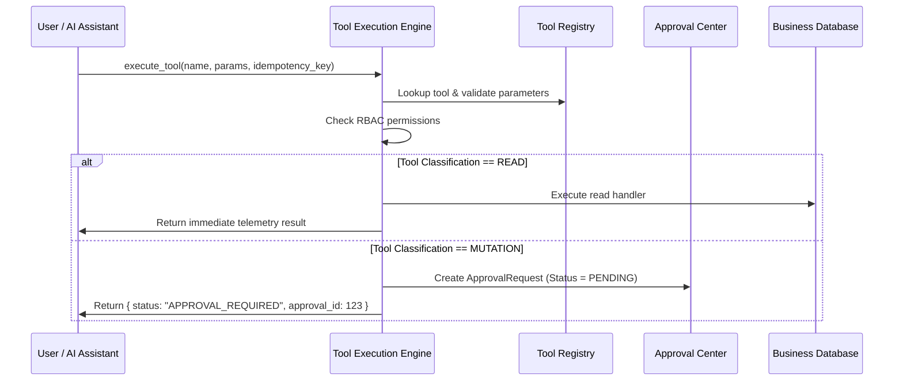

# Controlled Tool Calling & Tool Registry Architecture

## 1. Safety Principles & Architecture
The AI Business Platform explicitly rejects autonomous agents that can modify database state without human oversight.
The Controlled Tool Calling system enforces:
1. **Zero Direct DB Mutations by LLM**: Language models and assistants can never execute raw SQL or mutate database records directly.
2. **Schema-Validated Registry**: All tools are statically defined with JSON schema validation for inputs and outputs.
3. **Strict Classification**: Tools are divided into `READ` (telemetry & insights) and `MUTATION` (operational changes).
4. **Mandatory Redirection to Approval**: Any call to a `MUTATION` tool generates a `PENDING` `ApprovalRequest` record requiring authorized human review.

---

## 2. Tool Classification Matrix

| Tool Name | Classification | Risk Level | Required Permission | Purpose |
| :--- | :--- | :--- | :--- | :--- |
| `get_sales_summary` | `READ` | `LOW` | `retail.view_order` | Retrieve aggregate sales, revenue & order counts |
| `get_order_summary` | `READ` | `LOW` | `retail.view_order` | Categorize orders by lifecycle status |
| `get_service_ticket_summary`| `READ` | `LOW` | `service_ops.view_servicerequest` | SLA compliance & ticket count metrics |
| `get_technician_workload` | `READ` | `LOW` | `service_ops.view_employee` | Technician roster, availability & task loads |
| `query_nearby_technicians` | `READ` | `LOW` | `service_ops.view_employee` | PostGIS spatial distance & candidate ranking |
| `get_forecast` | `READ` | `LOW` | `forecasting.view_forecast` | 14-day XGBoost recursive forecast bands |
| `get_recommendations` | `READ` | `LOW` | `recommendations.view_recommendation` | Query pending/accepted operational recommendations |
| `dispatch_technician` | `MUTATION` | `HIGH` | `service_ops.change_servicerequest` | Assign technician to service ticket & update Task |
| `update_order_status` | `MUTATION` | `MEDIUM` | `retail.change_order` | Update retail order lifecycle status with state checks |
| `schedule_task` | `MUTATION` | `MEDIUM` | `service_ops.change_task` | Create or schedule work item for service staff |
| `adjust_product_price` | `MUTATION` | `MEDIUM` | `retail.change_product` | Adjust product unit price within tenant workspace |
| `create_promotion_request` | `MUTATION` | `LOW` | `retail.change_order` | *(Deprecated)* Preserved for backward compatibility |

---

## 3. Tool Execution Protocol
When a caller (AI Assistant, API client, or automated rule) invokes `execute_tool`:

---

## 4. Grounded AI Assistant Integration
The AI Assistant (`apps/knowledge/services.py`) parses user queries using keyword intent matching:
- When a user asks about sales, tickets, or technicians, it executes authorized `READ` tools.
- When an action or proposal is discussed, the assistant grounds its explanation in recommendations, and if a mutation is triggered, it informs the user:
  > *"Hành động thay đổi đã tạo Yêu cầu Phê duyệt #AR-X và cần Quản lý duyệt tại Approval Center."*
